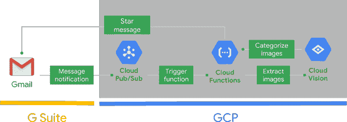

# TWiGCP —“云任务、私有云 SQL、K8S 和 TF 版本，以及新的支持模型”

> 原文：<https://medium.com/google-cloud/twigcp-cloud-tasks-private-cloudsql-k8s-and-tf-releases-and-new-support-models-2b0031e2c3b5?source=collection_archive---------0----------------------->

【Beta】[宣布**云任务**，App Engine flex 的任务队列服务和第二代运行时](http://goo.gl/gaXJ7z)(谷歌博客)更多的 App Engine 服务被提升为顶级产品。这个就像云调度器一样，支持有效的云原生模式。任务队列数

[Beta] [我们宣布了一个新的连接选项，private networking beta，使从 Google Cloud 中的应用程序连接到云 SQL 变得更容易，甚至更安全](http://goo.gl/NkyzwD) (Google 博客)。当你可以保持隐私的时候，为什么要通过公共网络？我们很高兴你问了！

深入研究 Kubernetes 1.12 (谷歌博客)

[TensorFlow 版本 1 . 11 . 0](http://goo.gl/NVeDik)(github.com)

[推出新的 GCP 支持模型:基于角色和企业](http://goo.gl/gpMu3e)(谷歌博客)。这包括围绕 IAM 构建的灵活的角色分配。

来自“太多的自动化和太少的测试让我上周搞砸了一些链接”部门:

*   [全新的 TensorFlow Hub Web 体验](http://goo.gl/TPrg6B)(medium.com)
*   使用容器本地负载平衡 (Google 文档)
*   [介绍数据传输项目:一个促进通用数据可移植性的开源平台](http://goo.gl/DfKEWN)(谷歌博客)
*   [自主数据中心冷却和工业控制的安全第一人工智能](http://goo.gl/gmqifm)(deepmind.com)
*   Sidecars 和 DaemonSets:集装箱化模式之战【wecode.wepay.com，
*   [chrislovecnm.com GKE 本地](http://goo.gl/C8ozoy)

来自“操作方法”部门:

*   [在 GCP 的无服务器 Gmail 上添加自定义智能](http://goo.gl/P1Dcho)(谷歌博客)
*   [在谷歌云平台上建立端到端物联网解决方案的快捷方式](http://goo.gl/hqU3Uq)(谷歌博客)
*   [与(medium.com)GCP 一起在几分钟内部署 Python 无服务器功能](http://goo.gl/L3fMMR)
*   推特、管道、谷歌云和诗歌——我怎么会在这里！(medium.com)
*   [用谷歌云功能简化 ML 预测](http://goo.gl/UHEoL7)(谷歌博客)
*   [你好 Istio Codelab(带 Google Kubernetes 引擎)](http://goo.gl/PF7htj) —更新至 Istio 1.0！(g.co/codelabs/cloud)

来自“用 TensorFlow.js 沾湿您的双脚”部分:

*   [tensor flow . js 入门](http://goo.gl/UnpHka)(youtube.com)
*   [使用机器学习(修改为使用 tensorflow.js)在浏览器中绘制并分类数字(0-9)](http://goo.gl/iTDn61)(github.com)

出自《春云 GCP》部:

*   布蒂芙·GCP:开始生产！(8/8) (spring.io)
*   [布蒂富尔·GCP:谷歌云发布/订阅的春云流](http://goo.gl/FKo4Fw)(springuni.com)

从“测试版，正式版，还是什么？”部门:

*   [GA] [云 SDK 218.0.0](http://goo.gl/QMtpTC)
*   [GA] [GCP 支持模型:基于角色和企业](http://goo.gl/gpMu3e)
*   [GA] [查看 journald 和 Stackdriver 中的 Docker 事件日志](http://goo.gl/3gz5FT)
*   大表键可视化工具
*   [GA] [启用/禁用防火墙规则](http://goo.gl/gWxPfj)
*   [防火墙规则日志](http://goo.gl/cnkFi1)

来自“所有多媒体”部门:

*   [播客] [马克·卡特的基础设施监控](http://goo.gl/PT1URq)(softwareengineeringdaily.com)
*   (gcppodcast.com)GCP 播客第 148 期——与西万·奥尔多·诺伊曼和埃里克·安德列科一起
*   [播客] [Kubernetes 播客# 22-SIG-Node，与 Dawn Chen](http://goo.gl/qkUymc)(kubernetespodcast.com)
*   [视频][tensor flow . js 入门](http://goo.gl/UnpHka)(youtube.com)
*   [视频][Redis 和 OpenCensus 的云存储](http://goo.gl/eQJ3Si)(youtube.com)

本周的图片摘自“[在 GCP](http://goo.gl/P1Dcho) 的无服务器 Gmail 上添加自定义智能”的帖子。#GSuiteGCP

这就是本周的全部内容！
——亚历克西斯