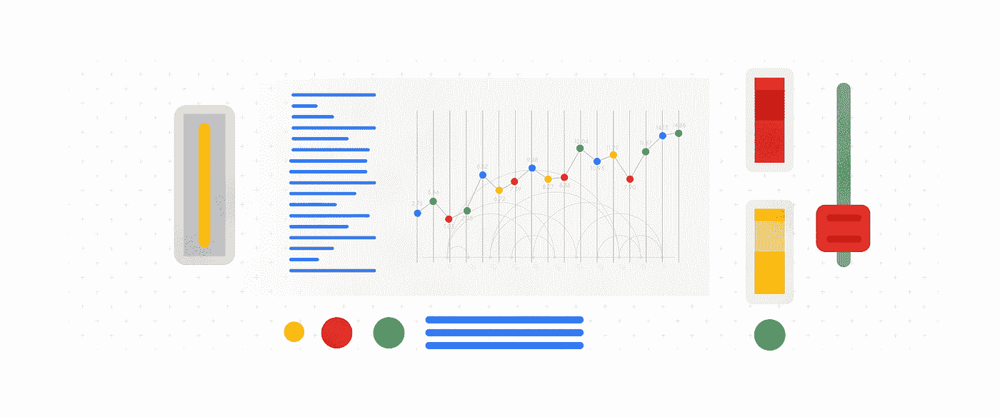

# TWiGCP —“加入谷歌的基石，新的 AMD procs，GKE 应用程序管理器，以及有史以来最大的数据流工作”

> 原文：<https://medium.com/google-cloud/twigcp-cornerstone-to-join-google-new-amc-procs-gke-app-manager-and-largest-dataflow-job-8813382e6192?source=collection_archive---------3----------------------->

以下是谷歌云视频系列 本周最新 [**的链接:**](http://gtech.run/ju4em)

*   [新的 C++客户端库可用于谷歌云](https://gtech.run/dj3tv)
*   [为批处理和流处理提供更好的数据管道可观察性](http://gtech.run/yn7j4)
*   【BigQuery 区域分配如何工作
*   [计划您的下一个 20 年旅程:会议指南现已发布](http://gtech.run/kagfe)

过去一周 GCP 的其他头条新闻包括:

*   首尔的新 GCP 地区(谷歌博客)
*   [谷歌云收购基石技术，帮助您迁移大型机](http://gtech.run/4tn98)(谷歌博客)
*   [介绍 Stackdriver 云监控仪表板 API](http://gtech.run/ya4pw) (谷歌博客)
*   [宣布基于 AMD 的 N2D VM 家族](http://gtech.run/c83ej)(谷歌博客)
*   [宣布谷歌 Kubernetes 引擎的应用管理器](http://gtech.run/a6clr)(谷歌博客)
*   [微软活动目录托管服务正式发布](http://gtech.run/xfd6e)(谷歌博客)
*   [Dialogflow 将虚拟代理的可用意向增加到 20，000 个](http://gtech.run/7ymw3)(谷歌博客)

来自“可解释的人工智能和最新的图形处理器”部门:

*   在表格数据上使用可解释的人工智能
*   [借助最新的 GPU，您的 ML 工作负载更便宜、更快](http://gtech.run/setk5)(谷歌博客)

来自“迁移和可靠性”部门:

*   [将一个整体迁移到谷歌 Kubernetes 引擎(GKE)](http://gtech.run/36ubl)(medium.com)
*   [迁移到谷歌云:优化您的环境](http://gtech.run/hq6x7)(cloud.google.com)
*   [让你的整体更加可靠](http://gtech.run/mv359)(谷歌博客)

来自“Anthos 的这一周”部门:

*   [宣布 Anthos 就绪存储资格](http://gtech.run/486cw)(谷歌博客)
*   【cloud.google.com】使用 Datadog 监控您的 Anthos 基础设施

来自“技术从业者”部门:

*   【cloud.google.com】教程:用 Jib 构建 Java 容器
*   用于与谷歌云平台接口的 GitHub 动作集合(github.com)
*   从地形(sethvargo.com)访问秘密管理器

来自我最喜欢的“客户和合作伙伴对 GCP 的最佳评价”部分:

*   [Spotify 如何为 Wrapped 2019 运行有史以来最大的谷歌数据流作业](http://gtech.run/zxzdv)(techcrunch.com)
*   [Etsy 借助云加速人工智能实验](http://gtech.run/f8xhq)(wsj.com)
*   [GameSnacks 为任何设备带来快速、休闲的游戏](http://gtech.run/vjx4y)

**从 Beta，GA，还是什么？**“部门:

*   [GA] [云 SDK 281.0.0](http://gtech.run/wfg8w)
*   [GA] [BigQuery —创建和使用整数范围分区表](http://gtech.run/ubwns)
*   [GA] [BigQuery 传输服务—从 Amazon Redshift 迁移数据](http://gtech.run/uk9c3)
*   [GA] [BigQuery 转账服务——亚马逊 S3 转账](http://gtech.run/5gehu)
*   【GA】[big query BI 引擎](http://gtech.run/lufxe)
*   [GA] [全局访问内部负载平衡器](http://gtech.run/kl5jy)
*   [GA] [GKE 连接](http://gtech.run/slmey)
*   [GA] [屏蔽 GKE 节点](http://gtech.run/zkmpd)
*   [GA] [设置 GCE 健康检查](http://gtech.run/x6dhp)
*   [GA] [gcloud 容器集群创建节点位置](http://gtech.run/6jgn6)
*   【GA】[云构建 GitHub 应用触发](http://gtech.run/yvs4u)
*   [GA] [为第三方设备设置内部 TCP/UDP 负载平衡](http://gtech.run/bxm6f)
*   【测试版】[big query INFORMATION _ SCHEMA](http://gtech.run/5s3er)
*   【测试版】 [GKE 应用交付](http://gtech.run/n7wr3)
*   【测试版】 [N2D 机器类型](http://gtech.run/3ffah)

来自“**万物多媒体**”部门:

*   kubernetespodcast.com，莱昂纳多·迪·多纳托
*   gcppodcast.com GCP 播客[第 208 集——凯蒂·麦克劳林的蟒蛇](http://gtech.run/gsufm)
*   [播客] [库伯内特和凯尔西·海塔尔的持久力——在云端尖叫](http://gtech.run/fh8ds)(lastweekinaws.com)

本周图片来自 Stackdriver 监控仪表板 API

这就是本周的全部内容！亚历克西斯