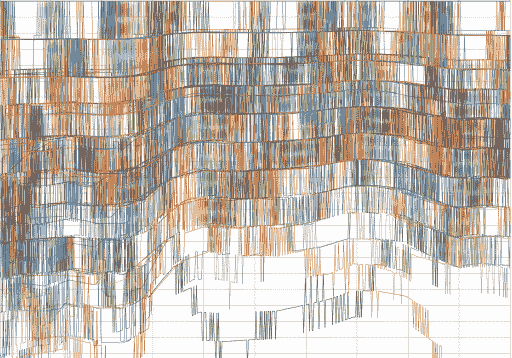

# TWiGCP —“定制仪表板，介绍 Dataproc Metastore 和机密计算合作伙伴”

> 原文：<https://medium.com/google-cloud/twigcp-custom-dashboarding-introducing-dataproc-metastore-and-confidential-computing-partners-1c3fb0fabc07?source=collection_archive---------0----------------------->

过去一周的 GCP 要闻包括:

*   [云监控改进了定制仪表板的创建](http://gtech.run/hzfpb)(谷歌博客)
*   [Dataproc Metastore:完全托管的 Hive metastore 现在公开预览](http://gtech.run/mbdfe)(谷歌博客)
*   [合作伙伴分享关于保密计算的想法](http://gtech.run/3c4mu)(谷歌博客)
*   云数据库使用 PostgreSQL 的新扩展(谷歌博客)
*   继续我们对 Kubernetes 和 CNCF 的长期承诺

来自“现在来点完全不同的…”部门:

*   欢迎来到现代博格蒙艺术博物馆(谷歌博客)

从“应用毫升，从接种疫苗到烘烤，任何规模”部门:

*   [介绍谷歌云情感分析:新冠肺炎疫苗接种战略成功的基础](http://gtech.run/z3yqf)(谷歌博客)
*   人工智能制作的烘焙食谱(谷歌博客)
*   [缩放机器学习预测](http://gtech.run/nbwpp)(谷歌博客)

来自“Anthos 混合云与多云”部门:

*   [今天，谷歌云在混合云和多云上提供的三种方式](http://gtech.run/hseks)(谷歌博客)
*   [Migrate for Anthos 如何改进虚拟机到容器的迁移](http://gtech.run/tyvvv)(谷歌博客)
*   [Anthos 附属集群的记录和监测](http://gtech.run/kfabv)(cloud.google.com)

来自“云扳手，刚刚好”部门:

*   [使用新的自动缩放器自动调整扳手实例的大小](http://gtech.run/m9zeb)(谷歌博客)

来自“云工作流十天”部门:

*   [第 10 天—访问内置环境变量](http://gtech.run/z3sf7)(glaforge.medium.com)

“每月高达 1 TB，无需信用卡”部门:

*   [使用免费公共数据集的云中大数据分析](http://gtech.run/65m86)(谷歌博客)

来自“最新云运行增强和使用案例”部门:

*   [用一个简单的命令](http://gtech.run/9u7fh)构建并部署一个应用到云运行(谷歌博客)
*   【cloud.google.com】配置云运行部署预览
*   【github.com】云运行的无服务器保险库
*   [使用 GitHub 动作部署到无服务器平台](http://gtech.run/t7lv5)(谷歌博客)

来自“安全、运营和$$”部门:

*   [通过政策控制者](http://gtech.run/7p6w5)缓解 CVE-2020–8554(谷歌博客)
*   [多网络接口概述和示例| cloud.google.com VPC](http://gtech.run/phjmr)
*   [GCP IAM 角色解释。何时使用基本 vs .预定义 vs… |阿德里安·沃克维亚](http://gtech.run/xvvpn)(medium.com)
*   [计费报告和保存的成本视图|作者 Mark Mirchandani](http://gtech.run/runqw)(medium.com)

来自“发布/订阅消息生命周期和高级主题”部门:

*   关于谷歌云，我希望知道的事情:第二部分| medium.com，洪杰
*   关于 Pub/Sub，我希望知道的事情(第三部分)|蔡(音)

来自“再见柴油发电机”部门:

*   更清洁的数据中心，包括电池

来自“Istio 首次社区会议”部门:

*   istio con 2021(events . istio . io)

来自“客户和合作伙伴与 GCP 一起解决实际问题”部门:

*   惠康桑格学院在本地经营 Anthos
*   [拉顿+菲尔兹如何在谷歌云上运行 SAP Hybris 和 SAP ERP](http://gtech.run/lqgux)(谷歌博客)

来自“**万物多媒体**”部门:

*   [播客] Kubernetes 播客[第 132 集——Akri，凯特·戈德琳](http://gtech.run/rj7tf)(kubernetespodcast.com)
*   在谷歌云上运行 kot Lin(youtube.com)
*   [视频] [使用 Kubernetes API](http://gtech.run/lew72)(youtube.com)
*   (youtube.com)【视频】[与 JWT 合作保护 REST API，代码](http://gtech.run/wmxq4)

从"**预告，GA，还是什么？**“部门:

*   【GA】[云 SDK 321.0.0](http://gtech.run/wfg8w)
*   [GA] [云监控定制仪表盘](http://gtech.run/drs44)
*   [GA] [两种新的云扳手多区域配置— nam12 和 eur6](http://gtech.run/nrb5s)
*   【GA】[云甲命名的 IP 地址列表](http://gtech.run/5d7lr)
*   [GA][MySQL 的云 SQL，并行复制](http://gtech.run/whla5)
*   [GA] [用于 PostgreSQL 扩展的云 SQL(db link，ip4r，prefix)](http://gtech.run/dbluc)
*   [GA] [云日志设置存储你的日志数据的区域](http://gtech.run/cr2dr)
*   [GA] [Kubernetes 引擎内部入口，用于内部 HTTP(S)负载平衡](http://gtech.run/xnrxa)
*   [GA] [基于 Cloud Dataproc CentOS 8 的 1.5 图像](http://gtech.run/n3jx8)
*   [GA] [Dataproc 工作流超时](http://gtech.run/9fgw3)
*   【GA】[云甲第三方命名 IP 地址列表](http://gtech.run/n98yy)
*   [GA] [用于私有服务访问的 VPC DNS 对等](http://gtech.run/yxwys)
*   [GA] [针对承诺使用折扣的计算引擎建议](http://gtech.run/jzh8w)
*   [GA] [用于 Redis TLS 加密的存储库](http://gtech.run/ul9qr)
*   【GA】[云任务队列不再需要 App Engine app](http://gtech.run/jcjpa)
*   【GA】[AI 平台 TF 2.4.0 深度学习 VM 镜像&容器](http://gtech.run/5lyqz)
*   [GA] [Vision API 内部 OCR](http://gtech.run/43sge)
*   【预览】[云甲新 WAF 规则(方法强制、扫描仪检测、协议攻击、PHP 注入、会话固定)](http://gtech.run/rdzx5)
*   【预览】[云 Dataproc 集群启动/停止](http://gtech.run/23ecj)
*   【预览】[使用私有服务连接访问 Google APIs 和服务](http://gtech.run/nbc46)
*   [预览] [Google Cloud Armor 托管保护增强层](http://gtech.run/qq58a)
*   【预览】 [AI 平台预测用 GPU 自动缩放](http://gtech.run/p2zbc)

本周的图片是“挂毯”，来自“博格蒙抽象艺术博物馆”。看看吧！

这就是本周的全部内容！亚历克西斯