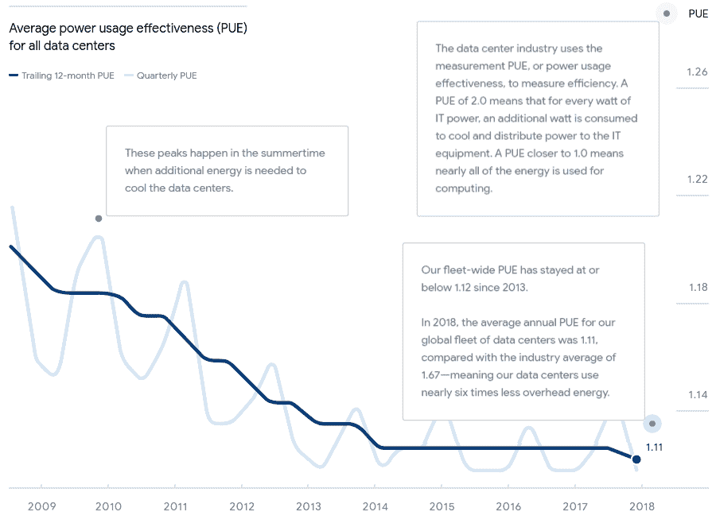

# TWiGCP —“数据中心效率、为 SQL Server 生成云 SQL、reCAPTCHA Enterprise 和 BigQuery Flex 插槽”

> 原文：<https://medium.com/google-cloud/twigcp-data-center-efficiency-gaing-cloud-sql-for-sql-server-recaptcha-enterprise-and-6f495c4f9323?source=collection_archive---------3----------------------->

以下是谷歌云视频系列 本周最新 [**的链接:**](http://gtech.run/ju4em)

*   [宣布谷歌 Kubernetes 引擎的应用管理器](http://gtech.run/2af8p)
*   [利用内置监控功能随时跟踪云指标](http://gtech.run/kaggc)
*   [宣布 Anthos 就绪存储资格](http://gtech.run/842s9)
*   [首尔新 GCP 地区](http://gtech.run/y4kma)

过去一周 GCP 的其他头条新闻包括:

*   [数据中心比以往更加节能](http://gtech.run/wz5ue) (blog.google)
*   [盐湖城的谷歌云区域现已开放](http://gtech.run/xm6ts)(谷歌博客)
*   [将您的 Microsoft SQL Server 工作负载迁移到谷歌云](http://gtech.run/ypk3a)(谷歌博客)
*   [引入 BigQuery Flex 插槽，实现无与伦比的灵活性和控制力](http://gtech.run/lmws3)(谷歌博客)
*   谷歌云(编年史)安全:继续发挥优势(谷歌博客)。Chronicle、reCAPTCHA Enterprise 和 Web Risk API 中新增的威胁检测和时间线功能
*   [云运营随着监控、日志记录等而增长](http://gtech.run/z79nf)(谷歌博客)。Stackdriver 功能现已完全集成到云控制台中。

来自“SQL Server 云 SQL 入门指南”部分:

*   [按照您自己的节奏在谷歌云上试用 SQL Server](http://gtech.run/9pryv)(medium.com)

来自“云 AI 势头”部门:

*   [谷歌云在 Gartner 2020 年云人工智能开发者服务魔力象限中被评为领导者](http://gtech.run/qt6vp)(谷歌博客)

来自“BigQuery momentum”部门:

*   BigQuery 引领现代数据分析之路

来自“BigQuery 的特别之处”部门:

*   [数据仓库中存储和计算的近似分离](http://gtech.run/3sgwa)(medium.com)

来自“Google Cloud 虚拟工作站解决方案”部门:

*   【cloud.google.com】创建虚拟 Windows 工作站
*   【cloud.google.com】创建虚拟 Linux 工作站

来自“云代码中的新 API 管理器”部门:

*   [现在，你可以用云代码](http://gtech.run/kg5rg)探索谷歌云 API(谷歌博客)

来自“GKE 第一天和第二天”部门:

*   GKE 的 Kubernetes
*   [企业多租户的 GKE 最佳实践](http://gtech.run/5289a)(cloud.google.com)

来自“迁移到云本机和无服务器”部门:

*   [将一个整体迁移到谷歌 Kubernetes 引擎(GKE)——分阶段迁移](http://gtech.run/lu8uu)(medium.com)
*   [从 0 到 Google Cloud 上的 dockerized 应用程序的工作无服务器 URL 运行](http://gtech.run/d58wk)(geshan.com.np)

来自“在聊天机器人中使用卡片、图像或自定义有效负载”部分:

*   [如何通过使用定制的有效负载和卡为具有 Dialogflow 的 Hangouts 构建聊天机器人](http://gtech.run/bc9bx)(medium.com)

**从 Beta，GA，还是什么？**“部门:

*   [GA] [云 SDK 282.0.0](http://gtech.run/wfg8w)
*   [GA] [针对 SQL Server 的云 SQL](http://gtech.run/asjaz)
*   【GA】[云数据流 CMEK](http://gtech.run/tbjxh)
*   [GA] [大查询沙箱](http://gtech.run/kfupv)
*   [GA] [GKE 集装箱-本地负载平衡](http://gtech.run/gaetg)
*   [GA] [GCE 设置健康检查和自动修复](http://gtech.run/rssmd)
*   [GA] [云 IAM 条件](http://gtech.run/xktpj)
*   [GA] [将 GPU 附加到 Dataproc 集群](http://gtech.run/u6jnj)
*   [Beta] [GKE 跨集群部署入口](http://gtech.run/5vswa)
*   [云存储文件集](http://gtech.run/rvle)
*   【测试版】[从谷歌云市场部署安全软件代理](http://gtech.run/e67a2)
*   [Beta] [存储日志—自定义保留](http://gtech.run/hfyca)
*   [Beta] [Dataproc —将组件网关与 VPC-SC 一起使用](http://gtech.run/pc3n3)
*   【1.4.0】[斯卡福德 1 . 4 . 0 在此](http://gtech.run/hcm8c)
*   【1.14】[Go 1.14 发布](http://gtech.run/ja9dn)

来自“**万物多媒体**”部门:

*   [播客] Kubernetes 播客[第 92 集 NVIDIA 的加速器和 GPU，Pramod Rama Rao](http://gtech.run/7xds4)(kubernetespodcast.com)
*   gcppodcast.com，GCP 播客第 209 集
*   [视频] [无服务器的容器和云运行——计量数据【youtube.com ](http://gtech.run/fdzj6)
*   [视频] [基于日志的指标—堆栈医生](http://gtech.run/gqrbf)(youtube.com)

本周的图片是谷歌 PUE(电力使用效率)随着时间的推移

这就是本周的全部内容！亚历克西斯