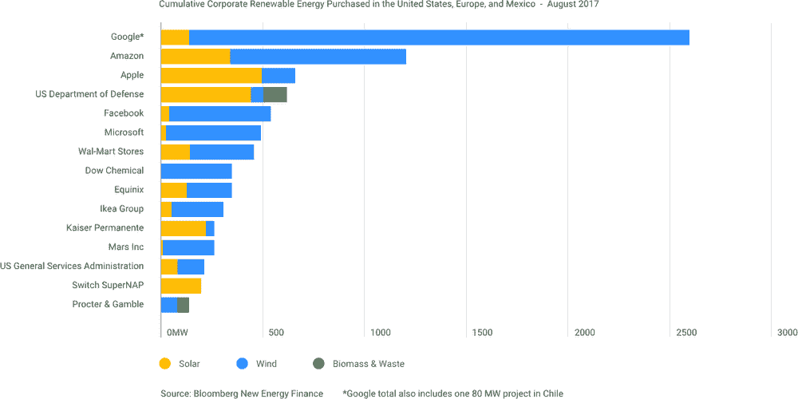

# TWiGCP—“dialog flow & PostgreSQL 即将正式上市。一顿晚餐的价格的 ImageNet 培训(旧金山)

> 原文：<https://medium.com/google-cloud/twigcp-dialogflow-postgresql-going-ga-imagenet-training-for-the-price-of-a-dinner-in-sf-5ff573489d15?source=collection_archive---------2----------------------->

本周来自“毕业与公告”部门:

*   [Dialogflow 企业版现已全面上市](http://goo.gl/nofcUa)(谷歌博客)。SLA 和 v2 API，支持 30 种语言和地区。查看客户故事，并查看 [Dialogflow 博客](http://goo.gl/RwkHy7)。
*   [云 SQL for PostgreSQL 现已正式发布](http://goo.gl/sp8Yun)(谷歌博客)。此版本提供了高可用性(99.95%)、复制、大量扩展和高达 416GB 的 RAM。到更多的 CloudSQL 数据库支持和更多的 PostgreSQL 扩展。
*   [kaniko 简介:在 Kubernetes 和 Google Container Builder 中构建容器映像，无需特权](http://goo.gl/sL8xJH) (Google 博客)。早期但充满希望的日子。
*   新的谷歌云数据中心很有趣，拥有 GCP 最好服务的新数据中心更有趣——“[big query 抵达东京地区](http://goo.gl/NFCFTh)”(谷歌博客)。
*   [为 HashiCorp Vault 改进谷歌云存储后端](http://goo.gl/nnuyRr)(谷歌博客)。现在还提供云存储作为后端、HA 和其他新功能。

[你现在可以在谷歌云 TPU](http://goo.gl/tyRPBr) (dawn.cs.stanford.edu)上花< $50 在< 7.5 小时内训练 ImageNet 达到 93%的准确率。最好的非 TPU 结果是 14.6 小时(大约 2 倍的时间)和大约 358 美元(大约 7 倍的成本)

来自“励志”部门:

*   [为什么构建对环境负责的云很重要](http://goo.gl/x1hVhh)(谷歌云)
*   [用机器学习实时检测癌症](http://goo.gl/4zHFeS) (YouTube)

来自“如何”部门:

*   [Kubernetes 最佳实践:如何以及为什么构建小型容器映像](http://goo.gl/4GhyU1) (Google 博客)。这是一个新的视频系列的一部分。订阅！
*   探索容器安全:保护和捍卫你的 Kubernetes 引擎网络(谷歌博客)

来自“GCP 别处报道”部门:

*   [REST 和 gRPC 并排出现在新的 Google 端点文档中](http://goo.gl/mWnpb6)(apievangelist.com)
*   [大查询惰性数据加载:DDL、DML、分区和半万亿维基百科页面浏览量](http://goo.gl/Hy65SC)(medium.com)
*   【shinesolutions.com】在 BigQuery 中引入基于列的分区
*   [用集装箱船云推出 GKE 集群](http://goo.gl/qMjgu2) (YouTube)

虽然 Istio 推广了术语“服务网格”，但这个 InfoQ 面板可能会帮助您更好地理解它所包含的概念——“使用服务网格的 [*微服务通信和治理*](http://goo.gl/pJVGrt)”(infoq.com)

来自“以防你错过(ICYMI)”部门:

*   [Beta] [HTTP(S)负载平衡后端服务—用户定义的请求头](http://goo.gl/vWU2Qf)
*   [GA] [为虚拟机实例启用嵌套虚拟化](http://goo.gl/MC9o15)
*   [Beta] [查看 Stackdriver 日志中的云源存储库 API 活动](http://goo.gl/JsVDQ2)

GCP 播客最新一集#123 是“ [*后量子密码术与尼克·沙利文和亚当·兰利*](http://goo.gl/RtHwu9)”(gcppodcast.com)

本周图片摘自“[对环境负责的云事务](http://goo.gl/x1hVhh)”帖子:

这星期到此为止！亚历克西斯