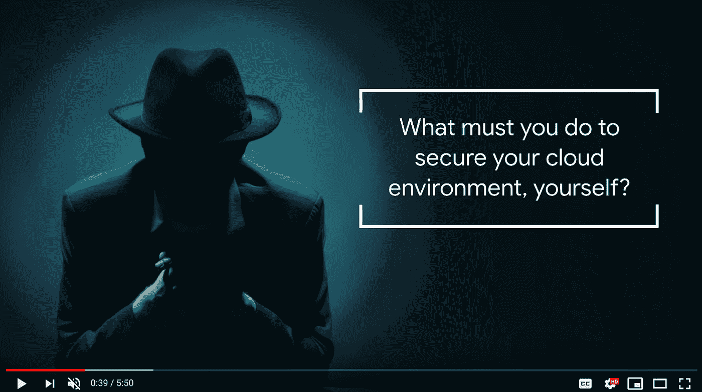

# TWiGCP —“文档 PWA、安全和协调的管道以及 BigQuery 挑战”

> 原文：<https://medium.com/google-cloud/twigcp-documentation-pwa-secure-and-orchestrated-pipelines-and-the-bigquery-challenge-13822257cf91?source=collection_archive---------0----------------------->

以下是谷歌云视频系列 本周最新 [**的链接:**](http://gtech.run/ju4em)

*   [配置连接器桥接库伯内特，GCP 资源](http://gtech.run/f43xk)
*   [在 GKE 上运行 Windows 服务器容器](http://gtech.run/en5ms)
*   [用 SRE 原则追踪辛劳](http://gtech.run/4vtrw)
*   [为游戏开发者大会做好准备](http://gtech.run/yes79)

过去一周 GCP 的其他头条新闻包括:

*   [谷歌云文档获得新外观和新功能](http://gtech.run/jx7p4)(谷歌博客)
*   [利用云数据融合构建更安全的数据管道](http://gtech.run/bcyzf)(谷歌博客)
*   [通过工作流程编排在本地和云中编写管道](http://gtech.run/b59jz)(谷歌博客)
*   [宣布 BigQuery 每周数据挑战](http://gtech.run/plz43)(youtube.com)

来自“应用现代化故事”部门:

*   第一部分(原型)【medium.com 
*   [第二部分(提升&换挡)](http://gtech.run/karaq)(medium.com)

来自“带或不带 Kubernetes 的 RDBMS”部门:

*   [连接云 SQL—Kubernetes Sidecar](http://gtech.run/nj4tt)(medium.com)
*   [medium.com GCP SQL Server 入门](http://gtech.run/zz8pk)

来自“关于 GCP 的更多数据库”部门:

*   InfluxDB 在谷歌云上上线(zdnet.com)
*   [使用 Google Sheets 从 Firestore 导出和导入数据](http://gtech.run/8gll6)(liftcodeplay.com)
*   Firestore 在性能、成本和安全性之间的权衡[(medium.com)](http://gtech.run/k6us7)
*   [云扳手中的序列生成](http://gtech.run/ds6u6)(cloud.google.com)

来自“克鲁德土著”部门:

*   [cloud.google.com GKE 配置同步概述](http://gtech.run/qrezu)
*   [2019 年年报| Knative](http://gtech.run/kydak) (knative.dev)
*   使用服务帐户(medium.com)保护谷歌云功能
*   [使用功能框架和发布/订阅仿真器](http://gtech.run/h5w7a)(medium.com)测试发布/订阅

来自“数据流使用案例”部门:

*   [桌面/设备/Raspberry Pi 上的流媒体对话流](http://gtech.run/4y8um)(medium.com)
*   [使用数据流将 Avro 记录流式传输到 big query](http://gtech.run/jqfg6)(cloud.google.com)

来自“用欺诈检测代码实验室弄脏您的手”部门:

*   [解释利用云人工智能平台的欺诈检测模型](http://gtech.run/z9dbh)(g.co/codelabs)

来自“关于云壳肯定有你不知道的一两件事”部门:

*   [充分利用谷歌云外壳](http://gtech.run/uxf66)(medium.com)

来自“移动数十亿文件和数百 TB”部门:

*   [内部数据概述转移服务](http://gtech.run/ytuyu)(cloud.google.com)

来自“大规模新电视数据集”部门:

*   [谷歌云视频人工智能看十年电视新闻](http://gtech.run/qg8mg)(blog.gdeltproject.org)
*   GDELT 项目博客【blog.gdeltproject.org 上一些视频 API 的 OCR 功能的简单例子

来自我最喜欢的“客户和合作伙伴对 GCP 的最佳评价”部分:

*   [零售商如何在谷歌云上使用 SAP 启动数字化转型](http://gtech.run/p8lrv)(谷歌博客)

**Beta，GA，还是什么？**“部门:

*   [GA] [云 SDK 279.0.0](http://gtech.run/wfg8w)
*   [GA] [创建具有特定名称的托管实例组实例](http://gtech.run/pt9g2)
*   【GA】[监控网络负载均衡](http://gtech.run/qqwl3)
*   [GA] [本地/集群 VPC 和集群主节点之间的路由](http://gtech.run/z2gvw)
*   [GA] [GKE 集群自动缩放配置文件](http://gtech.run/mwt7l)
*   [GA][stack driver Trace API v2](http://gtech.run/b3gpq)
*   [GA] [数据流增强的可观察性，用于批处理和流式管道的故障排除](http://gtech.run/sd5hs)
*   GitHub 应用触发
*   [Beta] [为托管实例组更新程序重新创建模式](http://gtech.run/vwmpn)
*   [Beta] [升级实例的 Redis 版本](http://gtech.run/ajldm)
*   【Beta】[云 IAM 转发规则的条件](http://gtech.run/3ubqb)

来自“**万物多媒体**”部门:

*   [YouTube] [如何保护您的云环境——云安全基础知识](http://gtech.run/5q56n)
*   【YouTube】[GCP 对 Firebase——功能& Firestore](http://gtech.run/yl5zc)
*   【YouTube】[张量处理单元:历史和硬件(AI Adventures)](http://gtech.run/guwkb)
*   【YouTube】[Firebase 生产力提示&窍门#AskFirebase](http://gtech.run/97gtb)
*   [播客] Kubernetes 播客[第 89 集——git lab，Marin Jankovski](http://gtech.run/p7abq)(kubernetespodcast.com)

本周的图片来自新的“云安全基础知识”视频系列

这就是本周的全部内容！亚历克西斯