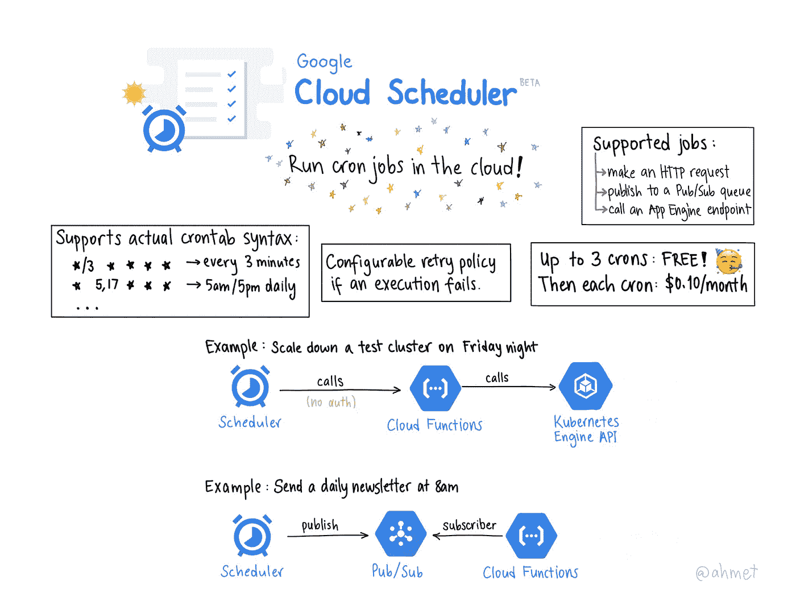

# TWiGCP —“欧盟转移设备、欧洲核子研究中心、创新进展和领导变革”

> 原文：<https://medium.com/google-cloud/twigcp-eu-transfer-appliance-cern-knative-progress-and-a-leadership-change-f7ce9841d9?source=collection_archive---------0----------------------->

以下是过去一周的主要公告:

" [*介绍* ***欧盟*** *用于云数据迁移*](http://goo.gl/ThjC6P) "(谷歌博客)。用正确的工具对抗数据重力。

“ [*亚原子粒子与大数据:谷歌加入****CERN openlab***](http://goo.gl/Fg9aTX)”(谷歌博客)。这听起来像是小事情成就大事业。

" [*宣布****Knative v 0.2****发布*](http://goo.gl/gMZgBL) " (medium.com)。实际上，v0.2.x 包含服务、构建和事件。

"[*Google Cloud****功能安全*** *:现配 FunctionShield 保护*](http://goo.gl/gkR5Zy) " (puresec.io)。对你的谷歌云功能实施严格的安全控制。

" [*谷歌云率先向英伟达* ***特斯拉 T4****GPU*](http://goo.gl/k9xJGf)"(谷歌博客)。

“ [*三年后过渡谷歌云*](http://goo.gl/S1sBPq) ”(谷歌博客)。黛安格林下台，托马斯库里安成为新的谷歌云领导。

来自“如果您不知道从哪里开始使用 Google 数据处理产品”部门:

*   [新报告调查了**云数据平台**的托管 Spark 和 Hadoop 解决方案](http://goo.gl/TxANG8)的经济价值(谷歌博客)
*   [谷歌云上缓慢的 Hadoop/Spark 作业的帮助:关于你的 Hadoop 和 Spark 集群性能的 10 个问题](http://goo.gl/J4ukxh)(谷歌博客)

来自“动手用户报告”部门:

*   [谷歌云上的大规模物联网——尼克·Ord](http://goo.gl/vHLjEi)(medium.com)
*   [在谷歌云平台上处理敏感数据](http://goo.gl/dYJAFG) (blog.ml6.eu)
*   [在 Kubernetes](http://goo.gl/h4Fvcs)(medium.com)上使用 Istio 服务网格的 JHipster 微服务
*   现代前端 CI/CD 架构——缺失的指南(部分。①(medium.com)

来自“数据集的乐趣”部门:

*   【medium.com】[什么时候栈溢出回复:如何用 BigQuery 预测](http://goo.gl/UPuD8p)
*   【机器上的机器学习:建立模型评估 CPU 性能(medium.com)

来自“谷歌的一些专业建议”部门:

*   云功能专家提示:使用重试来构建可靠的无服务器系统
*   [kube flow 管道入门](http://goo.gl/xcWmHp)(谷歌博客)
*   【解决方案】[黑色星期五生产准备](http://goo.gl/W54h9n)(cloud.google.com)
*   [掌控您的数据:使用云 DLP 寻找并保护 PII](http://goo.gl/1HWbXo) (谷歌博客)

来自“你知道他们怎么评价一张(好)照片”部门:

*   [解释谷歌云调度器的快速草图](http://goo.gl/Y7fzDb)(twitter.com)

从“测试版，正式版，还是什么？”部门:

*   [GA] [云 SDK 225.0.0](http://goo.gl/QMtpTC)
*   【GA】[云扳手—在控制台查看查询统计](http://goo.gl/E6J49L)
*   [Beta] [计算引擎——分离并重新连接启动盘](http://goo.gl/jxCeWo)
*   [Beta] [欧盟的 Google Transfer Appliance—ta 100](http://goo.gl/WRQNp9)
*   [Beta] [Cloud Dataproc —确定谁提交了作业](http://goo.gl/94Aqqp)
*   [Beta][Cloud data proc—Presto 顶层组件](http://goo.gl/a6frL5)
*   GCP 的英伟达 T4

来自“所有多媒体”部门:

*   [播客] Kubernetes 播客第 29 集— [工作负载 API 和 KubeCon，Janet Kuo](http://goo.gl/ZWvCNF)(kubernetespodcast.com)
*   gcppodcast.com GCP 播客第 155 集
*   [视频][tensor flow . js 入门](http://goo.gl/2UHMas)(youtube.com)

本周的图片是 Ahmet 解释 Google Cloud Scheduler 的快速草图

这就是本周的全部内容！
——亚历克西斯