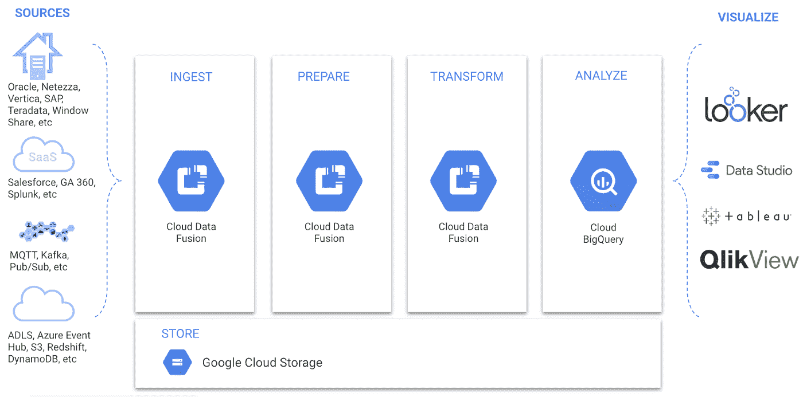

# TWiGCP—“fed ramp、数据融合 GA 和数据库分析师的好评”

> 原文：<https://medium.com/google-cloud/twigcp-fedramp-data-fusion-ga-and-database-analyst-praises-7e50f41574d3?source=collection_archive---------1----------------------->

以下是谷歌云视频系列 本周最新 [**的链接:**](http://gtech.run/ju4em)

*   [宣布数据融合的 GA，通向数据分析的桥梁](https://cloud.google.com/blog/products/data-analytics/introducing-the-code-free-bridge-to-data-analytics-on-google-cloud)
*   [沟通、调试并以最少的努力解决 VPC 服务控制问题](https://cloud.google.com/blog/products/identity-security/unique-identifier-helps-troubleshooting-vpc-service-controls-perimeter)
*   [谷歌云甲增加 WAF，遥测功能](https://cloud.google.com/blog/products/identity-security/understanding-google-cloud-armors-new-waf-capabilities)
*   [Gartner 称谷歌云是运营数据库管理系统的领导者](https://cloud.google.com/blog/products/databases/google-cloud-a-leader-in-gartner-magic-quadrant-for-opdbms)

过去一周 GCP 的其他头条新闻包括:

*   [谷歌云在高德纳 OPDBMS 魔力象限中领先](http://gtech.run/scfc7)(谷歌博客)
*   [谷歌云平台现已获得 FedRAMP 高授权](http://gtech.run/prfm4)(谷歌博客)
*   [ELT 和 ETL 管道的数据融合通用可用性](http://gtech.run/yy58g)(谷歌博客)
*   [新 1.2 版本的春云 GCP 现已正式上市(兼容最新版本的 Spring Boot 和春云)](http://gtech.run/x84p9)(github.com)
*   [用最少的努力沟通、调试和解决 VPC 服务控制问题](http://gtech.run/vhczh)(谷歌博客)

来自“本周云跑”部门:

*   云计算有一个广阔的工具生态系统
*   [云运行教程—服务对服务认证](http://gtech.run/xlwjr)(github.com)
*   [云运行分布式回显示例(经过身份验证的服务间调用)](http://gtech.run/deva4)(github.com)
*   [教程:云运行服务的本地故障排除](http://gtech.run/6slqc)(cloud.google.com)

来自“无服务器谷歌云，超越云运行”部门:

*   [跨谷歌云的无服务器平台迁移的可移植代码](http://gtech.run/quxkk)
*   从云功能调用内部 GKE 服务(medium.com)
*   在谷歌云功能中使用系统包和定制二进制文件(medium.com)

来自“通过用例学习云 AutoML 表”部门:

*   [如何建立更好的情境强盗机器学习模型(带 AutoML 表)](http://gtech.run/7t6hn)(谷歌博客)

来自“替代经验压缩算法的最佳实践”部分:

*   [在生产中使用 SRE 和灾难恢复测试原则(不幸和污垢之轮！)](http://gtech.run/lbqjw)(谷歌博客)
*   [控制谷歌云网络成本](http://gtech.run/gs6d2)(谷歌博客)
*   [云监控和日志分析技巧和工具](/google-cloud/gtech.run/xmrbg)(谷歌博客)
*   [安全意味着了解资产、对手和威胁](http://gtech.run/4f2b9)(forbes.com)

来自“作为一等 GCP 公民的 Terraform(反之亦然)”部门:

*   [使用凡赛堤配置验证器和地形验证器](http://gtech.run/7jg5c)(谷歌博客)
*   [地形课程——GCP 赛道](http://gtech.run/3blmr)(learn.hashicorp.com)

从“多区域 Istio 客户端请求路由至最近的实例”部门:

*   [地理感知 Istio 多集群入口【github.com ](http://gtech.run/bakas)

来自“GDELT 让 Google Cloud APIs 发挥作用”部门:

*   [使用谷歌的云推理 API &云自然语言 API](http://gtech.run/wyk5k) 的 2016 年至 2019 年最重要人物的年表&地点(blog.gdeltproject.org)
*   [使用谷歌的云推理 API &云自然语言 API 创建“热门话题”时间轴](http://gtech.run/47ssq)(blog.gdeltproject.org)

来自“BigQuery，一个词，但有许多用例”部分:

*   [代码问世:SQL+big query](http://gtech.run/9cswm)(towardsdatascience.com)
*   【github.com】Kafka to big query 数据流模板
*   [数据转换，预处理可用在 BigQuery ML](http://gtech.run/cknsc) (Google blog)中

从“你去过谷歌云社区吗？”部门:

*   [谷歌云—开发社区👩‍💻👨‍💻](http://gtech.run/6duhz)(开发到)

从" **Beta，GA，还是什么？**“部门:

*   成本分解报告
*   【GA】[云数据融合](http://gtech.run/w9upn)
*   [GA] [语音转文本自动标点符号 en-US](http://gtech.run/9ghrr)
*   【1 . 2 . 0】[Google 云平台上的 Spring 框架](http://gtech.run/6axhn)
*   [Beta] [云控制台中的 Stackdriver 监控](http://gtech.run/a622z)
*   [VPC 数据包镜像](http://gtech.run/gveaw)

来自“**万物多媒体**”部门:

*   [视频] " [使用谷歌云保护您的应用和用户数据:介绍 AACTT-安全之旅](http://gtech.run/wzd4m)(youtube.com)
*   [视频] " [云运行能处理好这 9 个工作负载吗？—无服务器工具箱](http://gtech.run/s4trc)(youtube.com)
*   [视频][2019 年圣地亚哥 kube con Anthos 日-所有会议](http://gtech.run/4zspb)(youtube.com)
*   [播客] Kubernetes 播客[第 81 集——混沌工程，安娜·玛格丽塔·梅迪纳](http://gtech.run/xs2h2)(kubernetespodcast.com)
*   [播客]gcppodcast.com GCP 播客[第 205 集](http://gtech.run/w2a3t)

本周图片来自数据融合 GA 公告

这就是本周的全部内容！亚历克西斯