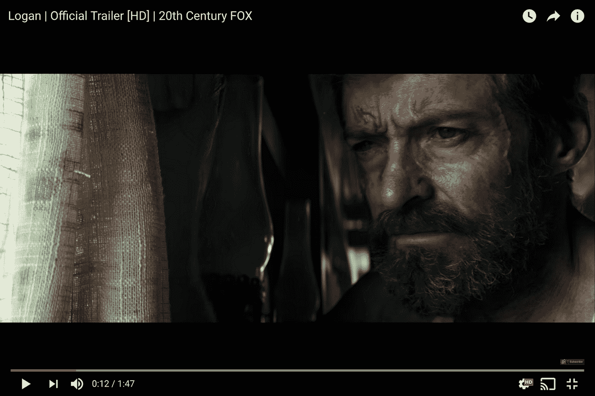

# TWiGCP“Firebase Summit，AppEngine 中的 Node.js 10，以及 7TB 的持久性 NVRAM”

> 原文：<https://medium.com/google-cloud/twigcp-firebase-summit-node-js-10-in-appengine-and-7tb-of-persistent-nvram-d3c2e308221b?source=collection_archive---------0----------------------->

以下是过去一周的主要公告:

"[*Firebase Summit 2018*](http://goo.gl/j77opZ)有什么新消息"(firebase.googleblog.com)。测试版正式支持，新的 Firebase 管理 API，改进的 ML 工具包，新的本地云 Firestore 仿真器，Data Studio 模板，等等！哦，该团队还庆祝了 150 万每月活跃的 Firebase 应用程序！

“ [*Node.js 10 可用于 App Engine，配合长期支持*](http://goo.gl/xzg17S) ”(谷歌博客)。其中习惯性意味着理解开发人员，包括他们的软件节奏。

“ [*谷歌云首发:英特尔 Optane DC 持久内存*](http://goo.gl/SWA3Se) ”(谷歌云博客)。高达 7 TB 的永久 NVRAM！

" [*云实例能比裸机表现更好吗？最新的 STAC-M3 基准测试结果是肯定的(谷歌博客)*](http://goo.gl/XsYSkk)

“ [*把企业网络安全控制带到你在 GKE 的 Kubernetes 集群上*](http://goo.gl/t9QiRf) ”(谷歌博客)。专用集群、主授权网络和共享 VPC。

" [*Kubeflow 0.3 简化设置&提升 ML 开发*](http://goo.gl/inoJ4F) " (kubeflow.org)。新的部署工具 kfctl，超参数调优，PyTorch 算子与 TensorFlow 的奇偶校验，更多的 TFX 库，XGBoost 的新例子，GPU 推断等。

来自我仍然最喜欢的“客户最好谈论 GCP”部分:

*   [Optiva Inc .案例研究](http://goo.gl/vNGW3Y)(cloud.google.com)# cloud spanner
*   [Streak 如何在 Cloud Spanner 上建立图形数据库来处理数十亿封电子邮件](http://goo.gl/Zfuyx9)(谷歌博客)

来自“操作方法”部门:

*   [20 世纪福克斯如何使用 ML 预测电影观众](http://goo.gl/MXfos6)(谷歌博客)
*   [使用 Google Kubernetes 引擎削减成本:使用集群自动缩放器和可抢占虚拟机](http://goo.gl/W5uPbA) (Google 博客)
*   [探索容器安全:运行并连接到 Kubernetes 上的 hashi corp Vault](http://goo.gl/dW8FVa)(谷歌博客)
*   [从零开始的无服务器:用数据库连接云功能(第三部分)](http://goo.gl/nMXvcU)(谷歌博客)
*   [利用云数据平台的灵活性和可预测性运行 Apache Spark 和 Apache Hadoop 工作负载](http://goo.gl/QTseRJ)(谷歌博客)
*   [将谷歌云构建与 JFrog Artifactory 整合](http://goo.gl/n7RWMU)(谷歌博客)
*   用机器学习对国会法案进行分类(medium.com)
*   OpenCensus 和 Firestore Native(medium.com)

从“gRPC-Web 会改变你对 REST 的看法吗？”部门:

*   特使和 gRPC-Web:REST 的全新替代方案

来自“仍有许多有待发明”部门:

*   [用于 BERT](http://goo.gl/7r8fDv)(github.com)的张量流代码和预训练模型
*   [介绍 AdaNet:具有学习保证的快速灵活的 AutoML](http://goo.gl/MY8YNW)(ai.googleblog.com)

来自“没有 BigQuery 的 TWiGCP 是什么？”部门:

*   [Python PyPI stats in big query:re clustered](http://goo.gl/pYeVqj)(towardsdatascience.com)
*   [现代数据仓库与 BigQuery: a Q & A 与工程总监 Jordan Tigani](http://goo.gl/G4jSbY)

来自“我们需要您的意见”部门:

*   迈克尔·麦克唐纳问道"[你会用云函数 API 网关做什么？【forms.google.com】(T21)插话！](http://goo.gl/GxgWDY)

来自“你知道的越多”部门:

*   [了解谷歌云医疗 API:第一部分](http://goo.gl/Er2xvm)(谷歌博客)
*   容器运行时第 3 部分:高级运行时(ianlewis.org)

从“测试版，正式版，还是什么？”部门:

*   [GA] [云 SDK 223.0.0](http://goo.gl/QMtpTC)
*   [GA] [Stackdriver Trace 基于消耗的定价](http://goo.gl/2iRFi2)
*   [Beta] [云 Firestore 本地仿真器](http://goo.gl/u1MbqD)
*   [Beta] [视频智能 API —对象跟踪、文本检测(OCR)](http://goo.gl/mG9RYT)
*   【2.8】[阿帕奇光束 2.8.0](http://goo.gl/8Wy8vf)
*   [0.3] [库贝弗洛 0.3](http://goo.gl/inoJ4F)

来自“所有多媒体”部门:

*   [Kubernetes 教程:如何在 Google Kubernetes 引擎上故障转移 MySQL(youtube.com GKE)](http://goo.gl/rFpuUK)
*   [tensor flow . js 入门](http://goo.gl/p4hssA)(youtube.com)
*   [ska ffold——当地 Kubernetes 开发变得简单](http://goo.gl/BwXNFz)(youtube.com)
*   [Firebase Summit 2018 的所有视频](http://goo.gl/3yFhXW)(youtube.com)
*   gcppodcast.com GCP 播客#153 — [巴泽尔与托尼·阿尤托](http://goo.gl/WZmFU1)
*   Kubernetes 播客# 27—[Kubernetes 社区的发展，Sarah Novotny](http://goo.gl/g1qj8w)(kubernetespodcast.com)
*   [谷歌涂鸦——2018 年万圣节](http://goo.gl/nr8qXD)(google.com)# GCP #公开赛

本周的图片是洛根预告片的第 12 秒，取自[“20 世纪福克斯如何使用 ML 预测电影观众”帖子](http://goo.gl/MXfos6)。

这就是本周的全部内容！亚历克西斯