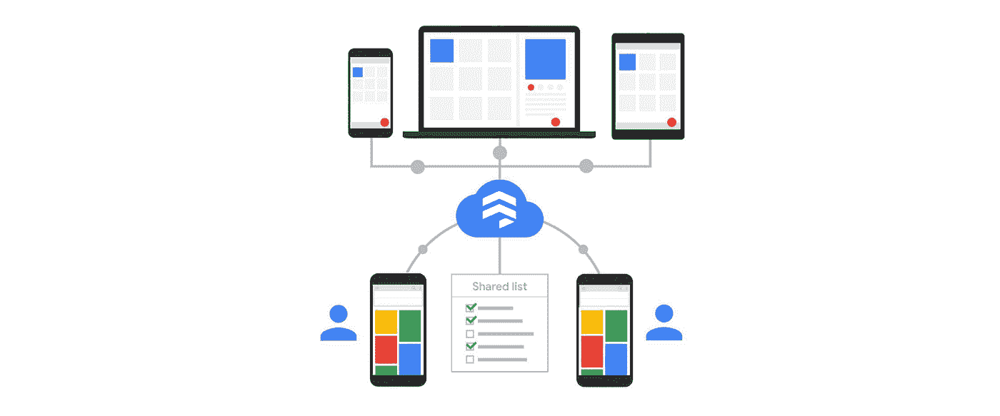

# twi GCP—“Firestore Goes GA、GKE 使用计量和 Kubernetes Spark Operator”

> 原文：<https://medium.com/google-cloud/twigcp-firestore-goes-ga-gke-usage-metering-and-kubernetes-spark-operator-400186222eba?source=collection_archive---------4----------------------->

以下是过去一周的主要新闻:

“ [*无服务器时代的 NoSQL:宣布云 Firestore 全面上市并更新*](http://gtech.run/cuc32) ”(谷歌博客)。GA 附带了 SLA、新区域等。激动人心的时刻！

“ [*数据分析，满足容器:Kubernetes Operator for Apache Spark 现处于测试阶段*](http://gtech.run/r9jh2) ”(谷歌博客)。可从 Kubernetes 的 GCP 市场获得—从 Kubernetes 本地管理您的 Spark 应用程序。

[*GKE 使用计量:到底是谁的行项目？*](http://gtech.run/7xj6h) (谷歌博客)。多租户 Kubernetes 集群中按名称空间和标签细分的资源使用情况。

" [*云迁移项目随着 Velostrata 迁移浪潮从 Google Cloud*](http://gtech.run/qaxhm)(Google blog)移动得更快。基于生产水平、规模、对业务的重要性等进行批量工作负载迁移…

来自“数据工作室胜过一千张图片”部门:

*   [用 Data Studio 社区可视化构建一个定制的数据 viz](http://gtech.run/cye2v)(谷歌博客)
*   [Data Studio 中更丰富的交互性(最近发布)](http://gtech.run/rak64)(谷歌博客)

来自“how-to and hacking”部门:

*   云中的橄榄球:与 towardsdatascience.com 的 GCP 一起在足球上进行黑客攻击
*   [构建无服务器网络游戏:谷歌云平台上的云英雄](http://gtech.run/he968)(谷歌博客)
*   [利用云发布/订阅的重播进行可靠的流媒体管道开发](http://gtech.run/px8xv)(谷歌博客)。如果你有一个*倒带*按钮，你会怎么做？
*   [在 SAP 云平台上使用 GCP 服务创建智能企业应用](http://gtech.run/hkcmt)(谷歌博客)

来自“务实物联网”部门:

*   [将 Sigfox 物联网网络与谷歌云平台整合](http://gtech.run/fvazg)(cloud.google.com)
*   [云物联网循序渐进:生活质量提示—命令行](http://gtech.run/ux5sb)(medium.com)

来自我最喜欢的“客户和合作伙伴对 GCP 的最佳评价”部分:

*   [云 Bigtable 为预知者带来数据库稳定性和性能](http://gtech.run/gcrty)(谷歌博客)
*   【youtube.com，谷歌云帮助 DSW 吸引超过 2800 万名鞋迷
*   【芬兰分子医学研究所(FIMM)(edu.google.com)
*   [AB Tasty 案例研究](http://gtech.run/rlnta)(cloud.google.com)
*   [MD.ai 案例研究](http://gtech.run/8hjcf)(cloud.google.com)

来自“Apigee 与 GCP 越来越近”部门:

*   [通过增强的 Apigee 开发者门户网站改善开发者体验](http://gtech.run/vdbfl)(谷歌博客)
*   [来年的 API](http://gtech.run/l95fv)(apigee.com)

来自“云数据是 GCP 最好的秘密吗？”部门:

*   使用 Cloud Dataproc 构建长期运行集群的 10 个技巧
*   [Cloud Dataproc 在 YARN 上遇到 TensorFlow:让 TonY 帮助你在集群中正确训练](http://gtech.run/uh6aa)(谷歌博客)

来自“张量流和 ML 所有事物”部门:

*   [用 AdaNet](http://gtech.run/l2vck)(medium.com)将多个 TensorFlow Hub 模块组合成一个系综网络
*   [卫星:用 tensor flow【github.com 整理了&关于深度学习的有用资源](http://gtech.run/63lvg)
*   [BigQuery ML 通过计算封闭形式的解变得更快(有时)](http://gtech.run/vy4ak)(medium.com)
*   [深度学习图片修订版 M19。TensorFlow 2.0 实验版](http://gtech.run/j9vr4)(blog.kovalevskyi.com)

来自“无服务器功能、应用和 Knative”部门:

*   一个爱情故事(medium.com)
*   [谷歌云平台上简单的无服务器数据管道](http://gtech.run/xcmkd)(medium.com)
*   [Firebase:在 Go](http://gtech.run/ux62u)(medium.com)中开发无服务器功能
*   [更新谷歌表单(Codelab)的功能](http://gtech.run/ldwql)(g.co/codelabs/cloud)
*   【谷歌云平台上的无服务器:无服务器商店演示简介(medium.com)

来自“媒体上总有更多的 GCP”部门:

*   [因此，您需要更新您的 GCP 云解决方案架构师认证！](http://gtech.run/fye4x)(medium.com)
*   [面向 MacOS 的 Kubernetes 开发工作流程💻](http://gtech.run/5mu9u)(medium.com)
*   [如何启动并运行云身份感知代理](http://gtech.run/s2nej)(medium.com)

从“测试版，正式版，还是什么？”部门:

*   【GA】[云 SDK 232.0.0](http://gtech.run/wfg8w)
*   [GA] [分离和重新连接启动盘](http://gtech.run/vpmx2)
*   【GA】[防火墙规则记录](http://gtech.run/fn6fa)
*   [GA] [基于 DNS 的服务发现支持内部 TCP/UDP 负载平衡](http://gtech.run/cqq7x)

来自“所有多媒体”部门:

*   [播客] Kubernetes 播客第 38 集— [Kubernetes 的失败故事，由 Henning Jacobs](http://gtech.run/7vhcq) 主持(kubernetespodcast.com)
*   [播客]谷歌云播客#160 — [马克·希曼尼和维尔·艾卡斯【gcppodcast.com 合作](http://gtech.run/xmmuc)
*   [视频] [谷歌云平台免费试用和免费等级](http://gtech.run/63b6x)(youtube.com)
*   【视频】[瓶中的 BeyondCorp(系列)](http://gtech.run/bzs8m)(youtube.com)

本周图片为 Cloud Firestore 登陆 GA

这就是本周的全部内容！亚历克西斯