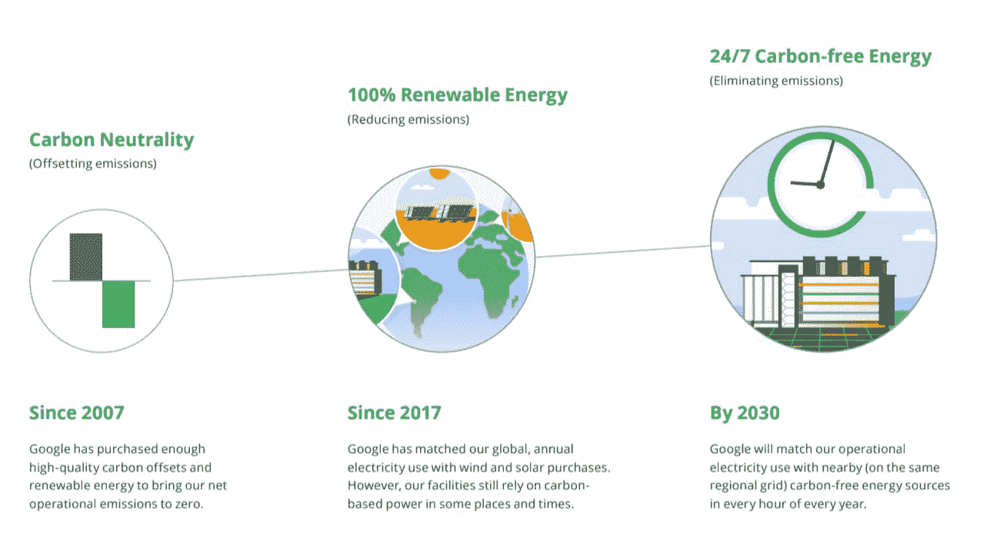

# twi GCP——“从可再生到无碳”

> 原文：<https://medium.com/google-cloud/twigcp-from-renewable-to-carbon-free-101a5b278b68?source=collection_archive---------0----------------------->

来自“其他公告有点无意义”部门:

*   谷歌云的目标是为其数据中心提供无碳能源

来自“合作会见客户”部门:

*   [GKE 支持新的软件定义的 NetApp 云卷服务](http://gtech.run/mvbhb)(谷歌博客)

来自“安全性不一定很难”部门:

*   [gVisor:保护现实世界中的 GKE 和无服务器用户](http://gtech.run/pcydc)(谷歌博客)
*   新的谷歌云白皮书:充分利用你的云密钥管理服务

来自“无服务器 DevX(开发者体验)”部门:

*   [现在，为云运行设置持续部署变得轻而易举](http://gtech.run/vgxqa)(谷歌博客)
*   [使用云代码简化云运行开发](http://gtech.run/ff96v)(谷歌博客)
*   [让我们比较一下 AWS、微软 Azure 和谷歌云平台](http://gtech.run/vlhnd)(seroter.com)提供的 CLI 体验

来自“关注虚拟机，许多工作负载的基础”部门:

*   [让管理 Windows 服务器虚拟机变得更加容易](http://gtech.run/uzems)(谷歌博客)
*   [计算引擎解释:大规模操作系统更新的最佳实践](http://gtech.run/ery35)(谷歌博客)
*   [调查并解决计算引擎像 detective🕵一样冷启动🏽斯蒂芬妮·王](http://gtech.run/dburf)(medium.com)‍♀️

来自“计算引擎迁移”部门:

*   [入门【cloud.google.com ](http://gtech.run/tzxzn)
*   [迁移您的虚拟机](http://gtech.run/y6w9j)(cloud.google.com)
*   奠定你的基础(cloud.google.com)

来自“面向运营和开发人员的云 SQL”部门:

*   [从云 SQL 导出数据，没有性能开销](http://gtech.run/p976g)(谷歌博客)
*   [招数&招数。使用 Google Cloud SQL 和 Node.js… |作者康斯坦丁·塔库斯](http://gtech.run/qwx46)(medium.com)

来自“日志查询您的方式或云方式”部门:

*   [在云日志](http://gtech.run/cegca)(谷歌博客)中使用建议查询测试版快速分析您的日志
*   [在云日志中使用新的正则表达式支持的技巧和诀窍](http://gtech.run/twk2w)(谷歌博客)

来自“如果您或您的管理层关心分析师报告”部门:

*   [谷歌领先于 Gartner 的 CIPS MQ](http://gtech.run/67mu4) (谷歌博客)
*   Forrester 称谷歌云是基于笔记本的预测分析和机器学习的领导者

来自我最喜欢的“客户用 GCP 解决现实世界的问题”部分:

*   [德意志交易所选择谷歌云 VMware 引擎](http://gtech.run/w7sd5)(谷歌博客)
*   [推动变革:Geotab 如何通过谷歌云实现应用的现代化](http://gtech.run/842tj)(谷歌博客)
*   [数据仓库迁移技巧:准备和发现](http://gtech.run/stq8p)(谷歌博客)

来自“**万物多媒体**”部门:

*   [视频] [“升级—资产跟踪”](http://gtech.run/3kwel)(youtube.com)
*   [播客] Kubernetes 播客[第 121 集——TiKV、TiDB 和 PingCAP，由 Ed Huang](http://gtech.run/reurg)(kubernetespodcast.com)主演
*   gcppodcast.com GCP 播客[第 236 集——宜家零售(英格卡集团)和马修·劳森](http://gtech.run/9jzjm)

**Beta，GA，还是什么？**“部门:

*   [GA] [云 SDK 310.0.0](http://gtech.run/wfg8w)
*   [GA] [有状态受管实例组](http://gtech.run/ccxxk)
*   [GA] [捕获虚拟机截图](http://gtech.run/2th6d)
*   【测试版】[机密虚拟机](http://gtech.run/azdke)
*   [Beta] [云分析器—查看历史趋势](http://gtech.run/9cz73)
*   [Beta] [在网络间迁移虚拟机](http://gtech.run/bqrqb)

本周的图片摘自“全天候清洁能源云邮报”

这就是本周的全部内容！

-亚历克西斯