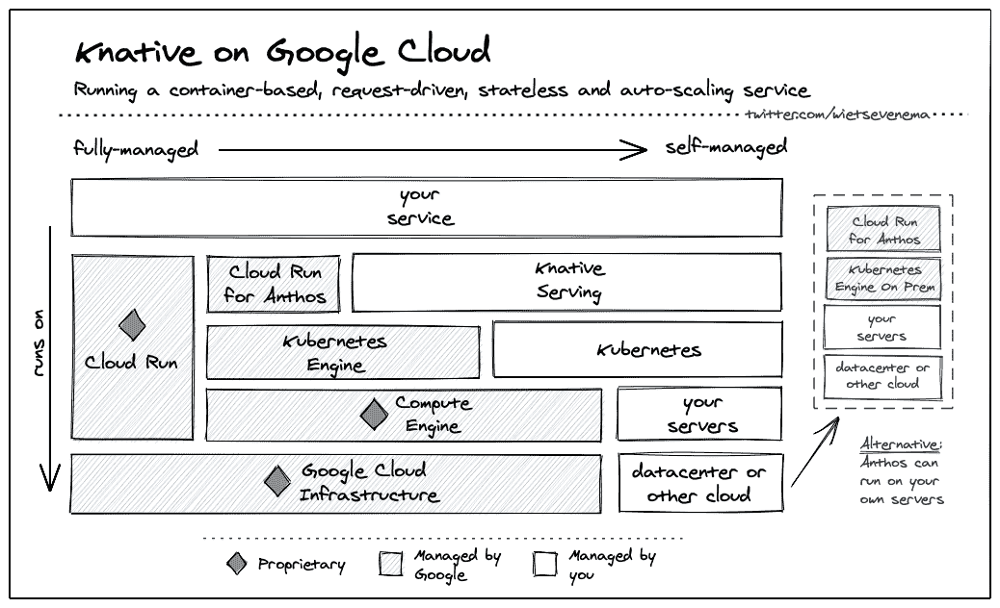

# TWiGCP—“G Suite(面向开发人员)、推荐 AI 和无代理服务”

> 原文：<https://medium.com/google-cloud/twigcp-g-suite-for-developers-recommendations-ai-and-proxyless-services-cb54467bb8e6?source=collection_archive---------2----------------------->

Cloud Next OnAir 现已结束第 2 周(共 9 周):“**生产力和协作**

以下是相关链接:

*   给在场的从业者——[《谷歌云对话 DevRel》](http://gtech.run/q5uhz)
*   [谷歌云第二周回顾下一个 20 年:OnAir](http://gtech.run/pemtl)
*   接下来是一个巧合:[所有的公告都在一个地方](http://gtech.run/x385a)
*   [您的 Google Cloud Next’20:on air 备忘单](http://gtech.run/swr7a)

[第 3 周"**基础设施**"将于明天周二](http://gtech.run/x339g)开幕，届时将有一场新的主题演讲和数十场技术会议。

过去一周的 GCP 要闻包括:

*   [安全第一:宣布 11 项新的 G 套件安全特性](http://gtech.run/hgy9y)(谷歌博客)
*   [用 G Suite 开发者平台构建一个更简单、无缝的工作空间](http://gtech.run/5fg64)(谷歌博客)
*   [流量总监和 gRPC——为您的服务网格提供无代理服务](http://gtech.run/ctbdn)(谷歌博客)
*   [在外部 HTTP(S)负载平衡器中使用新的流量控制功能](http://gtech.run/99led)(谷歌博客)
*   网上购物变得更加个性化
*   给你更好的成本分析能力——和更简单的发票

来自“G 套件与开发人员”部门:

*   [为什么你应该把你的应用程序脚本项目作为 G Suite 插件来分享](http://gtech.run/4xxwf)(谷歌博客)
*   [一键式同步从谷歌工作表到 BigQuery 表格|艾伦·戴](http://gtech.run/dhp2l)(medium.com)

来自“没有洞察力的数据只是数据”部门:

*   [借助谷歌云](http://gtech.run/6ufm6)AutoML[gtech.run/6ufm6](https://gtech.run/6ufm6)(谷歌博客)改进客户反馈管理
*   [用 BigQuery 分析冠状病毒表位数据|作者 Jignesh Mehta](http://gtech.run/lrqjd)(medium.com)

来自“云原生数据处理”部门:

*   [使用托管 Kafka](http://gtech.run/ujkzn) (谷歌博客)迁移和现代化您的本地数据湖
*   [GCP 上的流数据生成器数据流灵活模板|作者 prat hap Reddy](http://gtech.run/s2hdq)(medium.com)

来自“云原生操作方法”部门:

*   [Deploying Service or Ingress on GKE | by Joaquín Menchaca (智裕)](http://gtech.run/da4uc) (medium.com)
*   Knative v0.16.0 更新|由 Mete Atamel(medium.com)

来自“本周云跑”部门:

*   [使用云运行服务多个地区的用户](http://gtech.run/uyrml) (ahmet.im)
*   [Firebase 托管和云运行缓存| Neil Kolban](http://gtech.run/aytqt)(medium.com)
*   [R 职能框架|作者格兰特·蒂默曼](http://gtech.run/ct8mr)(medium.com)

摘自“Jaana 的作品总是很好地利用时间”部分:

*   [扳手的 SQL 故事|作者亚娜·多安](http://gtech.run/gkppx)(medium.com)

来自“每个 GCP 从业者都应该了解服务客户”部门:

*   [服务帐户凭证管理:如何改善您的安全状况|作者胡里奥·迭斯](http://gtech.run/ur299)(medium.com)

来自“**万物多媒体**”部门:

*   [视频播客][Istio 如何提高可靠性:采访谷歌【youtube.com 项目经理丹·奇鲁利](http://gtech.run/fyh84)
*   [播客] [第 14 集:数字原生播客——谷歌 BigQuery 产品管理总监乔丹·蒂加尼](http://gtech.run/h3rsp)(youtube.com)
*   [视频] [云功能 vs .云运行](http://gtech.run/548dz)(youtube.com)
*   [播客] Kubernetes 播客[第 113 集——乐器和指挥，大卫·阿什波尔](http://gtech.run/w6qgv)(kubernetespodcast.com)
*   gcppodcast.com，GCP 播客第 228 集

**从 Beta，GA，还是什么？**“部门:

*   [GA] [云 SDK 301.0.0](http://gtech.run/wfg8w)
*   安托斯·GKE 在 AWS 上
*   【嘎】 [GKE 发布渠道](http://gtech.run/v664g)
*   [GA] [使用 VPC 服务控件与人工智能平台培训](http://gtech.run/nx77g)
*   [GA] [通过 AI 平台培训使用客户管理的加密密钥(CMEK)](http://gtech.run/ue827)
*   【GA】[云存储细粒度访问控制](http://gtech.run/yd8vf)
*   交通总监无代理 gRPC
*   【GA】[将云计费数据导出到 BigQuery](http://gtech.run/tldcg)
*   [GA] [针对 Anthos 托管 TLS 证书和 HTTPS 的云运行](http://gtech.run/pk3fg)
*   【Beta】[建议 AI](http://gtech.run/zltjp)
*   [Beta] [容器优化的操作系统—使用 GPU 加速器运行实例](http://gtech.run/rqb6m)
*   【测试版】[谷歌云功能——Python 3.8](http://gtech.run/cs64b)
*   [无服务器 VPC 访问共享 VPC](http://gtech.run/grlcs)
*   [Beta] [Anthos 配置管理—层级控制器概述](http://gtech.run/l74du)
*   [谷歌云甲命名 IP 地址列表](http://gtech.run/ctcea)
*   [Beta] [预配置晶圆规则 RCE，LFI，RFI](http://gtech.run/vwhgv)

本周的图片由 Wietse 提供

这就是本周的全部内容！亚历克西斯