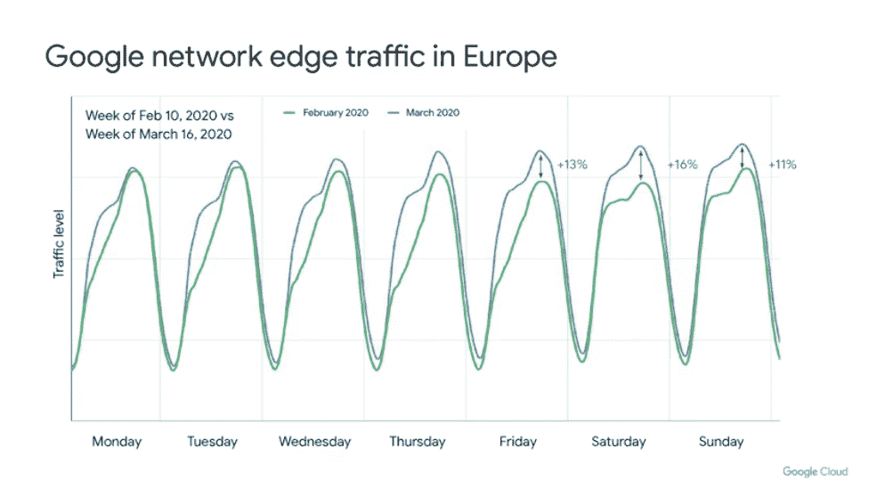

# TWiGCP —“游戏服务器在这里，Anthos 1.3 和 Kubernetes 1.18 也在这里”

> 原文：<https://medium.com/google-cloud/twigcp-game-servers-are-here-and-so-are-anthos-1-3-and-kubernetes-1-18-17e008fb97b8?source=collection_archive---------2----------------------->

过去一周的 GCP 要闻包括:

*   [谷歌云的冠状病毒应对](http://gtech.run/5tsdb)(谷歌博客)
*   [简化全球游戏管理:引入游戏服务器](http://gtech.run/vkhu)(谷歌博客)
*   【cloud.google.com】Anthos 1.3 出来了
*   [Kubernetes 1.18:Fit&Finish](http://gtech.run/cdlz6)(Kubernetes . io)
*   有了 FME (谷歌博客)，将地理空间数据加载到 BigQuery 变得更加容易

来自“利用最新产品和功能”部门:

*   [Secret Manager:不改代码提高云运行安全性](http://gtech.run/sfmg6)(medium.com)
*   [通过 VPC 对等简化路由](http://gtech.run/2wtp7)(medium.com)
*   [掌握语音代理对话流中的自动语音适配](http://gtech.run/8nm4a)(medium.com)
*   [谷歌云数据目录文件集:释放其全部潜力](http://gtech.run/sv4h3)(medium.com)

从“致房间里所有的 Java 开发人员”部门:

*   [infoq.com Spring Boot 教程:构建部署到谷歌云的微服务](http://gtech.run/zcynf)

来自“是，并且…”部门:

*   [Google Cloud Run 真的是 Knative 吗？](http://gtech.run/5rghz) (ahmet.im)

来自“解决披头士和滚石的纠纷”部门:

*   [处理 10TB 的维基百科页面浏览量——第二部分——马克·科恩](http://gtech.run/epma6)(medium.com)

来自“参考体系结构和解决方案”部门:

*   [基因组数据处理参考架构](http://gtech.run/vqsm5)(cloud.google.com)
*   [在计算引擎上为 Windows 设置 Chrome 远程桌面](http://gtech.run/ggr9p)(cloud.google.com)

从“您选择的 Google Cloud YouTube 节目的播放列表”部门:

*   [云安全的三大平台风险](http://gtech.run/gbmsp) —云安全基础知识
*   [如何建立机器学习策略](http://gtech.run/uvx3g) —着眼企业
*   [带负载平衡的容量管理](http://gtech.run/4ev2d)(在云端烹饪)
*   [发布/订阅—重放和丢弃消息。10](http://gtech.run/36kj5)
*   [kube flow 简介— Kubeflow 101](http://gtech.run/c99sm)

来自“谷歌游戏开发峰会 YouTube 视频”部门:

*   [龙之旅如何使用云扳手处理数百万玩家](http://gtech.run/aey2r)
*   [如何通过开放比赛使多人配对变得更容易和可升级](http://gtech.run/pcsvs)
*   [Unity 游戏模拟:用 Unity 和 GCP 找到完美的平衡](http://gtech.run/4na9x)
*   [用谷歌云和不可能的事情构建游戏分析在线服务](http://gtech.run/45y54)
*   [通过游戏服务器和 Agones 进行全球扩展](http://gtech.run/xv5td)

来自“**万物多媒体**”部门:

*   Kubernetes 播客[第 96 集——Kubernetes 1.18，Jorge alar con【kubernetespodcast.com ](http://gtech.run/42gyq)
*   gcppodcast.com，GCP 播客[第 213 集——亚历克斯·布拉姆利的 SLOs 艺术](http://gtech.run/7yc56)

**Beta，GA，还是什么？**“部门:

*   [GA] [云 SDK 286.0.0](http://gtech.run/wfg8w)
*   【GA】[云 IAM 转发规则的条件](http://gtech.run/hsdk8)
*   [GA] [AutoML 自然语言 20+语言](http://gtech.run/4eg9d)
*   [GA] [云 Bigtable 1–2 节点生产实例](http://gtech.run/9w82t)
*   [GA] [定制原产地云 CDN](http://gtech.run/elzm3)
*   安托斯 1.3 版
*   [GA] [安索斯 GKE 本地 1.3](http://gtech.run/5bj59)
*   安索斯·GKE 将负载平衡与跷跷板捆绑在一起
*   [GA] [使用带有 Dataproc 的 Presto](http://gtech.run/97hlk)
*   【GA】[data proc 最小 CPU](http://gtech.run/lvnvc)
*   【GA】[云功能 VPC 服务控件](http://gtech.run/vg7nt)
*   【GA】[云甲基于地理的访问控制](http://gtech.run/3wuhs)
*   [GA] [对 96 个核心虚拟机的云 SQL 支持](http://gtech.run/fblc8)
*   [GA] [存储转移服务](http://gtech.run/ttexw)
*   谷歌游戏服务器
*   [Beta] [BigQuery 数据传输服务—谷歌商业中心传输](http://gtech.run/z4g24)
*   [Beta] [BigQuery 列级安全性](http://gtech.run/94h2b)
*   微软 Azure Blob 存储的云存储转移服务
*   [Beta] [Dataproc Ranger 组件](http://gtech.run/r8atd)
*   [memory store Redis 5.0 版本](http://gtech.run/fuzad)

本周图片摘自“谷歌云的冠状病毒应对”帖子

这就是本周的全部内容！亚历克西斯