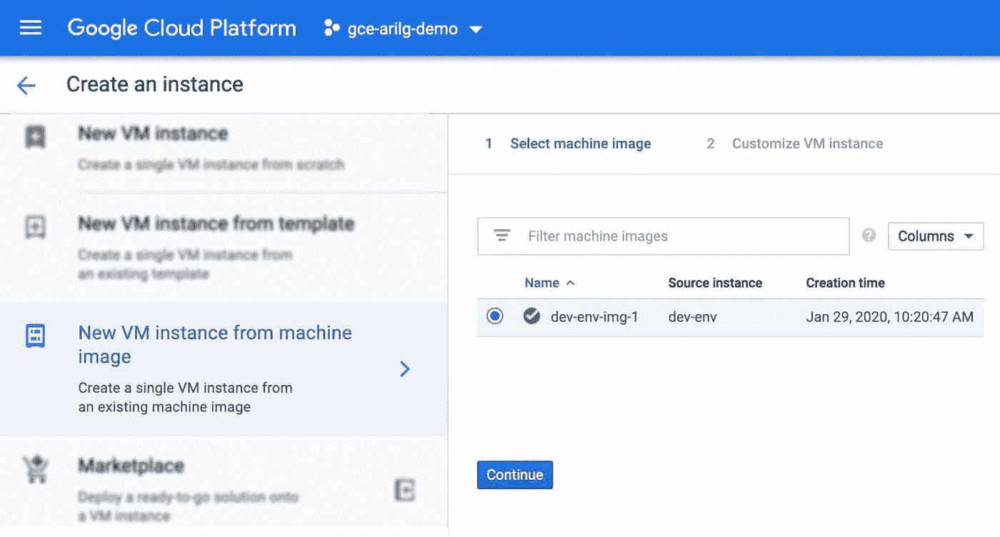

# twi GCP—“GCE 图像、GKE 应用身份、人工智能管道、9TB 固态硬盘和 Redshift、S3 迁移工具”

> 原文：<https://medium.com/google-cloud/twigcp-gce-images-gke-app-identity-ai-pipelines-9tb-ssds-and-redshift-s3-migration-tools-1df4ec9eb8f4?source=collection_archive---------1----------------------->

以下是谷歌云视频系列 本周最新 [**的链接:**](http://gtech.run/ju4em)

*   [计算引擎获取机器图像](http://gtech.run/8k9lk)
*   [自动化部署管道来到 GKE](http://gtech.run/va5qm)
*   [使用 API 的云监控仪表板](http://gtech.run/wgba8)
*   [将 Monolith 迁移到 Google Kubernetes 引擎(GKE)——分阶段迁移](http://gtech.run/h9666)

过去一周 GCP 的其他头条新闻包括:

*   [使用机器映像轻松创建计算引擎实例](http://gtech.run/cz3pd)(谷歌博客)
*   [介绍工作负载身份:为您的 GKE 应用程序提供更好的身份验证](http://gtech.run/4t74e) (Google 博客)
*   [本地固态硬盘+ VMs =一见钟情(tera)字节](http://gtech.run/a6g4d)(谷歌博客)
*   [引入云人工智能平台管道](http://gtech.run/sypa6)(谷歌博客)
*   新的红移、S3 迁移工具使现代分析变得容易(谷歌博客)
*   [使用数据流 SQL](http://gtech.run/p4rfx)(cloud.google.com)

来自“大数据发布和操作方法”部门:

*   [tensor flow Extended(blog.tensorflow.org):使用 Apache Beam 进行大规模数据处理](http://gtech.run/y6rcq)
*   在市场上获取 Kubernetes 的 Flink 运营商
*   [Apache Spark 和 Jupyter 笔记本通过 Dataproc 组件网关变得简单](http://gtech.run/brtwz)(medium.com)
*   [在十年电视新闻档案上比较谷歌云视频 API 的语音转录准确度与人类准确度](http://gtech.run/k6wpf)(blog.gdeltproject.org)
*   [处理 10TB 的维基百科页面浏览量——第一部分——马克·科恩](http://gtech.run/fmras)(medium.com)
*   在 GCP 建立一个有用的 ML 模型来预测披头士的听众(towardsdatascience.com)

来自“第二天安全”部门:

*   【medium.com 凡赛堤安检:海关规则
*   【blog.mrtrustor.net 本地应用的身份识别代理
*   [谷歌云——通过模仿提高安全性](http://gtech.run/ghryp)(jhanley.com)

来自“第二天行动”部门:

*   [在谷歌云中管理计费权限](http://gtech.run/pk5g2)(medium.com)
*   [用 Terraform 管理云 SQL 资源](http://gtech.run/a99fl)(medium.com)
*   [利用 SRE 原理，通过云监控仪表板监控管道](http://gtech.run/2hd3x)(谷歌博客)
*   [在谷歌堆栈底部发现问题](http://gtech.run/7h8mf)(谷歌博客)

来自“引擎盖下的意外事件”部门:

*   [棘手事件交付方式](http://gtech.run/prkxf)(medium.com)

来自“如何制作食谱”部门:

*   [如何用 25 行代码创建图像翻译 Web 应用](http://gtech.run/2t6ju)(medium.com)
*   使用云 Firestore(Firebase)构建 Flask(Python) CRUD API，并部署在云上运行【medium.com 
*   [自动化云存储数据分类—第二部分](http://gtech.run/s94j3)(medium.com)

来自我最喜欢的“客户和合作伙伴对 GCP 的最佳评价”部分:

*   [API 管理帮助 EBSCO 交付动态研究服务](http://gtech.run/2luzv)(谷歌博客)

**Beta，GA，还是什么？**“部门:

*   [GA] [云 SDK 284.0.0](/google-cloud/gtech.run/wfg8w)
*   【GA】[GKE 工作量标识](http://gtech.run/wyyun)
*   [GA] [BigQuery —禁用流尽力重复数据删除](http://gtech.run/w2dvp)
*   【测试版】 [GCE 机器图像](http://gtech.run/7c4d3)
*   [Beta] [查看和应用空闲虚拟机建议](http://gtech.run/fgkm2)
*   [测井柱状图面板](http://gtech.run/5h59p)
*   【测试版】 [9 TB 本地 SSD 最大容量](http://gtech.run/avnge)

来自“**多媒体**”部门:

*   [视频] [错误报告和错误记录—堆栈医生](http://gtech.run/z4pfg)(youtube.com)
*   [播客] Kubernetes 播客[第 94 集——gRPC，Richard Belleville](http://gtech.run/w3gee)(kubernetespodcast.com)
*   [播客]gcppodcast.com GCP 播客[第 211 集——带有 xMatters 的数字服务](http://gtech.run/fdfqe)

本周图片摘自 GCE 机器图像公告

这就是本周的全部内容！亚历克西斯