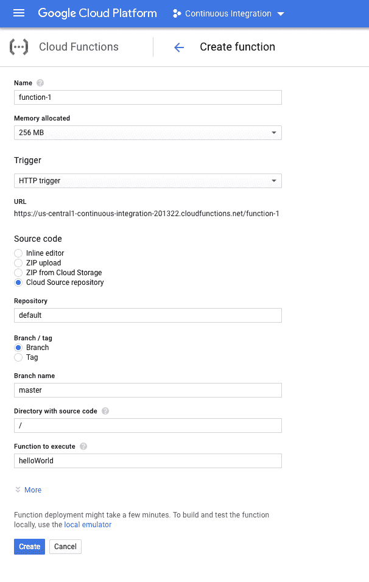

# TWiGCP—“GCP 的私有 git 回购、安全物联网、成本控制和象限”

> 原文：<https://medium.com/google-cloud/twigcp-gcps-private-git-repos-secure-iot-cost-control-and-quadrants-b94f132d76db?source=collection_archive---------1----------------------->

如果你对分析师报告感兴趣，你会喜欢“ [*谷歌被评为 2018 年 Gartner 基础设施即服务魔力象限*](http://goo.gl/A1Z6fd) 的领导者”，其中有 4 条来自该报告(谷歌博客)。你可以在这里(cloud.google.com)找到更多分析报告

在这篇看似及时的文章中，你可能想读一下“ [*云源代码库:不仅仅是一个私有的 Git 库*](http://goo.gl/tn7ZwQ) ”(谷歌博客)

来自“合作让每个人更强大”部门:

*   云物联网核心微芯片(ATECC608)合作伙伴关系和 JWT 认证方案正在发挥作用—“[*使用云物联网和微芯片*](http://goo.gl/Jkh2Ds) 保护云连接设备”(谷歌博客)
*   在& T，谷歌结成云服务合作伙伴(zdnet.com)

来自“从您的云提供商获得更多”部门:

*   [如何让你的云提供商倾听(并理解)](http://goo.gl/ECftFe)(谷歌博客)
*   [帮助你的云提供商帮助你](http://goo.gl/R2pFEF)(谷歌博客)

来自“了解和控制成本”部门:

*   " [*利用新的指标和工具获得可见性并控制堆栈驱动成本*](http://goo.gl/EGxpJf) "(谷歌博客)
*   [BigQuery 自助服务成本控制](http://goo.gl/yegz9J)(谷歌文档)

来自“深入观察”部门:

*   [App Engine 的新调度程序设置](http://goo.gl/sJGFTf)(medium.com)
*   构建容器的最佳实践
*   [零停机升级您的 Kubernetes 集群](http://goo.gl/1xd74s)(谷歌博客)

来自“云原生开源项目的一些更新”部门:

*   [Istio /介绍 Istio v1alpha3 路由 API](http://goo.gl/fE1WRi) (istio.io)
*   Skaffold:快乐的 Kubernetes 工作流程 (ahmet.im)

来自“GCP 社区广度和深度”部门:

*   [big query 的新特性](http://goo.gl/U2KZgK)(medium.com)
*   【blog.doit-intl.com】自动标记谷歌云资源
*   【rominirani.com】教程:使用 Google Sheets 和云自然语言 API 分析评论
*   [在您现有的(GKE)集群上使用 Jenkins-x 的 CI/CD—ruby on rails 应用](http://goo.gl/kVCdM3)(medium.com)
*   [Kubernetes w/ Let's 加密&云 DNS](http://goo.gl/gXyXD1)(medium.com)
*   [用 medium.com 的 GPG·斯迈卡德](http://goo.gl/aAzczC)加密谷歌应用默认和 gcloud 凭证
*   [预测旧金山的自行车份额。TensorFlow 和 LSTMs 的可用性](http://goo.gl/zCLmcG)(medium.com)
*   [使用 Google Kubernetes 引擎的可抢占节点上的有状态服务](http://goo.gl/aJvoNg)(medium.com)
*   更多来自[medium.com/google-cloud](https://medium.com/google-cloud)的社区文章

来自“以防你错过(ICYMI)”部门:

*   [GA] [云发布/订阅审计日志](http://goo.gl/UzZ98N)(谷歌文档)
*   云软件开发套件 203.0.0 (谷歌文档)
*   [Beta] [云 CDN——使用签名网址](http://goo.gl/sv6RA2)(谷歌文档)
*   [Beta] [使用 TPUs 训练您的模型(TensorFlow 的云 ML 引擎)](http://goo.gl/jCtMvF) (Google 文档)

来自“所有播客”部门:

*   GCP 播客#129 — [开发者与曼迪·韦特的关系](http://goo.gl/hazXBo)
*   Kubernetes 播客#5 — [文档，Zach Corleissen 和 Jared Bhatti](http://goo.gl/5W14n4)

本周的图片展示了云功能与云资源存储库的集成，有效地为您的功能提供了版本控制:

这就是本周的全部内容！亚历克西斯