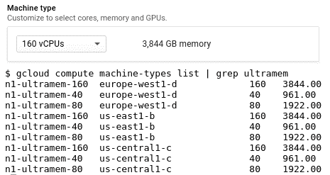

# TWiGCP—“GKE 1.10、Ultramem、新 GAE 调度程序、大新加坡及更多！”

> 原文：<https://medium.com/google-cloud/twigcp-gke-1-10-ultramem-new-gae-scheduler-greater-singapore-more-79cc517e87c4?source=collection_archive---------2----------------------->

强大的 Kubernetes，在此次 GKE 发布中支持更多的网络、可靠性和存储用例:“ [*Google Kubernetes 引擎 1.10 已正式发布，并准备好用于企业*](http://goo.gl/DsqAWi)”(Google 博客)

也许对 GKE 有用，但对内存数据库来说肯定是最惊人的:“ [*介绍 ultramem 谷歌计算引擎机器类型*](http://goo.gl/yWuwo2) ”(谷歌博客)

为了庆祝 Google App Engine 十周年，正在更新调度程序:“ [*使用新的 App Engine 调度程序*](http://goo.gl/NjuYZJ) 提高性能，同时降低成本”(Google 博客)

新的地区和更多的专区:“ [*在新加坡开设第三个专区*](http://goo.gl/VH6mj1) ”(谷歌博客)

使用谷歌地图惊人丰富的数据，就像你使用任何其他 GCP 服务一样:“ [*谷歌地图平台现在与 GCP 控制台*](http://goo.gl/z3pswL) ”(谷歌博客)

为现有的正在运行的虚拟机动态添加和删除别名 IP 范围:“ [*利用别名 IP 提高应用程序可用性，现在利用热备用*](http://goo.gl/tPVmvJ) ”(谷歌博客)

更强的日志输入功能:" [*从您的堆栈中获取更多价值用结构化数据驱动日志*](http://goo.gl/8SK4v1) "(谷歌博客)

“ [*谷歌生命科学云:新产品和新伙伴*](http://goo.gl/FBGtjY) ”(谷歌博客)

“ [*木桶正在加入谷歌云*](http://goo.gl/KSZYG7) ”(木桶博客)

来自“如何”部门:

*   [在谷歌云平台上建立一个数据湖](http://goo.gl/TReNKP)(谷歌文档)
*   [云扳手中时间戳排序数据的分片](http://goo.gl/pDi4y7)(谷歌博客)
*   [在 GCP 建立一个无服务器的移动开发管道](http://goo.gl/RpJ3YJ)(谷歌文档)
*   [Kubernetes 最佳实践:优雅地终止](http://goo.gl/AG1vXo)(谷歌文档)
*   在云 Dataproc 集群上运行 RStudio 服务器 (Google 文档)

来自“以防你错过(ICYMI)”部门:

*   [GA] [向您的 GCE 实例添加持久磁盘](http://goo.gl/E9j1kx)(谷歌文档)*在实例创建期间，您可以连接多达 15 个辅助非引导持久磁盘，以在不同的卷上存储您的应用程序、数据文件、数据库和日志*
*   [Beta] [使用 TPUs 来训练您的模型](http://goo.gl/pEX9v9) (Google 文档)*使用 Cloud ML Engine jobs API 的方式与您在 CPU 或 GPU 上使用它进行训练的方式相同*
*   [Beta] [BigQuery 数值类型](http://goo.gl/v7x6yB) (Google 文档)
*   [kubemci](http://goo.gl/at4Mfq) :使用多个 kubernetes 集群配置 L7 负载平衡器的命令行工具(github.com)
*   GitHub repository to "[tensor flow and deep learning without a PhD](http://goo.gl/J3a5t9)"，这是一个六集速成班，面向希望成为机器学习从业者的软件开发人员(github.com)
*   斯卡福德演示(youtube.com)

来自“所有播客”部门:

*   Kubernetes 播客第 3 集: [gVisor，Nicolas Lacasse 和 Yoshi Tamura](http://goo.gl/xWmBTT)(kubernetespodcast.com)
*   (gcppodcast.com)GCP 播客#127 [SRE vs 德沃普斯](http://goo.gl/q46CgK)

本周图片是 [ultramem 机种](http://goo.gl/yWuwo2)的更新 UI:

这星期到此为止！亚历克西斯