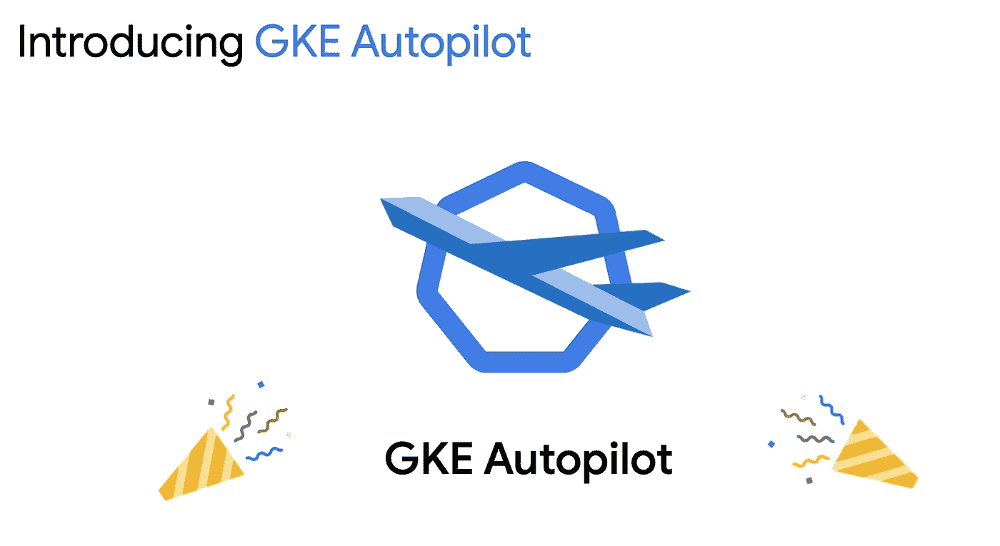

# TWiGCP—“GKE 自动驾驶仪、Databricks 和 MongoDB 合作伙伴，以及更多”

> 原文：<https://medium.com/google-cloud/twigcp-gke-autopilot-databricks-mongodb-partnerships-and-quite-a-bit-more-5cb02d2b9b86?source=collection_archive---------3----------------------->

GCP 头条新闻📣过去一周包括:

*   [介绍 GKE 自动驾驶仪:管理库伯内特的一场革命](http://gtech.run/mcl9f)(谷歌博客)
*   [数据砖块，谷歌云一起提供数据，分析和人工智能](http://gtech.run/npp89)(谷歌博客)
*   [MongoDB 和谷歌扩展合作伙伴关系，推动企业云现代化](http://gtech.run/vyup9)(谷歌博客)
*   在 BigQuery 中实现物化视图的现代化
*   [为计算引擎引入基于时间表的自动缩放](http://gtech.run/q6xqw)(谷歌博客)
*   [服务目录正式发布，增加了自动服务注册](http://gtech.run/h7zty)(谷歌博客)
*   [介绍云领域](http://gtech.run/wld4f)(谷歌博客)
*   [介绍 GKE 多集群服务](http://gtech.run/mbsar)(谷歌博客)
*   [BigQuery 通过 BI 引擎在流行的 BI 工具中驱动更快的查询](http://gtech.run/zastd)(谷歌博客)
*   [Twitter @ Google cloud tech——新名字，同样的团队](http://gtech.run/ekkpl)

来自“保持整洁”部门:

*   谷歌云市场的私有目录支持 Terraform (谷歌博客)
*   [用云数据准备元数据更新谷歌数据目录标签|作者 Victor Coustenoble](http://gtech.run/ttgn2)(medium.com)

来自“理解和使用谷歌的秘密武器——它的网络”部门:

*   [了解谷歌云网络边缘点](http://gtech.run/jw2y4)(谷歌博客)
*   私人服务连接|尼尔·科尔班(medium.com)

来自“控制成本”部门:

*   通过定制你的预算来了解最新情况
*   [预算:定制电子邮件地址|马克·米尔钱达尼](http://gtech.run/7smkw)(medium.com)

来自“并行化和扩展工作流”部门:

*   [用工作流和连接器构建无服务器应用](http://gtech.run/vqqua)(谷歌博客)
*   【谷歌工作流的并行执行】Guillaume blaquiere(medium.com)

来自“云运行真正热爱所有编程语言”部门:

*   [用 ko](http://gtech.run/dvj2y) (谷歌博客)把你的 Go 应用更快地运送到云上运行

来自“Dataproc —从决策树到大规模数据科学”部门:

*   [将 Apache Hadoop 迁移到 Dataproc:决策树](http://gtech.run/bkcem)(谷歌博客)
*   [使用 Dataproc 和 Apache Spark 大规模运行数据科学](http://gtech.run/3866z)(谷歌博客)

来自“Google Cloud 上的 ML 模型，从便捷到高性能”部门:

*   [使用 RAPIDS+Dask+NVIDIA GPU 在几分钟内完成模型训练](http://gtech.run/j639q)(谷歌博客)
*   [如何使用 BigQuery ML 从谷歌工作表中使用机器学习模型](http://gtech.run/dw6j2)(谷歌博客)

来自“更多项目、指标和保留”部门:

*   [增加三项云监控功能的限制](http://gtech.run/b89r7)(谷歌博客)

来自“使用示例应用程序练习 GKE 故障排除”部门:

*   [如何在 GKE 找到并解决你的应用和基础设施中的问题](http://gtech.run/h5mpg)(谷歌博客)

来自我们“不断发展和丰富的媒体社区”部门:

*   [使用 Terraform 和 Kubernetes 在 GCP |通过 MPL](http://gtech.run/m9489)(medium.com)快速部署应用程序
*   谷歌大查询上以太坊公共数据的完整关系图
*   [监控数据流管道:概述|作者热雷米·戈麦斯](http://gtech.run/ac97h)(medium.com)
*   [Google Cloud Spanner:从查询到 NodeJS |中的事务的数据流，作者 Knut Olav lite](http://gtech.run/cwugv)(medium.com)

来自“架构最佳实践”部门:

*   [使用数据融合和 Composer 构建配置驱动的数据湖的框架](http://gtech.run/e55cm)(谷歌博客)
*   [安全左移](http://gtech.run/ddbnp)(cloud.google.com)
*   【cloud.google.com】设计多租户架构
*   【cloud.google.com】使用 kpt 管理云基础设施
*   [新的谷歌云 VMware 引擎网络白皮书](http://gtech.run/et97a)(谷歌博客)

来自“客户和合作伙伴与 GCP 一起解决现实世界的问题🤝“部门:

*   [Cash App 使用谷歌云 AI+ni vida GPU 为移动支付提供动力](http://gtech.run/vx749)(谷歌博客)
*   [为什么 Sabre 公司利用 Prisma 云计算 gmon 谷歌云](http://gtech.run/x5s9c)(谷歌博客)
*   [具有 Dialogflow 和 Apigee API 管理的对话式人工智能](http://gtech.run/ckt3b)(谷歌博客)
*   [cloud.google.com，BBVA 与谷歌云结成伙伴关系](http://gtech.run/8w3t7)
*   [美国职业棒球大联盟(cloud.google.com)案例研究](http://gtech.run/nz3yt)

从“🔊**多媒体的一切🎥**“部门:

*   【YouTube】[介绍 youtube.com GKE 自动驾驶](http://gtech.run/m5gbh)
*   【YouTube】[秘密经理人 YouTube 系列](http://gtech.run/gupng)(youtube.com)
*   [YouTube] [如何为应用程序的可扩展性选择合适的数据库](http://gtech.run/7ag6x)(youtube.com)
*   【新播客】[谷歌新推出的云安全播客](http://gtech.run/3ycnh)(cloud.google.com)
*   [播客] GCP 播客[第 247 集——使用 Nimesh Bhagat 的云 SQL 洞察](http://gtech.run/usvlq)(gcppodcast.com)
*   [播客]gcppodcast.com GCP 播客[第 248 集——与迪拉杰·考尔和克里斯托夫·布斯勒一起重访“云扳手”](http://gtech.run/q2e8g)
*   [播客] Kubernetes 播客[第 138 集——多集群服务，Jeremy Olmsted-Thompson](http://gtech.run/ljcsc)(kubernetespodcast.com)
*   [播客] Kubernetes 播客[第 139 集——由 Yochay Kiriaty](http://gtech.run/a4tkw) 主持的 GKE 自动驾驶仪(kubernetespodcast.com)

来自“**的预告，嘎，还是什么？**“部门:

*   【GA】[云 SDK 329.0.0](http://gtech.run/wfg8w)
*   [GA] [分级防火墙策略概述](http://gtech.run/3kx2p)
*   [GA] [BigQuery 物化视图](http://gtech.run/zg93e)
*   [GA] [Cloud Composer 对 CMEK 的支持](http://gtech.run/pv7hg)
*   [GA] [计算引擎承诺使用折扣的最佳建议](http://gtech.run/tx3v6)
*   [预览] [迁移项目(跨组织，自助)](http://gtech.run/xmc2j)
*   【预览】 [Kubernetes 1.20 可在 GKE 快速频道获得](http://gtech.run/cmxet)
*   【预览】[秘密管理者事件通知](http://gtech.run/ksxb4)
*   【预览】 [Firestore 工作流程连接器](http://gtech.run/zadh7)
*   【预览】 [BigQuery BI 引擎 SQL 接口](http://gtech.run/vzhbl)
*   【预览】[云 IAM 模拟策略变化](http://gtech.run/zfekz)

本周图片摘自自动驾驶仪发布材料

这就是本周的全部内容！亚历克西斯