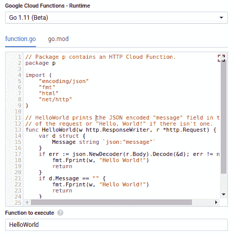

# TWiGCP—“Go 1.11 云函数、Moar GPUs 和 BigQuery 表单”

> 原文：<https://medium.com/google-cloud/twigcp-go-1-11-cloud-functions-moar-gpus-bigquery-in-sheets-e2834bff832e?source=collection_archive---------1----------------------->

以下是过去一周的一些主要新闻:

"[*Get Go-ing with Cloud Functions:Go 1.11 现在是支持的语言*](http://goo.gl/6NBMpn) "(谷歌博客)。备受期待的 Go on GCF 测试版已经发布，所有的 Go HTTP 中间件和库现在都可以利用了！

“ [*连接 BigQuery 和 Google Sheets，帮助进行海量数据分析*](http://goo.gl/J81TPd) ”(谷歌博客)。BigQuery 的 Sheets 数据连接器即将上市。

“ [*英伟达特斯拉 T4 GPU 现已推出测试版*](http://goo.gl/tZsStT) ”(谷歌博客)。现在，您可以使用多达 4 个 T4 GPU、96 个虚拟 CPU、624GB 内存和 3TB 固态硬盘来创建自定义虚拟机形状。对于可抢占的虚拟机实例，GPU 的起价为每小时 0.29 美元！

" [*检查您的远程车队:云物联网现在使设备活动日志记录普遍可用*](http://goo.gl/mddyv7) "(谷歌博客)。现在，用户可以为单个设备或整个设备群启用设备日志记录。

来自“无服务器一切事物”部门:

*   [用云文本到语音转换和应用引擎打造谷歌年度游戏](http://goo.gl/YhUfRJ)(谷歌博客)
*   [使用云调度器在计算引擎上进行可靠的任务调度](http://goo.gl/iAD5Fh)(cloud.google.com)
*   [宣布 Java & Kotlin 客户端库用于谷歌【medium.com 的操作](http://goo.gl/2a6BA1)
*   [Firebase 和 Google Cloud 是什么关系？](http://goo.gl/T2BJLC)(medium.com)
*   [使用 Spring Cloud GCP 创建 Google Cloud 发布/订阅发布者和订阅者—第 1 部分:设置](http://goo.gl/u4TjuU)(medium.com)

来自“GKE 和云土著”部门:

*   [配置垂直 pod 自动缩放](http://goo.gl/mz8mWJ)(cloud.google.com)
*   谷歌 Kubernetes 引擎上的 VPC 本地集群
*   [宣布 Knative v0.3 发布](http://goo.gl/C1Jdd1)(medium.com)
*   [谷歌仍然是 techcrunch.com CNCF 项目的最大开源贡献者](http://goo.gl/D7CZ2b)

来自“机器学习公告、最佳实践和未来”部门:

*   [使用 TensorRT 5 和英伟达 T4 GPU 大规模运行 TensorFlow 推理工作负载](http://goo.gl/VwN8mH)(谷歌博客)
*   [介绍盛宴:机器学习的开源特性商店](http://goo.gl/h16wgh)(谷歌博客)
*   [云 TPUs 入门:在线资源概述](http://goo.gl/g1Sxj4)(谷歌博客)
*   在 GCP 建立人工智能客户服务的简单蓝图
*   [在谷歌云平台中构建令牌推荐器](http://goo.gl/AMdMSw)(medium.com)
*   [tensor flow 2.0 的新功能](http://goo.gl/fRGVts)(medium.com)
*   [谷歌人工智能博客:回顾谷歌 2018 年的研究成果](http://goo.gl/yLoN26)(ai.googleblog.com)

来自“DevOps 和所有连续事物”部门:

*   [谷歌云生产指南](http://goo.gl/DRTkou)(medium.com)
*   [基于云构建的 GitOps 式持续交付](http://goo.gl/Uqenwe)(cloud.google.com)
*   金丝雀分析:谷歌和 Waze 的经验教训和最佳实践
*   与詹金斯和帕克一起为 GCP 创建定制基础图像的指南(谷歌博客)
*   [Jenkins——谷歌 Kubernetes 引擎插件](http://goo.gl/9YTZo3) (wiki.jenkins.io)

来自“认证一切”部门:

*   “[谷歌云——数据工程师考试学习指南](http://goo.gl/vy9GvA)”(medium.com)
*   “[通过所有谷歌云认证](http://goo.gl/WdSocW)”(medium.com)

来自我最喜欢的“客户和合作伙伴对 GCP 的最佳评价”部分:

*   UNPKG 在 Twitter 上说:“[本周的重大变化:我们的后端现在完全托管在@googlecloud 上，通过@Firebase 托管！所有 npm 代理请求现在都由谷歌云功能处理，它提供了一个自动伸缩、容错的后端](http://goo.gl/z1UKR)(twitter.com)
*   [耶路撒冷邮报集团案例研究](http://goo.gl/r9Nmnk)(cloud.google.com)
*   【cloud.google.com FTD 案例研究
*   Greg Fiske:“在过去的 7 年里，我们已经绘制了北极&白令海峡的每艘船的地图……”(twitter.com)

从“测试版，正式版，还是什么？”部门:

*   [GA] [云 SDK 230.0.0](http://goo.gl/QMtpTC)
*   【GA】[Go 云发布](http://goo.gl/a6VxY6)(godoc.org)
*   【GA】[围棋云秘笈](http://goo.gl/Mmxf21)(godoc.org)
*   [GA] [加拿大转让设备 GA](http://goo.gl/Kctv4p)(谷歌文档)
*   [Beta] [使用全端口转发规则部署内部负载平衡器](http://goo.gl/oMxR3x)(谷歌文档)

来自“所有多媒体”部门:

*   [播客] Kubernetes 播客[第 36 集——卢克，杰瑞德·沃茨](http://goo.gl/XFzJKf)(kubernetespodcast.com)
*   【视频】[【Go 云功能】](http://goo.gl/hcU16K)(youtube.com)
*   [视频] [正确的 Bigtable 索引决定一切【youtube.com ](http://goo.gl/LHVGqu)
*   [视频] [大表和地理定位性能](http://goo.gl/dZhrqA)(youtube.com)
*   [视频] [什么是 BeyondCorp？什么是 IAP (BeyondCorp in a Bottle)](http://goo.gl/h2qQkk)

本周的图片展示了云函数的新 Go 1.11 运行时

这就是本周的全部内容！亚历克西斯