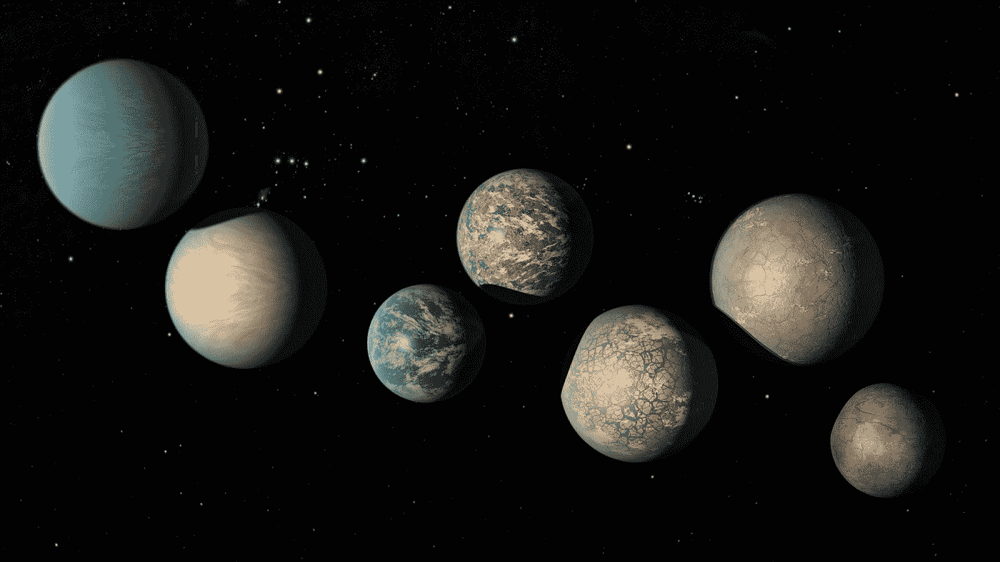

# twig CP—“Grafana，Spinnaker+Kubernetes，Apigee，支持 NASA 的 FDL”

> 原文：<https://medium.com/google-cloud/twigcp-grafana-spinnaker-kubernetes-apigee-and-supporting-nasas-fdl-be9d3a7773ad?source=collection_archive---------0----------------------->

在过去几周的报道之后，现在是正式的声明——“[*引入 Stackdriver 作为 Grafana*](http://goo.gl/KepRTN) (谷歌博客)的数据源

身份和访问管理需要为*您的*设置工作，因此这里的“ [*利用新的云 IAM 功能*](http://goo.gl/grDj1d) ”(谷歌博客)对您的计算引擎资源进行更多控制

一个新的 Spinnaker (1.10) Kubernetes 提供程序，用于自动检索与构建图像的提交版本相匹配的清单—“[*增强 Spinnaker 的 Kubernetes 支持以简化应用程序部署*](http://goo.gl/6yNX2B)”(Google 博客)

随着几个 Apigee 功能即将上市，可能是时候研究一下谷歌云的全生命周期 API 管理平台了—“[*API gee API 监控、扩展和托管目标现已全面上市*](http://goo.gl/8oEv9d) ”(谷歌博客)

停留在 API 这个话题上，这里是:“ [*REST vs. RPC:你的 API 在试图解决什么问题？*](http://goo.gl/t7cdPB) ”(谷歌博客)

来自“深入挖掘最近发布的技术”部门:

*   云地址转换:深入了解我们新的网络地址转换服务(谷歌博客)
*   构建应用程序并将其部署到 Knative(starkandwayne.com)

来自“最佳实践”部门:

*   构建 Kubernetes 操作符和有状态应用程序的最佳实践
*   [使用 ha proxy](http://goo.gl/KyafiA)(cloud.google.com)将 MySQL 集群迁移到计算引擎
*   [在谷歌云功能中使用木偶师](http://goo.gl/UXg55Z)(medium.com)
*   [使用 Istio](http://goo.gl/a7ZHWS)(blog.sebastian-daschner.com)进行零停机滚动更新

从“我们是孤独的吗？”部门:

*   其他星球上有生命吗？谷歌云正在与美国宇航局前沿发展实验室(FDL)合作，以找出(谷歌博客)#天体生物学

来自“ML 综述”部门:

*   机器学习的公平性，从[研究](http://goo.gl/2LC2Bf)到[在线速成班](http://goo.gl/9e1iDV) (developers.google.com)。
*   【deepmind.com】开源 TRFL:强化学习构建模块库
*   [统一 TensorFlow 和 Keras 优化器的提议](http://goo.gl/uaTDzu) (github.com)。需要反馈！

来自“会见开发人员”部门:

*   [从头开始无服务器:构建一个简单的具有云功能的微服务(第一部分)](http://goo.gl/dvedSn)(谷歌博客)
*   [将(JHipster apps)部署到谷歌云平台](https://www.jhipster.tech/gcp/)(JHipster . tech)# KubernetesEngine # app engine
*   [用于 Visual Studio 的谷歌云工具](http://goo.gl/cG64y2)(marketplace.visualstudio.com)
*   Codelab : [使用云存储器的 Spring Boot 缓存](http://goo.gl/bw5BAE)(codelabs.developers.google.com)

来自我最喜欢的“客户对谷歌云的最佳评价”部分:

*   [嗨嗬，嗨嗬，要开始扳手了](http://goo.gl/P2WN8b)——蜂蜜科技博客(medium.com)
*   [简化谷歌云中的无服务器秘密](http://goo.gl/C1JsEh)(open.nytimes.com)

从“测试版，正式版，还是什么？”部门:

*   [GA] [云 SDK 221.0.0](http://goo.gl/QMtpTC)
*   [Beta] [面向云存储的 BigQuery 数据传输服务](http://goo.gl/Qpbbz2)
*   [Beta] [针对计算引擎资源的云 IAM 策略](http://goo.gl/51isWx)
*   阿帕奇光束 2 . 7 . 0(beam.apache.org)

来自“所有多媒体”部门:

*   [播客 ARCHITECHT 秀: [Ep。第 74 位:谷歌的柳文欢·泰克讲述了为什么无服务器如此重要，以及我们如何从 PaaS](http://goo.gl/CxtWgj)(architecht.libsyn.com)走到这一步
*   [视频][tensor flow . js 入门](http://goo.gl/L6YSuF)(youtube.com)
*   [Podcast] [一位谷歌产品管理人员介绍了 CI/CD 的真正含义](http://goo.gl/oSNTqf) (thenewstack.io)
*   gcppodcast.com 的 GCP 播客第 151 集
*   [Podcast]Google Kubernetes Podcast—【kubernetespodcast.com GKE 集装箱本地负载平衡，Ines Envid 和 Neha Pattan

本周图片摘自描述[谷歌云+ NASA FDL 合作](http://goo.gl/8b7846)的帖子:

这就是本周的全部内容！亚历克西斯