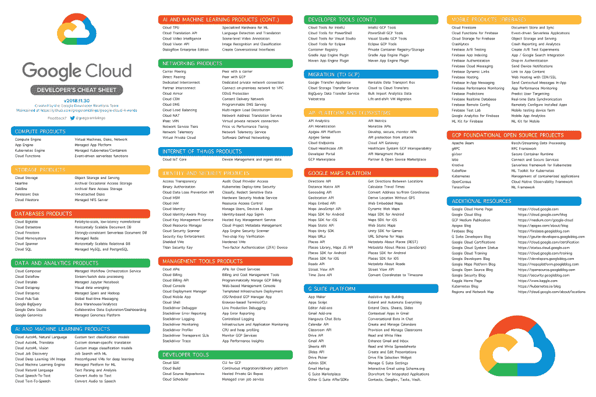

# TWiGCP —“你好，香港，潘多拉选择 GCP，折叠蛋白质”

> 原文：<https://medium.com/google-cloud/twigcp-hello-hong-kong-pandora-choses-gcp-and-folding-proteins-85f1136dacc8?source=collection_archive---------0----------------------->

以下是过去一周的主要公告:

" [*扩大我们在亚太地区的影响力:在香港和雅加达的新 GCP 地区*](http://goo.gl/XoXc2R) "(谷歌博客)。每一个新地点都是提及 gcping.com[的好机会。 ***你的*** 潜伏期怎么样？](http://gcping.com/)

" [*云身份现在可以通过安全 LDAP*](http://goo.gl/juVehZ) (谷歌博客)访问传统应用。适用于 G Suite Enterprise 和 Cloud Identity Premium 版本。

" [*投资潘多拉的核心差异化要素*](http://goo.gl/tSVHtt) " (medium.com)。潘多拉选择 GCP 是因为它有 900 亿个拇指向上或向下，2500 个 Hadoop 节点和 6 PB 的数据。#大查询#数据流#张量流

" [*AlphaFold:利用人工智能进行科学发现*](http://goo.gl/cUaZFM) " (deepmind.com)。利用人工智能预测蛋白质的形状；帮助科学家治疗被认为是由错误折叠的蛋白质引起的疾病。

来自“服务网络是未来”部门:

*   Kubernetes 用户，准备好迎接微服务管理的下一个篇章吧
*   Istio 1.0.4
*   [增量 Istio 第 1 部分，交通管理](http://goo.gl/6neJnZ) (istio.io)

来自“谷歌和合作伙伴提供的解决方案”部门:

*   【解决方案】[采用 Spinnaker 和 Google Kubernetes 引擎的连续输送管道](http://goo.gl/rXxs7k)(更新！)
*   [解决方案] [Pega 工作流自动化:简化谷歌网络，并为您的 GCP 工作负载做好准备](http://goo.gl/R36KYe)(谷歌博客)

来自“医疗保健 API 更新和操作方法”部门

*   [释放医学成像数据在云端的可能性](http://goo.gl/yae5HP)(谷歌博客)
*   [了解谷歌云医疗 API:第二部分](http://goo.gl/ShrADG)(谷歌博客)

来自“帮助您做出正确的架构决策”部门:

*   HTTP vs. MQTT:两种物联网协议的故事
*   [云函数 pro 提示:构建幂等函数](http://goo.gl/wQkgzn)(谷歌博客)

来自“选择 GCP，移居 GCP——徒步旅行的故事”部分:

*   [为什么我们选择搬到 GCP](http://goo.gl/cfb8T5)
*   [不停机迁移到 GCP](http://goo.gl/vCX4Dv)

从“测试版，正式版，还是什么？”部门:

*   [GA] [云 SDK 226.0.0](http://goo.gl/QMtpTC)
*   [GA] [云身份安全 LDAP 服务](http://goo.gl/QyW3r9)
*   [1.0.4] [Istio 1.0.4](http://goo.gl/yBVgj4)
*   【v2018.11.30】(更新！)[谷歌云开发者的备忘单](http://goo.gl/h1Vqpv)

来自“所有多媒体”部门:

*   [播客]gcppodcast.com GCP 播客第 157 集 [NeurIPS 和人工智能研究](http://goo.gl/oVPX6H)
*   [播客] Kubernetes 播客第 34 集— [Kontena Pharos，Jari Kolehmainen](http://goo.gl/TawzTE)(kubernetes.com)

本周的图片是更新的 GCP 小抄

这就是本周的全部内容！亚历克西斯