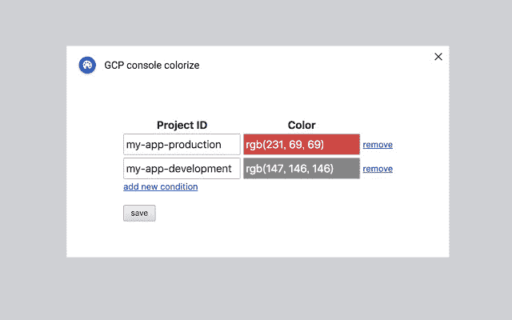

# TWiGCP —“改进的 BigQuery ML 和更多工具，有效管理您的$$$预算”

> 原文：<https://medium.com/google-cloud/twigcp-improved-bigquery-ml-and-more-tools-to-effectively-manage-your-budget-6ffc736b4343?source=collection_archive---------3----------------------->

在过去相当平静的一周里，GCP 的头条新闻包括:

*   [云数据分析中内置的新机器学习模型](http://gtech.run/9fpye)(谷歌博客)
*   [云计费获得更好的预算和自动化](http://gtech.run/s8hkp)(谷歌博客)

本周，Ahmet、Rochard 和 Guillaume 为您带来了以从业者为中心的内容:

*   [用 Terraform 实现无服务器负载平衡:艰难的道路](http://gtech.run/g5nu9)(谷歌博客)
*   [让开发者为多云做好准备](http://gtech.run/ua785)(谷歌博客)
*   [将微服务与云工作流相结合——Guillaume la forge 的博客](http://gtech.run/3rm5s)(glaforge.appspot.com)

在 Google Cloud 最近发布数据库迁移服务之后，Jan 讨论了 MySQL 的具体案例:

*   [缩小差距:使用数据库迁移服务时的迁移完整性](http://gtech.run/5xnsv) (Google 博客)

Shashank 讨论了一种用于关系数据库的高可用性方法(没有 CloudSQL):

*   [Shashank Agarwal](http://gtech.run/8qbvq)(medium.com)GCP SQL Server 使用有状态 MIGs 实现高可用性和灾难恢复

寻找详细答案的真实客户问题:

*   [为跨国公司设置谷歌云身份|作者哈维·加西亚·普加](http://gtech.run/er6qb)(medium.com)
*   [在 Apache Airflow 中支持最新的谷歌云运营商| Israel Herraiz](http://gtech.run/u34kz)(medium.com)
*   [如何从 Google Cloud Kubernetes 引擎上运行的容器 app(web，Spark)在 KFServing 上做出 ML 模型推断？|作者达莫达尔·帕尼格拉希](http://gtech.run/55m2s)(medium.com)

如果你需要这个，你会知道的:

*   (chrome.google.com)GCP 控制台着色

来自“客户和合作伙伴与 GCP 一起解决实际问题”部门:

*   电子商务公司 Wayfair 使用谷歌云进行数据分析

来自“**万物多媒体**”部门:

*   [【视频】裸机上的 Anthos 介绍](http://gtech.run/aqu5m)(youtube.com)
*   [视频][Istio 1.8 的新功能](http://gtech.run/nxyss)(youtube.com)

本周的图片是一个简单但有用的 chrome 扩展插件

这就是本周的全部内容！
——亚历克西斯