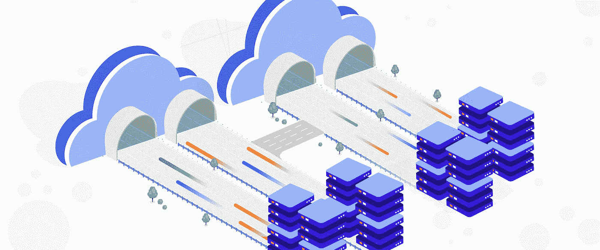

# TWiGCP —“介绍 Anthos 开发人员沙盒和数据库迁移服务”

> 原文：<https://medium.com/google-cloud/twigcp-introducing-anthos-developer-sandbox-and-database-migration-service-aa1406ded013?source=collection_archive---------4----------------------->

过去一周的 GCP 要闻包括:

*   [介绍 Anthos 开发者沙盒](http://gtech.run/gqwpc)(谷歌博客)
*   [数据库迁移服务现可用于云 SQL 和更多](http://gtech.run/yehg9)(谷歌博客)
*   [正在预览:医疗保健自然语言 API 和医疗保健自动实体提取](http://gtech.run/58gce)(谷歌博客)
*   [扩大我们对客户的隐私承诺](http://gtech.run/75rh8)(谷歌博客)
*   [谷歌云推出机器学习工程师认证](http://gtech.run/2tn42)(谷歌博客)
*   [谷歌云如何帮助创业公司成功](http://gtech.run/tzygm)(谷歌博客)

来自“当我们谈到数据库的话题时”部门:

*   [数据库迁移服务连接——技术反思](http://gtech.run/ugudq)(谷歌博客)
*   [跨兼容数据库引擎迁移的技巧](http://gtech.run/kyyly)(谷歌博客)

来自“BigQuery 原则、技巧和诀窍”部分:

*   [BigQuery 解释:数据操纵](http://gtech.run/bv5jb)(谷歌博客)
*   [big tips:big query 中的信息模式视图|作者 Brian Suk](http://gtech.run/qu8ey)(medium.com)
*   使用 BigQuery 的时间序列分析|作者:medium.com 邓梓峰
*   [Lak Lakshmanan](http://gtech.run/x6ard)(medium.com)使用 ASSERT |验证 BigQuery 脚本的成功执行

来自“在 Google Cloud 上引导您的容器”部分:

*   [将容器迁移到谷歌云:入门](http://gtech.run/r56tc)(cloud.google.com)
*   在 GKE 检查你的 gRPC 服务器的健康状况

来自“如果你也插手每一件事”部门:

*   [引入 VS 代码的“GCP 项目切换器”扩展|作者:márton Kodok](http://gtech.run/g5bdl)(medium.com)

来自“共享集群资源，而不是数据”部门:

*   [Dataproc 合作多租户](http://gtech.run/lszch)(谷歌博客)

来自“功能也可以受益于构建包”部门:

*   [云函数 Buildpacks！格兰特·蒂默曼](http://gtech.run/r8k3s)(medium.com)

来自“不仅仅是最小实例”部门:

*   [减轻云运行冷启动的 3 种解决方案。|作者:纪尧姆·布莱克维尔](http://gtech.run/b65g5)(medium.com)

来自“掌控您的基础架构资源”部门:

*   [在没有公共 IP 或 VPN 的情况下安全地连接到谷歌计算引擎虚拟机|阿伦德·迪特莫](http://gtech.run/yza3p)(medium.com)
*   [查看和应用闲置资源推荐](http://gtech.run/zenhu)(cloud.google.com)
*   [创建高度可用的混合云 DNS 配置](http://gtech.run/3dykp) (Google 博客)

来自“客户和合作伙伴与 GCP 一起解决实际问题”部门:

*   [福布斯从自主管理的 MongoDB 迁移到谷歌云上的 MongoDB Atlas](http://gtech.run/5gctg)(谷歌博客)
*   [约翰·霍普金斯大学 BIOS 部门案例研究](http://gtech.run/xuncy)(cloud.google.com)

来自“**万物多媒体**”部门:

*   [视频] [什么是 Kubernetes？](http://gtech.run/kzeng)(youtube.com)
*   [视频] [介绍数据库迁移服务【youtube.com ](http://gtech.run/dcunf)
*   [视频] [了解你的 GKE 成本](http://gtech.run/jkmlm)(youtube.com)
*   [播客] Kubernetes 播客[第 129 集——Linkerd，与 Thomas Rampelberg](http://gtech.run/42r7r)(kubernetespodcast.com)

从“**预告，GA，还是什么？**“部门:

*   [GA] [云 SDK 318.0.0](http://gtech.run/wfg8w)
*   [GA] [IAM 策略分析器(API)](http://gtech.run/kntl5)
*   [GA] [Anthos 服务网格 1.7](http://gtech.run/gqtmf)
*   【GA】[深度学习虚拟机 M59](http://gtech.run/7g9la)
*   【GA】[云函数 Python 3.8](http://gtech.run/9cxr7)
*   【GA】[云构建手动触发器](http://gtech.run/svl4c)
*   【GA】[云 AI 新区域端点](http://gtech.run/5kx86)
*   【预览】[医疗保健自然语言 API](http://gtech.run/gfjp6)
*   【预览】[面向医疗保健的自动实体提取](http://gtech.run/m6bth)
*   【预览版】 [GKE 版本 1.19.3](http://gtech.run/w3lyz)
*   【预览】 [MQL(监控查询语言)宏](http://gtech.run/66er8)

本周的图片来自数据库迁移服务(DMS)公告

这就是本周的全部内容！亚历克西斯