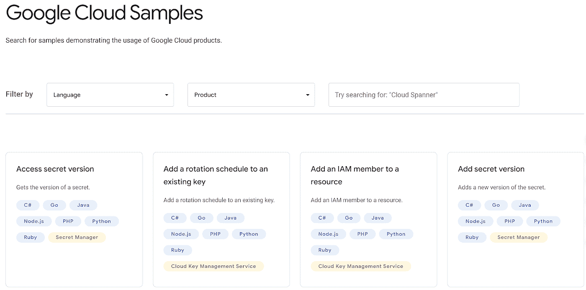

# TWiGCP —“介绍 Apigee X、HPC 虚拟机、数据融合复制和有保证的工作负载”

> 原文：<https://medium.com/google-cloud/twigcp-introducing-apigee-x-hpc-vms-datafusion-replication-and-assured-workloads-b25fe809f893?source=collection_archive---------0----------------------->

以下是谷歌云视频系列 本周最新 [**的链接:**](http://gtech.run/ju4em)

*   [引入虚拟机管理器:轻松操作大型计算引擎群](http://gtech.run/ww5be)
*   [裸机解决方案:新地区、新服务器和新认证](http://gtech.run/7aa23)
*   [开发人员的数据库可观察性:引入云 SQL 洞察](http://gtech.run/kfq72)
*   [使用 Dialogflow CX 更快更准确地响应客户](http://gtech.run/tgf8t)

过去一周 GCP 的其他头条新闻包括:

*   [引入 BigQuery 与云数据融合的实时数据集成](http://gtech.run/rvvpx) (Google 博客)
*   [Apigee X:谷歌云更强大的 API 管理平台](http://gtech.run/d6g74)(谷歌博客)
*   [信心合规:引入有保证的工作负载支持](http://gtech.run/n995x)(谷歌博客)
*   [新的 HPC 虚拟机映像针对要求苛刻的工作负载进行了调整](http://gtech.run/lpdsp)(谷歌博客)

来自“VPCs、DNS、IPs 和电缆，哦，我的天！”部门:

*   [如何在共享 VPC 环境中使用云 DNS 对等](http://gtech.run/m87sw)(谷歌博客)
*   [作曲家、数据流和私有 IP 地址|作者尼尔·科尔班](http://gtech.run/ccxdl)(medium.com)
*   [限制谷歌云上的公共 IP](http://gtech.run/7awvz)(谷歌博客)
*   谷歌的杜楠特海底电缆现已准备好投入使用

来自“控制成本和配额”部门:

*   [使用云数据库如何省钱](http://gtech.run/rcsqm)(谷歌博客)
*   [建立谷歌云预算|马克·米尔钱达尼](http://gtech.run/pjult)(medium.com)
*   [如何在谷歌云中以编程方式管理配额](http://gtech.run/elxmb)(谷歌博客)

来自“正好赶上澳网”部门:

*   [机器学习能让你成为更好的运动员吗？](http://gtech.run/blg5x)(谷歌博客)

来自“多云、混合和安全”部门:

*   [我的 Anthos 混合和多云部署选项是什么？](http://gtech.run/32wjt)(谷歌博客)
*   【BeyondCorp Enterprise 如何支持多云应用和资源(谷歌博客)
*   如何用 Anthos 服务网格联合多个 GKE 集群

来自“通过自动化实现多云”部门:

*   [使用 Ansible 和 Terraform 在 GCP 上自动迁移数据库|作者 Safwene Ben Aich](http://gtech.run/yethz)(medium.com)

来自“保护访问和图像层”部门:

*   [一个云函数的不幸遭遇|娜塔莉·戈德克](http://gtech.run/pq92h)(medium.com)
*   [集中管理 Google Cloud 上的工件注册表容器映像漏洞:第一部分|作者丹·皮奇](http://gtech.run/zvu4b)(medium.com)

来自“ML 从业者生产力”部门:

*   使用 PyTorch Lightning 提高你的工作效率
*   [使用 BigQuery ML、存储过程和云调度器进行连续模型评估](http://gtech.run/6p54v) (Google 博客)

来自“任何种类的从业者糖果”部门:

*   [让我们比较一下 AWS、微软 Azure、谷歌云平台](http://gtech.run/wztu2)(seroter.com)提供的云壳
*   搜索和浏览谷歌云代码样本(谷歌博客)

来自“动手云工作流”部门:

*   [Pic-a-daily:实验 6——流程编排](http://gtech.run/rjpus)(codelabs.developers.google.com)
*   [云工作流第 13 天:云日志记录|作者 Guillaume la forge](http://gtech.run/b2mbz)(medium.com)
*   [云工作流第 14 天:子工作流|作者 Guillaume la forge](http://gtech.run/fwn23)(medium.com)

来自“金属时代”部门:

*   [面向 TPUs 的 Tensorflow 2.4 发布](http://gtech.run/rpttz)(kaggle.com)
*   【cloud.google.com】GPU 数据流支持|谷歌云

来自“客户和合作伙伴与 GCP 一起解决实际问题”部门:

*   推特扩大战略合作(cloud.google.com)
*   制作数据的客户歌唱并分析产品新闻来治愈你的数据 FOMO

来自“**多媒体**”部门:

*   [视频] [介绍 Anthos 的迁移](http://gtech.run/pzf5j)(youtube.com)
*   [视频] [阿皮格 X 简介](http://gtech.run/n2c8q)(youtube.com)
*   gcppodcast.com,【播客】GCP 播客[第 245 集——达斯汀·戴伊和亚历克斯·西格的机器人复制](http://gtech.run/7re7q)
*   [播客] Kubernetes 播客[第 135 集——后台，李·米尔斯和马特·克拉克](http://gtech.run/5dpkz)(kubernetespodcast.com)

从“**预告，GA，还是什么？**“部门:

*   [GA] [云 SDK 326.0.0](http://gtech.run/wfg8w)
*   [GA] [IAP &内部 HTTP(S)负载平衡](http://gtech.run/dk78y)
*   [GA] [PayPal 作为一种支付方式](http://gtech.run/xcma5)
*   [GA] [内部 TCP/UDP LB-单个 IP 的多个转发规则](http://gtech.run/jvykh)
*   [GA] [GKE 自动缩放器、发布通道和机器类型更新](http://gtech.run/mgglp)
*   [GA] [云调度程序重复数据删除标题](http://gtech.run/cujwt)
*   [GA] [云构建对秘密管理器的支持](http://gtech.run/xcent)
*   [GA] [人工智能平台培训使用 E2、N2 或 C2 机器](http://gtech.run/z48vm)
*   [GA][HTTP vs HTTPS 的云功能安全级别特性](http://gtech.run/rsr2g)
*   【1 . 8 . 0】[云代码对 VS 代码](http://gtech.run/z6995)
*   [21 . 2 . 1][IntelliJ 的云代码](http://gtech.run/gudpb)
*   【预览】[集装箱登记处按需图像扫描](http://gtech.run/q9k9d)
*   【预览】[安全指挥中心新的异常 IP 地理定位和异常用户代理检测器](http://gtech.run/jm3vq)
*   【预览】[数据融合从 DBs 到 BigQuery 的连续数据复制](http://gtech.run/e8afn)

本周的图片是搜索 1200 多个代码样本的新用户界面

这就是本周的全部内容！
——亚历克西斯