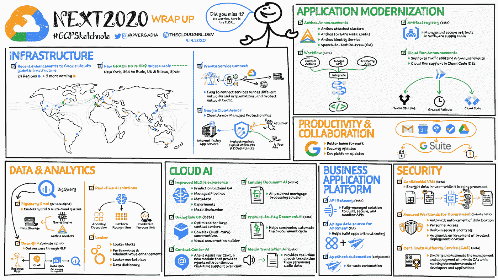

# TWiGCP —“引入历史检测和人工智能平台预测 GA”

> 原文：<https://medium.com/google-cloud/twigcp-introducing-chronicle-detect-and-ai-platform-prediction-ga-de2bbd7ad796?source=collection_archive---------1----------------------->

以下是谷歌云视频系列 本周最新 [**的链接:**](http://gtech.run/ju4em)

*   [引入云 SQL 无服务器导出](http://gtech.run/gcuap)
*   [在谷歌云上运行的 Windows 新管理工具](http://gtech.run/kendn)
*   [所有谷歌云迁移指南的指南](http://gtech.run/l7hj9)
*   [云日志获得正则表达式支持](http://gtech.run/r8bfr)

过去一周 GCP 的其他头条新闻包括:

*   [介绍来自谷歌云的 Chronicle Detect](http://gtech.run/fc8v5)(谷歌博客)
*   [AI 平台预测现在有了更好的可靠性& ML 工作流程](http://gtech.run/9vnqe)(谷歌博客)

来自“一起更好”部门:

*   [在你的谷歌负载均衡器上使用云装甲和云 CDN](http://gtech.run/4yayf)(谷歌博客)

来自“进来吧，谷歌云水是暖的”部门:

*   所有谷歌云迁移指南的指南(谷歌博客)
*   [如何通过三个步骤将你的定制 ML 模型迁移到谷歌云](http://gtech.run/uekfp)(谷歌博客)

来自“帮助您更新应用，一次一个 Anthos 功能”部分:

*   [云运行为 Anthos 添加事件](http://gtech.run/j24yq)(谷歌博客)
*   [深入探究 Anthos 捆绑负载均衡器](http://gtech.run/t7ny8)(谷歌博客)

从“管理所有计算虚拟机”部门:

*   [云监控获得全舰队虚拟机监控](http://gtech.run/meaht)(谷歌博客)
*   计算引擎获得更好的监控和日志记录

来自“Knative 未来 90 分钟，加入我们！”部门:

*   [谷歌开源直播的庆祝日(10 月 1 日)](http://gtech.run/a47h2)(opensourcelive.withgoogle.com)

来自“BigQuery，从标准查询到高级分区”部门:

*   [BigQuery 解释:查询您的数据|作者 Rajesh thal am](http://gtech.run/nsza3)(medium.com)
*   【medium.com】[如何在 BigQuery |中调整您的固定费率和灵活时段预订](http://gtech.run/zwfje)

来自“为工作选择最佳 ASIC”部门:

*   【medium.com】[如何在 GPU 上创建自动缩放的数值计算 web 服务](http://gtech.run/ywebq)

来自我最喜欢的“客户用 GCP 解决现实世界的问题”部分:

*   【Waze 如何使用谷歌云人工智能平台预测拼车(谷歌博客)

来自“**多媒体**”部门:

*   [视频][Kubernetes 引擎上的垂直和水平自动缩放](http://gtech.run/2fxj3)(youtube.com)
*   [视频] [自动化云监控仪表板](http://gtech.run/9dj4a)(youtube.com)
*   【视频】[什么是数据去标识？](http://gtech.run/q2ga2)(youtube.com)
*   [播客] Kubernetes 播客[第 122 集——格拉芙娜，与托克尔·德加德](http://gtech.run/fkr5m)(kubernetespodcast.com)
*   gcppodcast.com，GCP 播客第 237 集

从 **Beta，GA，还是什么？**“部:

*   [GA] [云 SDK 311.0.0](http://gtech.run/wfg8w)
*   秘密经理现在在所有地区都有了
*   [GA] [云甲威发规则(LFI、RCE、RFI)](http://gtech.run/kxb27)
*   [GA] [分离发布/订阅订阅](http://gtech.run/22edh)
*   [GA] [管理云日志存储桶](http://gtech.run/5aysc)
*   [GA] [BigQuery 每小时分区表](http://gtech.run/8x3kj)
*   【GA】[big query ML 单一时间序列预测](http://gtech.run/8xcux)
*   【GA】[云 AI 笔记本 API](http://gtech.run/uez3d)
*   [Beta] [在网络间迁移虚拟机](http://gtech.run/4cpvb)
*   [工作量身份联邦](http://gtech.run/6lzcs)

本周的图片是 Priyanka 关于 2020 年 OnAir 云的草图

这就是本周的全部内容！
——亚历克西斯