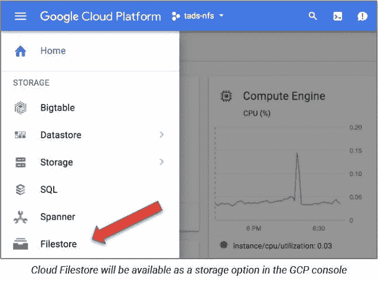

# TWiGCP —“介绍云文件存储、GitLab，详细介绍向 GCP 的迁移，以及新的洛杉矶云区域”

> 原文：<https://medium.com/google-cloud/twigcp-introducing-cloud-filestore-gitlab-detailing-migration-to-gcp-and-a-new-la-cloud-4b25f9192de?source=collection_archive---------1----------------------->

开放最终总是会胜出，“ [*为什么我们相信开放的云*](http://goo.gl/v3Kq4m) ”(谷歌博客)

Filestore(带 L)是来自谷歌云的文件存储即服务——“[*新的云文件存储服务为 GCP 用户带来高性能的文件存储*](http://goo.gl/2EaoCY) (谷歌博客)

GCP 今年夏天要来洛杉矶—“[*面向媒体和娱乐行业的谷歌云*](http://goo.gl/H299ot) ”(谷歌博客)

与此同时，Kubernetes 这次坚持其发布节奏，推出了 1.11 版的[并提供集群内负载平衡。此外，CoreDNS 插件现在是 GA (kubernetes.io)](http://goo.gl/Qo2fak)

这篇文章中有相当多的技术内容——“[*我们正从 Azure 迁移到谷歌云平台*](http://goo.gl/XKSZF3)”(about.gitlab.com)

来自“你应该知道的 GCP 的事情”部门:

*   “[企业组织的最佳实践](http://goo.gl/i1DCjK)”是使用 GCP 的新老企业的重要资源列表。请特别查看“风险管理”和“计费和成本归属”部分(谷歌云文档)
*   用于创作和服务 codelabs 的工具 (github.com)。g.co/codelabs.的动力是什么

来自“充分利用 GCP”部门:

*   [如何将 Stackdriver 连接到外部监控](http://goo.gl/nLjak6)(谷歌博客)
*   [beta] [使用云密钥管理服务](http://goo.gl/im2GaX)(谷歌博客)中管理的密钥保护您的计算引擎资源
*   [没有本地主机？没问题！使用 Google Cloud Shell 作为我的全职开发环境](http://goo.gl/EgM17Z)(medium.com)

来自“本周人工智能”部门:

*   [用于机器人操作的可扩展深度强化学习](http://goo.gl/oZ3o1V)(谷歌博客)
*   [OpenAI 正在 blog.openai.com GCP](http://goo.gl/PNyn8D)使用数百个 GPU&128，000 个 CPU 内核
*   [为什么企业在机器学习上失败](http://goo.gl/2aNiqG)(hackernoon.com)

来自“GCP 的 DB 适合你”部门:

*   [在 GCP 宣布 MongoDB Atlas 免费等级](http://goo.gl/Mb4gcF)(在三个地区)(谷歌博客)
*   [使用云 Bigtable 运行 JanusGraph】(谷歌文档)](http://goo.gl/Hwhd2V)

来自“云数据流和 Apache Beam”部门:

*   [Dataflow SDK 2.5](http://goo.gl/6bKUeB) 是该系列的最后一个——从现在开始，Dataflow 将直接支持 Apache Beam SDK(谷歌博客)
*   使用数据流和云存储的无服务器 AVRO 与 CSV 之间的转换，使用云数据流和 Apache Beam 运行格式转换(谷歌博客)

来自“Medium.com 上的 GCP 财富内容”部门:

*   [世界杯可视化:最有价值球员](http://goo.gl/azsLU4)(medium.com)
*   [我获得谷歌云平台帮助的建议](http://goo.gl/DVG8Ly)(medium.com)
*   [探索谷歌云平台上的 gRPC](http://goo.gl/Wh1ojo)(medium.com)

来自“不适合其他部分的随机事件，抱歉”部门:

*   [用于电子设计自动化的谷歌云:新合作伙伴](http://goo.gl/4Rngqy)(谷歌博客)
*   在 Apache Kafka 上模仿谷歌的云发布/订阅(blog.appscale.com)
*   [谷歌。NET 开发者调查](http://goo.gl/Cq21KV)
*   有效除垢:当库伯内特遇到芹菜【hackernoon.com 

来自“以防你错过(ICYMI)”部门:

*   [Beta] [云功能现已在全球四个地区推出](http://goo.gl/2xFCSv)(谷歌文档)
*   用转移设备来阻止移动，现在在美国普遍可用
*   [Beta] [限制对(计算引擎)图像的访问](http://goo.gl/zh3Z83)
*   【GA】[Kubernetes 引擎节点中的 NVIDIA GPU](http://goo.gl/L8YZQC)

来自“所有多媒体”部门:

*   Brahim Elbouchikhi 和 Sachin Kotwani(gcppodcast.com)的 GCP 播客#133 ML 工具包
*   [视频] [伊斯迪奥，我们有一个问题！使用服务网格了解并修复错误](http://goo.gl/5Ecrvy)(dotconferences.com)
*   张育青和弗雷德·范·登·德瑞斯彻在 kubernetespodcast.com 的 SRE

本周的图片来自于云文件存储的[公告，即将推出测试版:](http://goo.gl/2EaoCY)

这就是本周的全部内容！
——亚历克西斯