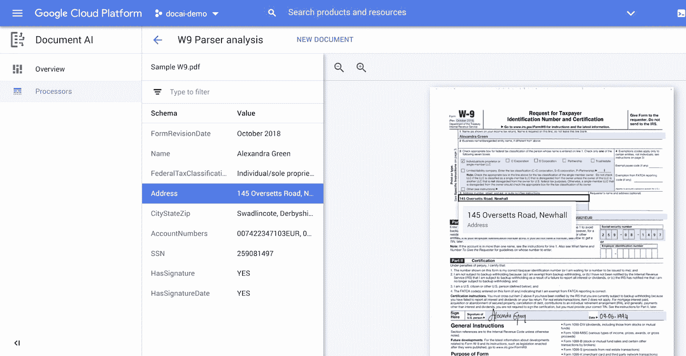

# TWiGCP —“介绍 Document AI、PostgreSQL 13 和新的 CDN 特性”

> 原文：<https://medium.com/google-cloud/twigcp-introducing-document-ai-postgresql-13-and-new-cdn-features-994da1cbab57?source=collection_archive---------2----------------------->

过去一周的 GCP 要闻包括:

*   [介绍文档人工智能平台，文档处理的统一控制台](http://gtech.run/y5ypp)(谷歌博客)
*   [云 SQL 现在支持 PostgreSQL 13](http://gtech.run/9smw3) (谷歌博客)
*   [如果可以的话，请用最新的云 CDN 功能](http://gtech.run/d54l8)(谷歌博客)

来自“信任我们，因为我们让您更少信任我们”部门:

*   云信任悖论:要更多地信任云计算，你需要减少对它的信任

来自“遗留系统和现代 API 不要混合，不要让这个阻止你”部门:

*   Apigee:你通向更易管理的 SAP API 的大门

来自“洞察和公平定价”部门:

*   [见解的民主化:赋予数据分析师和业务用户权力](http://gtech.run/npn9n)(谷歌博客)
*   [BigQuery Flex Slots 定价:程序化方法|作者 Charles verley en](http://gtech.run/xxzky)(medium.com)

来自“来自构建者的数据目录连接器”部门:

*   [如何在生产中运行谷歌数据目录连接器——云功能与 Kubernetes |作者 Marcelo Costa](http://gtech.run/v737g)(medium.com)

来自“修理和改装集装箱”部门:

*   [GKE 故障排除服务|作者尤里·格林斯泰恩](http://gtech.run/ux5en)(medium.com)
*   [黑掉你自己定制的容器注册域](http://gtech.run/fqeuq)(谷歌博客)

来自“容器、云代码和云运行的开发者体验”部门:

*   在本地测试容器时使用谷歌云用户证书
*   [使用云代码和 Google Cloud Run 开发和部署无服务器容器](http://gtech.run/qx7m6)(medium.com)

来自“客户和合作伙伴与 GCP 一起解决实际问题”部门:

*   [南加州大学利用云人工智能削减临床试验收费的繁文缛节](http://gtech.run/5q47b)(谷歌博客)

来自“**多媒体**”部门:

*   【YouTube】【youtube.com】数据目录要点
*   [播客] Kubernetes 播客[第 128 集——安特里亚，安东宁巴斯](http://gtech.run/wkrex)(kubernetespodcast.com)

从"**预告，GA，还是什么？**“部门:

*   【GA】[云 SDK 317.0.0](http://gtech.run/wfg8w)
*   【GA】[凡世通进出口](http://gtech.run/mvfmy)
*   【GA】[资产库存结构化资产导出到 BigQuery](http://gtech.run/tfzsg)
*   【GA】[云日志——设置日志数据的区域](http://gtech.run/665sx)
*   [GA] [云构建—支持云原生构建包](http://gtech.run/fyj8d)
*   [预览] [GKE —使用本地固态硬盘](http://gtech.run/jyh6x)
*   [预览] [秘密管理器—启用客户管理的加密密钥](http://gtech.run/emh8n)

本周的图片是新发布的文档 AI 产品的控制台截图

这就是本周的全部内容！亚历克西斯