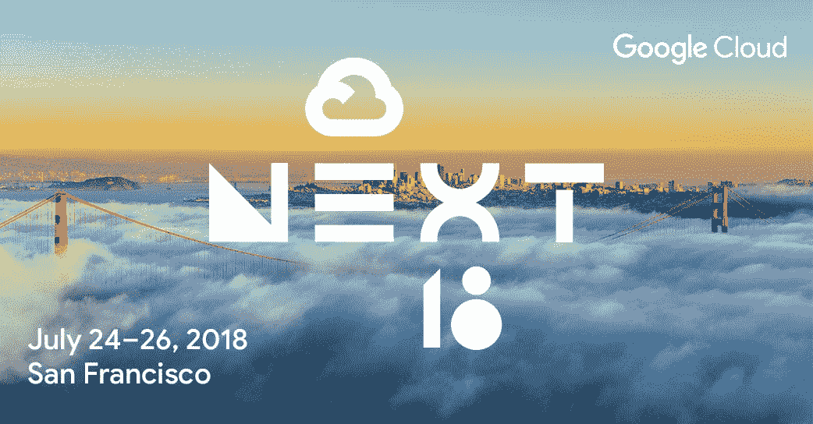

# TWiGCP —“介绍 Python 数据流、端点验证以及 Google/SAP 合作成果”

> 原文：<https://medium.com/google-cloud/twigcp-introducing-python-dataflow-streams-endpoint-verification-and-a-look-at-what-the-b362395f4c01?source=collection_archive---------1----------------------->

谷歌正在让低延迟并行处理与数据科学和机器学习工具很好地结合起来—“[*数据流处理现在支持 Python*](http://goo.gl/dqNmH2) ”(谷歌博客)

如果你更喜欢老的 Apache Spark 数据流，那么看看这个[教程，它涉及云数据 proc 和云发布/订阅](http://goo.gl/CPggJ7)(谷歌博客)

关于大数据，这篇谷歌云客户帖子值得一读“ [*我们为什么在 outfit 7*](http://goo.gl/rvoE88)”(outfit7.com)

有了新发布的[端点验证](http://goo.gl/tfPyPN)(Chrome 扩展和桌面原生应用)，你现在可以建立一个访问你的公司数据和服务的设备清单(谷歌博客)

Kubernetes 1.11 已经发布，这篇文章将让你详细了解谷歌的最新成果

了解与 SAP 的主要合作伙伴关系和联合工程可以为谷歌云平台上的 [HANA 生态系统带来什么。提示:它不仅仅是大型 GCE 实例。](http://goo.gl/rtfgMT)

从“你最近看过 GCP 媒体出版物吗？”部门:

*   [我是如何结束的。我的创业公司 Kubernetes 上的 NET Core](http://goo.gl/bg6VKZ)(medium.com)
*   [卡夫卡和普布苏伯的源汇](http://goo.gl/xU2bPR)(medium.com)
*   [如何使用谷歌云视觉 API 并点击发送来跟踪你的宠物【medium.com ](http://goo.gl/hiJNFM)

BeyondCorp 不仅仅是一份白皮书或云 IAP 服务，它是一种在谷歌内部成功部署的模式—“[*为贵公司的 BeyondCorp 世界做准备*](http://goo.gl/oJpqCP) ”(谷歌博客)

来自“以防你错过(ICYMI)”部门:

*   [GA] [创建云 Dataproc 定制图像](http://goo.gl/y2ubQN) (Google 文档)
*   在源代码库中检测安全密钥(Google 文档)
*   从云函数连接到云 SQL(Google 文档)

来自“所有多媒体”部门:

*   gcppodcast.com GCP 播客#134 — [用 Unity 连接游戏，用 Brett Bibby 和 Micah Baker 连接谷歌云](http://goo.gl/Ke7Qnm)
*   Kubernetes 播客——【kubernetespodcast.com】Kubernetes 1.11，由乔希·伯库斯和蒂姆·佩珀
*   [如何用 Kaggle 做一个数据科学项目](http://goo.gl/L5bfbd)(towardsdatascience.com)
*   [云？是法语版的 GCP 系列！](http://goo.gl/MEuAGh)(youtube.com)

本周的图片提醒人们，谷歌云迄今为止最大的活动“云下一届 2018 年([g.co/next18](http://g.co/next18))将于本月晚些时候举行:

这就是本周的全部内容！亚历克西斯