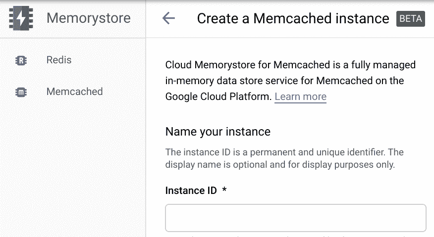

# TWiGCP —“介绍服务目录、BQ 列级安全性、Memcached 的 Memorystore 以及免费培训”

> 原文：<https://medium.com/google-cloud/twigcp-introducing-service-directory-bq-column-level-security-memorystore-for-memcached-and-f54eb4e3bdba?source=collection_archive---------1----------------------->

过去一周的 GCP 要闻包括:

*   [谷歌云正在做些什么来支持全球的企业和用户](http://gtech.run/9quk6)(谷歌博客)
*   [引入服务目录:在一个地方大规模管理你所有的服务](http://gtech.run/5x5qn)(谷歌博客)
*   [引入 BigQuery 列级安全性:新的细粒度访问控制](http://gtech.run/c58dz)(谷歌博客)
*   [用 Memcached 的 Memorystore 启动缓存](http://gtech.run/qd9h8)(谷歌博客)
*   [免费获得谷歌云培训](http://gtech.run/fgqn7)(withgoogle.com)

来自“有效大声拖纸”部门:

*   [在谷歌云上实现身份和访问治理](http://gtech.run/75d2c)(谷歌博客)

来自“与众不同的网络选择”部门:

*   [谷歌云网络连接选项，解释](http://gtech.run/c9lkg)(谷歌博客)

来自“动手人工智能”部门:

*   [利用免费的公共数据集探索与新冠肺炎相关的有价值的数据，这些数据可以在谷歌云的 BigQuery](http://gtech.run/b69vf) (谷歌博客)中找到
*   [动手操作 ML Precision/Recall &用 x 光预测肺炎](http://gtech.run/s4qvw)(youtube.com)
*   [Codelab:通过 Python 使用视频智能 API](http://gtech.run/jmc8c)(g.co/codelabs/cloud)

来自“打造更好的聊天机器人”部门:

*   使用应用程序脚本建立一个谷歌聊天机器人(谷歌博客)
*   [利用代理验证这一现成的审查功能创建高质量的聊天机器人](http://gtech.run/83aer)(medium.com)

来自“更好更快洞察”部门:

*   [向 Data Studio 时间序列图添加注释的 3 种方式](http://gtech.run/qpsqp)(medium.com)
*   [BigQuery +云功能:如何在新的谷歌分析表可用后立即运行查询](http://gtech.run/gavrx)(towardsdatascience.com)
*   [填补 NCAA 的空白:使用 BigQuery 模拟疯狂三月](http://gtech.run/gfpl6)(谷歌博客)

来自“云内外兼修”部门:

*   【gcloud 内部运行部署 (ahmet.im)
*   [gVisor 网络安全](http://gtech.run/u3vs7) (gvisor.dev)
*   [在云上运行的无服务器容器中使用 Java 14 和 Micronaut 开始享受乐趣](http://gtech.run/a73le)(glaforge.appspot.com)

来自“谷歌云数据库的有效使用”部门:

*   [Firestore 的 FieldValue.serverTimestamp() —揭秘！](http://gtech.run/5zw8t)(medium.com)
*   [云 SQL 数据库如何扩展，设置时需要了解什么](http://gtech.run/xby9n)(blog.doit-intl.com)

来自“这不会发生在你身上”的部分:

*   [如何在 medium.com GCP 调试一个没有响应的应用](http://gtech.run/v59wk)

来自“**万物多媒体**”部门:

*   [视频] [欢迎来到云海！云原生景观的图解介绍](http://gtech.run/trntw)(youtube.com)
*   [播客] Kubernetes 播客[第 97 集——耶格，尤里·什库洛](http://gtech.run/lkquy)(kubernetespodcast.com)
*   (gcppodcast.com)GCP 播客[第 214 集——戴尔·马科维茨](http://gtech.run/bxe7g)的人工智能在医疗保健中的应用

**Beta，GA，还是什么？**“部门:

*   [GA] [云 SDK 287.0.0](http://gtech.run/wfg8w)
*   【GA】[云 SQL PostgreSQL 版本 10](http://gtech.run/ghw64)
*   【GA】[云安全指挥中心](http://gtech.run/lyjan)中的云装甲
*   [GA] BigQuery [脚本](http://gtech.run/hcpkp)和[存储过程](http://gtech.run/9t7yk)
*   [GA] [托管实例组更新—替换方法](http://gtech.run/k7ywy)
*   [GA] [托管实例组更新—保留实例名称](http://gtech.run/43un2)
*   [GA] [云 ML 视频智能 API — Logo 检测](http://gtech.run/7wqty)
*   【GA】[云 NAT 监控](http://gtech.run/9dh5e)
*   [GA] [云监控扩展指标保留](http://gtech.run/krr7x)
*   [GA] [Anthos 服务网格 CA](http://gtech.run/ktwrq)
*   [Beta] [用于 Memcached 的云内存商店](http://gtech.run/9duey)
*   【Beta】[云扳手模拟器](http://gtech.run/psdmy)
*   服务发现(发现、发布和连接你所有的谷歌云服务)
*   [Beta][Cloud Composer 的监控仪表板](http://gtech.run/v3gan)
*   [Beta] [计算引擎 Windows 虚拟机诊断工具](http://gtech.run/9d9rf)
*   在云 TPU 吊舱上训练 PyTorch 模型
*   人工智能平台笔记本的 VPC 服务控制
*   【测试版】[推荐者 API 见解](http://gtech.run/h2e42)
*   【测试版】[健康检查日志](http://gtech.run/yc836)
*   【测试版】[云 SQL PostgreSQL 版本 12](http://gtech.run/7n5ey)

本周的图片展示了“Memcached 的 Memorystore”公告

这就是本周的全部内容！亚历克西斯