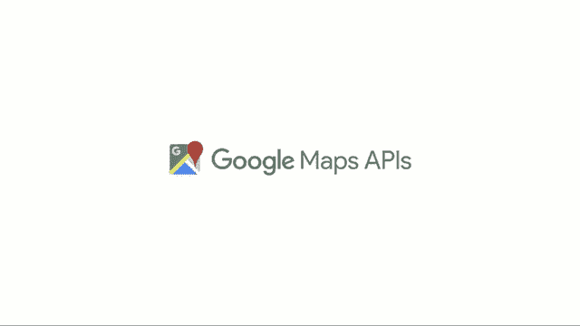

# TWiGCP—“介绍 Skaffold、Agons、Europe-west 4a 和新的 Stackdriver 定价”

> 原文：<https://medium.com/google-cloud/twigcp-introducing-skaffold-agons-europe-west4-a-and-new-stackdriver-pricing-a293d5ec6c59?source=collection_archive---------0----------------------->

这是充满公告的一周，首先是在 GDC(游戏开发者大会)上发布的几个公告:

*   " [*介绍 Agones:基于 Kubernetes*](http://goo.gl/L6B5Vr) 的开源、多人、专用游戏服务器托管"(谷歌博客)。Kubernetes 上的开源多人游戏，由育碧开发。
*   “ [*真实世界为你的游乐场:用谷歌地图 API*](http://goo.gl/zPs1iN)”构建真实世界游戏(谷歌博客)。谷歌地图+ Unity。不是你祖父的地图 API。
*   " [*介绍 Skaffold:简单且可重复的 Kubernetes 开发*](http://goo.gl/fbqCem) "(谷歌博客)。如果你上周密切关注的话，你应该已经看到了 GitHub 项目的链接。
*   " [*宣布新的堆栈驱动定价——能见度降低*](http://goo.gl/PCcfuV) "(谷歌博客)。所有人都可以使用高级警报和仪表盘。六月底生效。
*   “ [*GCP 生长在荷兰地区*](http://goo.gl/Vs6uWc) ”(谷歌博客)。45 个 GCP 区还在继续。
*   “ [*语义图像分割用 TensorFlow 中的 DeepLab*](http://goo.gl/uAPxe4)”(谷歌博客)。TensorFlow 驱动的 DeepLab-v3+现已开源。

本周来自“方法和最佳实践”部门:

*   8 个 DevOps 工具，让我们从 AWS 顺利迁移到 GCP: Tamr (谷歌博客)
*   [使用云资源仓库和容器构建器的自动无服务器部署](http://goo.gl/6DkAZC)(谷歌博客)
*   [使用 TensorFlow、GDELT 和云数据流预测 Reddit 上的社区参与度:第 1 部分](http://goo.gl/QUk7Q7)(谷歌博客)
*   [谷歌云平台上的超参数调整现在更快更智能](http://goo.gl/MrrP79)(谷歌博客)
*   [zulily 转向自助营销分析:通过 BigQuery 使用 Tableau 的最佳实践](http://goo.gl/PY7uMS)(谷歌博客)
*   [使用 Google Cloud AutoML 对澳大利亚毒蜘蛛进行分类](http://goo.gl/NX6JsS)(shinesolutions.com)
*   [用谷歌应用程序脚本和谷歌自然语言 API 分析 2018 奥斯卡电影中的情感](http://goo.gl/neXVwj)(kutil.org)

来自“后退一步”部门:

*   [Istio 我为什么需要它？](http://goo.gl/N7q4ZU)(medium.com)
*   [Kubernetes 节点端口 vs 负载平衡器 vs 入口？什么时候该用什么？](http://goo.gl/9qRvMH)(medium.com)

来自“观察和倾听”部门:

*   [Spinnaker meetup:Kubernetes v2 提供商](http://goo.gl/NkNHwn)(youtube.com)
*   摩根·麦克林和 JBD 主持的 GCP 播客#118 公开人口普查(gcppodcast.com)

来自“以防你错过(ICYMI)”部门:

*   [GA] [创建、删除和废弃自定义图像](http://goo.gl/nKhx7m)(谷歌文档)
*   超级内存机器类型(谷歌文档)

本周图片来自“[用谷歌地图 API](http://goo.gl/zPs1iN)构建真实世界游戏”公告博文:

这星期到此为止！亚历克西斯