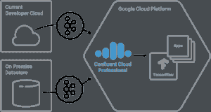

# TWiGCP —“托管 GCP 上的 Kafka、计费通知以及 Dialogflow 和 GKE 企业增强功能”

> 原文：<https://medium.com/google-cloud/twigcp-managed-kafka-on-gcp-billing-notifications-and-dialogflow-and-gke-enterprise-11230aae659d?source=collection_archive---------0----------------------->

Apache Kafka 及其丰富的生态系统，现在可以通过 Google/Confluent 合作在 GCP 上作为一项服务使用！“ [*谷歌云平台和合流合作伙伴交付托管的阿帕奇卡夫卡服务*](http://goo.gl/cy9btL) ”(谷歌博客)

定价和成本都是谷歌云团队一直努力简化的事情，这次是通过:“ [*谷歌云计费程序通知*](http://goo.gl/i8P97b) ”(谷歌博客)更好地控制成本

新的 Stackdriver 警报 UI，新特性—“[*stack driver 为条件编辑器 UI*](http://goo.gl/WBrsPc) ”(谷歌博客)带来了强大的警报功能

在谷歌 I/O 上宣布的三个主要的新 Dialogflow 测试版功能在这篇文章中有详细介绍—“[*dialog flow 增加了版本控制和其他新功能，以帮助企业建立充满活力的对话体验*](http://goo.gl/GEUKcn) ”(谷歌博客)

GKE 1.10 发布后，我们发布了一系列谷歌博客文章，详细介绍了 GCP 用户现在可以依赖的企业功能:

*   [超越 CPU:在 Google Kubernetes 引擎中使用自定义指标进行横向扩展](http://goo.gl/mSD5pY) (Google 博客)
*   [使用 Google Kubernetes 引擎上的区域持久磁盘获得更高的可用性](http://goo.gl/Xbp5SN) (Google 博客)
*   [介绍谷歌 Kubernetes 引擎的共享 VPC](http://goo.gl/4yxTia)(谷歌博客)

还可以查看 Kubernetes 最佳实践系列的最新文章:

*   [映射外部服务](http://goo.gl/7BxTov)(谷歌博客)

来自“快速张量流和 ML 综述”部门:

*   Coursera 上新的机器学习专业教你在 GCP 建立生产就绪模型
*   " [Tensorflow 急切模式中的 12 条推文。你会喜欢推特#12 的😁](http://goo.gl/5NACW5)(twitter.com)
*   谷歌机器学习 API 培训(github.com)

来自“如果您关注分析师报告”部门:

*   [谷歌云在最新的 Forrester Research 公共云平台原生安全浪潮中任命了一名领导者](http://goo.gl/WQQKGw)(谷歌博客)
*   【zdnet.com】谷歌云平台在高德纳的魔力象限中跻身领导者类别

来自“所有播客”部门:

*   凯西·科济尔科夫(gcppodcast.com)GCP 播客#128《决策情报》
*   [Kubernetes 播客(来自谷歌)第 4 集 Stackdriver Kubernetes 监测，JD Velasquez](http://goo.gl/GP9xzq)(kubernetespodcast.com)

本周图片是[汇流云的阿帕奇卡夫卡运行在 GCP](http://goo.gl/cy9btL) :

这就是本周的全部内容！亚历克西斯