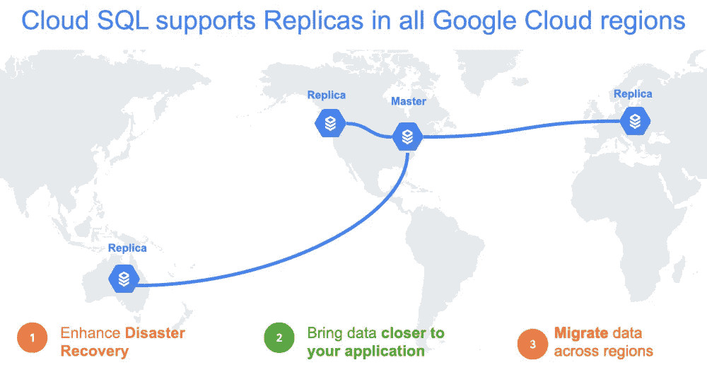

# TWiGCP —“将 Java 迁移到 Anthos，跨区域云 SQL，以及查找 GKE 日志”

> 原文：<https://medium.com/google-cloud/twigcp-migrate-java-to-anthos-cross-region-cloud-sql-and-finding-gke-logs-2502414b5b3?source=collection_archive---------1----------------------->

过去一周的 GCP 要闻包括:

*   [Migrate for Anthos 简化传统 Java 应用程序现代化](http://gtech.run/xegkf)(谷歌博客)
*   [引入云 SQL 的跨区域副本](http://gtech.run/zmdp2)(谷歌博客)
*   [如何通过云日志找到并使用你的 GKE 日志](http://gtech.run/5kapr)(谷歌博客)
*   新的谷歌云技能徽章、学习路径和远程认证机会(谷歌博客)

来自“让移动和准备数据更容易”部门:

*   [使用 dbt 将数据加载并转换到 big query](http://gtech.run/yyqx3)(medium.com)
*   [当文件到达时如何自动化云数据准备管道](http://gtech.run/7y283)(trifacta.com)

来自“其他技术思考”部门:

*   [带有 Knative Eventing 的事件驱动图像处理流水线](http://gtech.run/4jtry)(medium.com)
*   [构建自己的 bit.ly](http://gtech.run/4s5q7) (mco.dev)
*   [谷歌云发布/订阅有三个独特的功能，帮助它为应用集成商提供价值](http://gtech.run/9j7u8)(seroter.com)

来自“源自客户用例的谷歌云解决方案”部门:

*   [谷歌云上的集中式网络设备](http://gtech.run/4abdk)(cloud.google.com)
*   [物联网设备的多架构容器图像【cloud.google.com ](http://gtech.run/qxwq6)
*   [使用 Istio 构建 GKE 多集群服务网格:跨不同网络共享控制平面](http://gtech.run/ba5xp)(cloud.google.com)

来自我最喜欢的“客户和合作伙伴对 GCP 的最佳评价”部分:

*   [数据流和 gRPC——大规模使用——帕洛阿尔托网络工程](http://gtech.run/se8ef)(medium.com)
*   [英国政府与谷歌签署公共部门折扣云协议](http://gtech.run/ve7m6)(cnbc.com)

来自“**万物多媒体**”部门:

*   [视频] [用 OpenTelemetry 整合轨迹和日志](http://gtech.run/w68yg)(youtube.com)
*   如何在 Anthos(youtube.com)中为您的应用采用多集群策略
*   [播客] Kubernetes 播客【kubernetespodcast.com 第 106 集——CoreDNS，约翰·贝拉马里克
*   [播客]gcppodcast.com GCP 播客[第 223 集 Elliott Abraham 和 Jason Bisson 的安全行动](http://gtech.run/ephpq)

从" **Beta，GA，还是什么？**“部门:

*   【GA】[云 SDK 295.0.0](http://gtech.run/wfg8w)
*   [GA] [云功能转到 1.13](http://gtech.run/clyxd)
*   云函数的 node . js 10
*   [GA] [访问上下文管理器—自定义访问级别](http://gtech.run/bzdqz)
*   [GA] HTTP(S) [负载平衡日志记录和监控](http://gtech.run/5kkax)
*   【GA】[将 DICOM 数据导入/导出到云存储和 BigQuery](http://gtech.run/zzyy3)
*   [Beta] [启用非 RFC 1918 保留 IP 地址范围](http://gtech.run/b7b5k)
*   【测试版】[云视频智能 API 流式视频注释](http://gtech.run/uhrlm)
*   [分级防火墙策略](http://gtech.run/j8f6w)
*   [Beta] [VPC 服务控件，带有用于 Redis 的存储库](http://gtech.run/qgznb)

本周图片来自云 SQL 复刻博文

这就是本周的全部内容！亚历克西斯