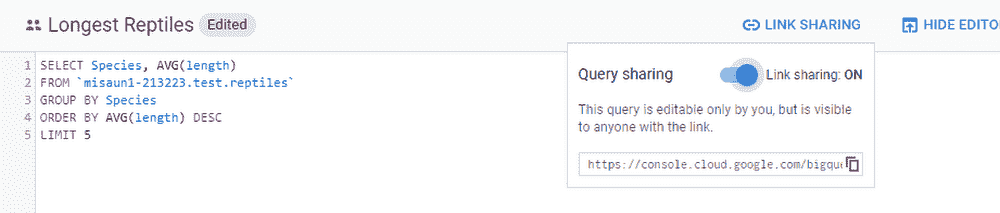

# TWiGCP —“新的 BigQuery UI，引入 krew 和 Minikube 增强”

> 原文：<https://medium.com/google-cloud/twigcp-new-bigquery-ui-introducing-krew-and-minikube-enhancements-136f894db501?source=collection_archive---------1----------------------->

以下是过去一周的主要新闻:

"[新的 BigQuery UI 特性帮助你更快地工作](http://goo.gl/sxex4g)(谷歌博客)。在新的用户界面中共享查询、数据集等。

[来见见 kubectl 插件管理器“krew ”!](http://goo.gl/pq54bw) (github.com)。发现、安装并保持 kubectl 插件最新。

" [Livin' la vida local:从您的笔记本电脑上更轻松地开发 Kubernetes】"(谷歌博客)。Minikube GPU 和负载平衡器支持；再加上 Skaffold 和 Jib 的构建和部署。](http://goo.gl/GkPhBF)

从“从视觉 API 限制到 AutoML 的质量结果之旅”部门:

*   [海岸分类器:使用 AutoML 视觉评估和跟踪环境变化](http://goo.gl/rFcTGd)(谷歌博客)

来自“哪个是最好的 Google 云身份认证和身份管理选项”部门:

*   [身份和认证，谷歌云方式](http://goo.gl/yTByxe)(谷歌博客)

来自“谷歌在零售业的蓬勃发展超出了你的想象”部门:

*   [巅峰表现:零售商如何在黑色星期五/网络星期一期间使用谷歌云](http://goo.gl/w1ELct)(谷歌博客)
*   [像 Ulta 和 DSW 这样的零售商如何使用谷歌云来改善客户体验](http://goo.gl/iGTSbn)(谷歌博客)

来自“操作方法”部门:

*   [应用引擎:将您的网站转移到 medium.com HTTPS](http://goo.gl/A7KPwf)
*   [Istio 中的应用指标](http://goo.gl/EZXUdM)(medium.com)

来自“回过头来看看关键云原生技术的状态”部门:

*   [Istio 1.1 的状态](http://goo.gl/Yfg73X)(讨论. istio.io)
*   [浏览器中 gRPC 的状态](http://goo.gl/Zhx1gy) (grpc.io)

从“行业视角”部门:

*   [用云扳手和无服务器重新思考商业软件交付](http://goo.gl/pZk4es)(谷歌博客)
*   [2019 年金融服务机构在云计算领域加快发展的 5 种方式](http://goo.gl/DZDfxF)(谷歌博客)

来自“什么是没有专用 BigQuery 的 TWiGCP？”部门:

*   一年回顾(medium.com)
*   【medium.com】[如何使用云 SQL 从 MySQL 提供 BigQuery 结果](http://goo.gl/FxvfkF)
*   【datascience.com.co】如何使用云数据流将 BigQuery 表转移到云 SQL

从“测试版，正式版，还是什么？”部门:

*   [GA] [云 SDK 229.0.0](http://goo.gl/QMtpTC)
*   [GA] [配置云装甲安全策略](http://goo.gl/vv7WTi)
*   [Beta] [gcloud beta firestore 指数](http://goo.gl/krT7HJ)
*   [Beta] [gcloud beta dns 政策](http://goo.gl/KvFwZN)
*   公开比赛(github.com)

来自“所有多媒体”部门:

*   [Podcast] [Kubernetes 播客第 35 集——云原生计算基金会，与 Dan Kohn 合作](http://goo.gl/DoiDPA)(kubernetespodcast.com)
*   【视频】[欢迎来到谷歌云平台——GCP 必备](http://goo.gl/UdSDzN)(GCP YouTube 频道新推出的“入门”视频系列，分享给正在入门 GCP 的同事们吧！)
*   [视频]windy.com—[以最快的速度提供最准确的风力数据【youtube.com ](http://goo.gl/8JFcHH)

本周的图片是 BigQuery UI 及其共享查询的能力

这就是本周的全部内容！亚历克西斯