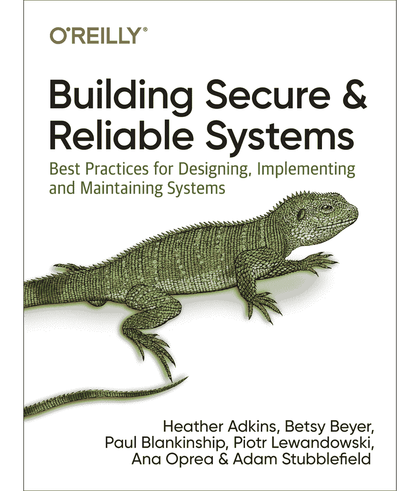

# TWiGCP —“新的日志查看器、海量大数据和存储产品功能，以及新的 SRE 书籍”

> 原文：<https://medium.com/google-cloud/twigcp-new-log-viewer-its-raining-big-data-and-storage-product-features-and-a-new-sre-book-a5b4344a9645?source=collection_archive---------3----------------------->

过去一周的 GCP 要闻包括:

*   [使用我们新的日志查看器](http://gtech.run/95kzc)(谷歌博客)更快地找到并修复问题
*   [使用 XGBoost 的机器学习在 GPU 上使用 Dataproc 变得更快](http://gtech.run/yw2s7)(谷歌博客)
*   [相同的云大表数据库，现在用于较小的工作负载](http://gtech.run/s27pp)(谷歌博客)
*   [云大表控制台中的关键可视化工具](http://gtech.run/t548t)(谷歌博客)
*   [用于数据争论的新 Dataprep AI 特性](http://gtech.run/nyfbm)(谷歌博客)
*   [用谷歌的新书学习构建安全可靠的系统](http://gtech.run/962km)(谷歌博客)

来自“科技为善”部门:

*   [在新冠肺炎期间支持联络中心](http://gtech.run/lqyve)(谷歌博客)
*   [COVID19 公共数据 NLP 机器学习谷歌云平台](http://gtech.run/623dr)(towardsdatascience.com)

来自“移入和移出数据”部门:

*   [如何将数据从 MySQL 转移到 BigQuery？](http://gtech.run/qd29n)(谷歌博客)
*   [从 Google Drive 加载 XLSX 数据，并使用 Airflow 将其加载到 big query](http://gtech.run/cadvy)(medium.com)
*   将数据从 Firebase (Firestore)导出到 big query【medium.com 

来自“谷歌云上的人工智能模型实践”部门:

*   [把你的原始数据变成一个没有 Python 或者 SQL 的机器学习模型](http://gtech.run/sqph8)(谷歌博客)
*   [如何在云人工智能平台上部署 TensorFlow 2 模型](http://gtech.run/8l9su)(blog.tensorflow.org)
*   [准备用于个性化的 ML 就绪数据](http://gtech.run/ca289)(cloud.google.com)

来自“SAP 开发人员，谷歌云水是温暖的”部门:

*   [SAP、谷歌云和开发者](http://gtech.run/9mpkx)(medium.com)

来自“新的无服务器工具、指南和示例”部门:

*   [使用云代码为 IntelliJ 部署云运行应用](http://gtech.run/lul6k)(cloud.google.com)
*   [了解 gRPC、OpenAPI 和 REST 以及何时使用它们](http://gtech.run/7h4f3)(谷歌博客)
*   【medium.com】在 Google Cloud 上用 Node.js 和 MySQL 构建一个无服务器的 REST API
*   [您的私人 PDF 合并服务](http://gtech.run/bcax5)(开发到)

来自“语音到文本到语音”部门:

*   [使用谷歌预先训练的语音转文本 API 转录视频](http://gtech.run/52vq6)(medium.com)
*   [通过 Python 使用语音转文本 API](http://gtech.run/arj42)(g.co/codelabs/cloud)
*   [通过 Python 使用文本到语音的 API](http://gtech.run/qcrjx)(g.co/codelabs/cloud)

来自“改善，现在与 Looker”部门:

*   [所有 200 多个谷歌云产品用不超过 4 个字描述](http://gtech.run/ywk78)(medium.com)

来自“**万物多媒体**”部门:

*   【扩展编码视频】[用 Node.js 和 MySQL 创建 REST API](http://gtech.run/yy97e)(youtube.com)
*   【YouTube】[使用假设工具进行解释](http://gtech.run/u77pe)
*   [YouTube][GKE 网络端点组的负载均衡](http://gtech.run/m8tla)
*   Kubernetes 播客[第 98 集——卡桑德拉，山姆·拉姆奇](http://gtech.run/ehyg5)(kubernetespodcast.com)
*   gcppodcast.com GCP 播客[第 215 集——汤玛斯·荣格和露西娅·苏巴丁的 SAP](http://gtech.run/yqrdd)

**Beta，GA，还是什么？**“部门:

*   [GA] [云 SDK 288.0.0](http://gtech.run/wfg8w)
*   [GA] [TLSv1.3 HTTPS LB、SSL 代理 LB 和云 CDN](http://gtech.run/zxqr2)
*   [GA] [N2D 机器类型](http://gtech.run/vng6n)
*   【GA】[谷歌云 AI 平台笔记本](http://gtech.run/fuzkl)
*   Anthos 服务网格可观察性
*   安托斯策略控制者
*   【GA】[云 Bigtable Key 可视化工具](http://gtech.run/ys8hl)
*   【GA】[云数据融合 VPC 服务控件](http://gtech.run/bp4p5)
*   【GA】[big query 调度查询所需权限](http://gtech.run/ssxsh)
*   【GA】[云数据融合—数据防丢失](http://gtech.run/ues7l)
*   【GA】[云作曲家——共享 VPC](http://gtech.run/gelqt)
*   【GA】[云作曲家私有 IP](http://gtech.run/tf5qe)
*   [GA] [云医疗 API v1](http://gtech.run/e7kby)
*   [GA] [安全健康分析](http://gtech.run/ytb6c)
*   巴泽尔
*   【测试版】[洞察平台](http://gtech.run/as73h)
*   [BigQuery 物化视图](http://gtech.run/edgmu)
*   [Beta] [BigQuery 流 FHIR 资源更改](http://gtech.run/p5jb7)
*   【Beta】[云 AI 平台优化器](http://gtech.run/jxxv5)
*   【测试版】[云医疗 API HL7v2](http://gtech.run/kbkpq)
*   [Beta][Memcached 的云内存存储](http://gtech.run/dylcz)
*   [Beta] [Dataproc HBase 组件](http://gtech.run/x7avb)
*   [Beta][Flex 模板的数据流支持](http://gtech.run/yl4u2)
*   【测试版】[数据流互动笔记本](http://gtech.run/6rykv)
*   【Beta】[App 引擎区域路由](http://gtech.run/rv2d4)

本周的图片是最新的谷歌 SRE 图书的封面，免费的数字格式