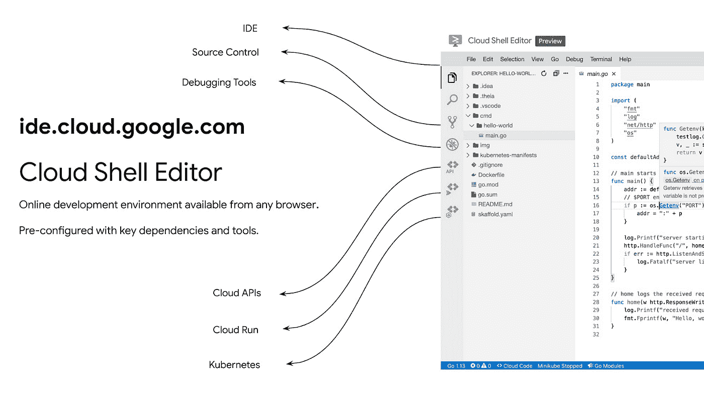

# TWiGCP —“新的存储生命周期、云外壳编辑器和更多云运行事件”

> 原文：<https://medium.com/google-cloud/twigcp-new-storage-lifecycle-cloud-shell-editor-and-more-events-for-cloud-run-9e4b8db6f856?source=collection_archive---------2----------------------->

过去一周的 GCP 要闻包括:

*   [云存储对象生命周期管理获得新控制](http://gtech.run/6g23r)(谷歌博客)
*   [介绍云壳编辑器](http://gtech.run/3y5qv)(谷歌博客)
*   [用来自 60 多个谷歌云资源的事件触发云运行](http://gtech.run/tnaz8)(谷歌博客)
*   [减轻新 Docker Hub 拉取请求限制的影响](http://gtech.run/nfpcf)(谷歌博客)

来自“这似乎是一个 Java 周”部门:

*   [使用 Spring Cloud GCP 更新您的 Java 应用](http://gtech.run/wgbqr)(谷歌博客)
*   [使用 Cloudstate 和 Akka Serverless 的 Google Cloud 上的有状态无服务器](http://gtech.run/94spx) (Google 博客)
*   [比较容器化方法:Buildpacks、Jib 和 Dockerfile](http://gtech.run/6kyqc) (谷歌博客)

来自“将您最喜欢的工具与 Google Cloud twist 结合使用”部分:

*   [云代码入门](http://gtech.run/3usbc)(youtube.com)

来自“借鉴 Ash 的云扳手经验”部门:

*   [谷歌云扳手——关键概念](http://gtech.run/2a8qr)(medium.com)
*   [谷歌云扳手—技术概述](http://gtech.run/pyp2v)(medium.com)

来自“优化您的堆栈和架构”部门:

*   [优化云运行响应时间的 3 种方法|作者:【medium.com 王从希](http://gtech.run/7wvql)
*   [向谷歌云数据库添加缓存层(Bigtable + Memcached) |作者:比利·雅各布森](http://gtech.run/c7suy)(medium.com)

来自“您的每周 BigQuery 提示”部门:

*   [使用授权的 UDF 有条件地取消 BigQuery 中的列屏蔽|作者:邓梓峰](http://gtech.run/v2eea)(medium.com)

来自“没有锁定的 FaaS”部门:

*   任何语言的无服务器功能(medium.com)

来自“充分利用 GCP 内置的运营优势”部门:

*   [为 GKE 建立云运营|作者 Yuri Grinshteyn](http://gtech.run/xvkzy)(medium.com)

来自“它在媒体上，但仍然是参考资料”部门:

*   【谷歌云发布/订阅可靠性指南:第二部分订阅|基尔·蒂蒂夫斯基(medium.com)

来自“管道框架有一个 API”部门

*   [使用远程和事件触发的人工智能平台管道](http://gtech.run/6wgm8)(谷歌博客)

来自“客户和合作伙伴与 GCP 一起解决实际问题”部门:

*   [客户和合作伙伴谈论将 SAP 迁移到谷歌云](http://gtech.run/7ruqr)(谷歌博客)
*   [Mercari 使用云分析器减少服务延迟](http://gtech.run/tknff)(谷歌博客)

来自“**万物多媒体**”部门:

*   [播客] Kubernetes 播客[第 127 集——流行朋克到豆荚，大卫·派特](http://gtech.run/5pjl6)(kubernetespodcast.com)
*   [播客] GCP 播客[第 242 集——NASA 和 FDL 与詹姆斯·帕尔和马杜里卡·古哈塔克塔](http://gtech.run/88nnj)(gcppodcast.com)

从"**预告，GA，还是什么？**“部门:

*   [GA] [云 SDK 316.0.0](http://gtech.run/wfg8w)
*   【GA】[云壳编辑器云代码支持](http://gtech.run/xpjt8)
*   [GA] [支持 Secret Manager 的云代码 IDE](http://gtech.run/lvsuk)
*   [GA] [云 SQL 承诺使用折扣](http://gtech.run/jfql4)
*   Google cloud platform/cloud-code-vs code(github.com)
*   谷歌云平台/云代码智能(github.com)
*   【测试版/预览版】 [Firebase 认证模拟器](http://gtech.run/3u26e)
*   [Beta/Preview] [分析 IAM 策略](http://gtech.run/gh4fw)
*   【预览】 [AI 平台在线预测:定制集装箱](http://gtech.run/4u3hh)
*   [预览] [Anthos 配置管理:从多个存储库同步](http://gtech.run/uugjc)

本周图片来自“介绍云壳编辑器”帖子

这就是本周的全部内容！
——亚历克西斯