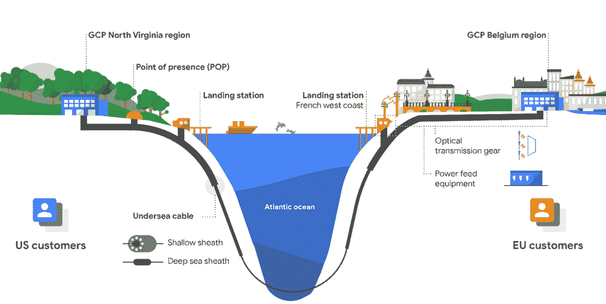

# TWiGCP —“下一个 2018 年来了。你准备好了吗？"

> 原文：<https://medium.com/google-cloud/twigcp-next-18-is-here-are-you-ready-ab3442890303?source=collection_archive---------0----------------------->

**云下**‘18 周(【g.co/next18】)来了！期待主题演讲、众多会议、一长串激动人心的公告，对于那些有幸参加的人来说，还有大量的走廊谈话。周二上午收听商业主题演讲，周三收听产品主题演讲，周四收听开发者主题演讲(太平洋时间上午 9 点开始)。

这里还有一些不容错过的会议:

*   [将于 2018 年举办的顶级存储和数据库会议](http://goo.gl/RxBpey)
*   【2018 年 Google Cloud NEXT 的 5 场必看网络会议
*   [在 GoogleNext2018](http://goo.gl/MNdavX) 上直播这些数据和机器学习会议

从“小开胃菜到云下一个‘18 公告’部门:

*   [宣布 Cirq:NISQ 算法的开源框架](http://goo.gl/ddRXpz)(谷歌博客)
*   [介绍数据传输项目:一个促进通用数据可移植性的开源平台](http://goo.gl/6U4gdU) (Google 开源博客)
*   [现在发货:ultramem 机器类型，内存高达 4TB](http://goo.gl/XQny6G)(谷歌博客)
*   [通过我们的第一条私有跨大西洋海底电缆提高连接性](http://goo.gl/nmGuqX)(谷歌博客)
*   [GCP 市场上的商业 Kubernetes 应用](http://goo.gl/55L3AK)(谷歌博客)。应用程序列表已经很长了，看看吧。
*   [Cloud Spanner 增加了导入/导出功能以简化数据移动](http://goo.gl/BCC89g)(谷歌博客)

来自“合作伙伴交付时”部门:

*   [VMware 和谷歌云:与 vRealize Orchestrator 一起构建混合云](http://goo.gl/ZgZsSk)(谷歌博客)
*   [快速启动——通过一个命令在谷歌云平台上安装 Pivotal Cloud Foundry](http://goo.gl/8pKxkt)(github.com)

从“基础到实用再到愚蠢的谷歌 ML 解决方案”部门:

*   将连接组学提高一个数量级
*   对 AutoML 和神经架构搜索的自以为是的介绍
*   【towardsdatascience.com】AutoML Vision alpha 入门
*   [移动镜子:你移动，80，000 幅图像随之移动](http://goo.gl/9s5Zuc)(谷歌博客)

来自“谁不喜欢比较文章”部分:

*   [GCP 和 AWS 有什么区别？](http://goo.gl/xR3ngB)(bravenewgeek.com)

来自“medium.com GCP 周复一周的丰富多彩”部门:

*   [使用数据流将数据上传到云数据存储](http://goo.gl/1aAmrp)(medium.com)
*   [使用 Cloud Firestore](http://goo.gl/CbR8aA)(medium.com)在谷歌上可扩展地查询行动数据
*   [在 TPUs 上使用 ResNet 进行快速图像分类的 Codelab](http://goo.gl/vRFZRi)(medium.com)
*   [通过 AppScale 使用谷歌发布/订阅消息](http://goo.gl/JsFcjT)(blog.appscale.com)
*   [将串口控制台输出日志推送到 Stackdriver，并在 medium.com GCP 设置告警](http://goo.gl/kkofQQ)

来自“在 C#代码实验室中使用 Google Cloud ML APIs”部分:

*   [在 C#中使用自然语言 API](http://goo.gl/xNCZxb)
*   [通过 C#使用语音转文本 API](http://goo.gl/c8dJJz)
*   [通过 C#使用文本到语音转换 API](http://goo.gl/ioDou8)
*   [在 C#中使用视觉 API](http://goo.gl/VC3Fc2)

从“测试版，正式版，还是什么？”部门:

*   从外部服务器复制 MySQL 的云 SQL[(Google 文档)](http://goo.gl/nDm4NZ)
*   【Beta】[深度学习虚拟机镜像文档](http://goo.gl/b3UxsX)(谷歌文档)
*   使用(云函数)环境变量(谷歌文档)
*   用于云 Bigtable 的 Node.js 和 C#客户端库(Google 文档)
*   GCP 控制台中的 BigQuery UI(谷歌文档)
*   [Bigtable Key Visualizer](http://goo.gl/T9EpZF) (谷歌文档)
*   【github.com】发布 Istio 1.0.0 预览版

来自“所有多媒体”部门:

*   Raia Hadsell(gcppodcast.com)GCP 播客#136 — [机器人、导航和强化学习](http://goo.gl/Y9DJ6A)
*   Kubernetes 播客#12 — [Kubernetes 的起源，乔·贝达](http://goo.gl/AsPhav)(kubernetespodcast.com)

本周图片取自第一个私人跨大西洋海底电缆站[:](http://goo.gl/nmGuqX)

这就是本周的全部内容！亚历克西斯