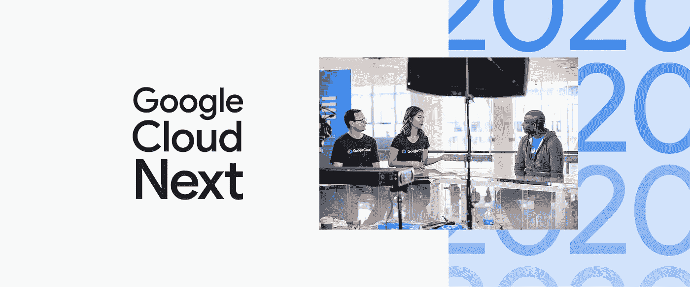

# TWiGCP —“下一个 20 年将是数字化、Kubeflow 1.0、更多数据中心等等”

> 原文：<https://medium.com/google-cloud/twigcp-next-20-goes-digital-kubeflow-1-0-more-datacenters-and-so-much-more-83147446f044?source=collection_archive---------0----------------------->

以下是谷歌云视频系列 本周最新 [**的链接:**](http://gtech.run/ju4em)

*   [快速缩放云数据仓库](http://gtech.run/wstar)
*   [使用云原生工具包 Kubeflow 1.0 在生产中运行 ML 工作流](http://gtech.run/qvvr6)
*   [如何测试并帮助防止不良网络连接](http://gtech.run/nfv43)
*   [加入我们的 Google Cloud Next’20:Digital Connect](http://gtech.run/qwdrk)

过去一周 GCP 的其他头条新闻包括:

*   [扩大我们的业务范围，在 2020 年支持全球客户](http://gtech.run/wc9jn)(谷歌博客)
*   [点击几下鼠标，为您的 GKE 工作负载创建部署管道](http://gtech.run/l3whp)(谷歌博客)
*   [云 TPU Pods 现已上市，包括 TensorFlow 2.1 支持](http://gtech.run/jaj3q)(谷歌博客)
*   [谷歌云公布电信行业战略](http://gtech.run/brdk7)(谷歌博客)
*   2020 年，将有超过 70 个新的合作伙伴专业化认证(谷歌博客)

来自“Google Cloud 上的 Kubeflow 1.0”部门:

*   [使用云原生工具包 Kubeflow 1.0 在生产中运行 ML 工作流](http://gtech.run/wxpkz)(谷歌博客)
*   [根据与 KFP 管道的同现数据训练定制嵌入](http://gtech.run/wsc86)(谷歌博客)

来自“无限大查询”部门:

*   没有限制的 DML，现在在 BigQuery 中
*   [如何在 BigQuery 中高效查询地理栅格数据](http://gtech.run/sxhf8)(medium.com)
*   [谷歌大查询数据建模师](http://gtech.run/c8t7w)(blog.doit-intl.com)

来自“ML APIs 更新及其应用”部门:

*   [语音转文本](http://gtech.run/z5mu4)(谷歌博客)的增强模式和功能现已推出新语言版本
*   [使用云视觉和云自然语言 API 可视化搜索 10 年的晚间电视新闻](http://gtech.run/grnku)(blog.gdeltproject.org)

来自“无服务器第二天”部门:

*   [Google Cloud 上的 Secret Manager 库的无服务器神秘事件](http://gtech.run/ekyyz)
*   【medium.com】用 TypeScript 和 Firebase 组织云函数以获得最大冷启动性能和可读性

来自“安全、网络和性能”部门:

*   [如何检测和防止网络中断——同时保持合规性](http://gtech.run/3jvya)(谷歌博客)
*   [App 发动机重载](http://gtech.run/ufn8p)(medium.com)
*   [使用凭证访问边界(向下范围)令牌](http://gtech.run/mc8jm)(medium.com)

来自“处理和保护数据”部门:

*   [为 MySQL 构建多区域数据库灾难恢复](http://gtech.run/jwcmd)(谷歌博客)
*   medium.com GCP 数据工程:[第一部分](http://gtech.run/e6nrz)、[第二部分](http://gtech.run/3lqr4)
*   [使用发布/订阅、数据流、BQML &云 DLP](http://gtech.run/uhgkk)(github.com)的流式异常检测解决方案

来自“较少移动部件”部门:

*   2020 年的 Istio 跟随信风

来自我最喜欢的“客户和合作伙伴对 GCP 的最佳评价”部分:

*   [红移到游戏应用的 BigQuery 迁移](http://gtech.run/upa58)(谷歌博客)
*   [Etsy 完成谷歌云迁移—来自 2，000 台本地服务器的 5.5 数据](http://gtech.run/n393f)(essentialretail.com)
*   [美国职业棒球大联盟和谷歌扩大合作关系，为世界各地的球迷提供更加个性化的体验并增加参与度](http://gtech.run/h8e2j)(prnewswire.com)
*   [variety.com，MLB 从亚马逊的 AWS 转向谷歌的数据和分析云](http://gtech.run/zqppv)

**从 Beta，GA，还是什么？**“部门:

*   [1.0] [Kubeflow 1.0:面向所有人的云原生 ML](http://gtech.run/mdhx3)
*   【GA】[云 SDK 283.0.0](http://gtech.run/wfg8w)
*   [GA] [GCE 新的持久磁盘节流指标](http://gtech.run/aflwh)
*   [GA] [VPC —数据包镜像](http://gtech.run/byfu9)
*   【GA】[云扳手外键](http://gtech.run/9yqhf)
*   [GA] [GCE —用一个命令导出图像](http://gtech.run/r9sne)
*   [GA][Redis 的存储库— VPC 支持](http://gtech.run/favvg)
*   【Beta】[云数据流 SQL](http://gtech.run/vsmaq)
*   【测试版】[云 NAT 监控](http://gtech.run/fgkkq)

来自“**万物多媒体**”部门:

*   [视频] [内置算法的 AI 平台训练(AI Adventures)【youtube.com ](http://gtech.run/r9lc2)
*   Kubernetes 播客[第 93 集——kube flow 1.0，杰瑞米·路易](http://gtech.run/hwk49)(kubernetespodcast.com)
*   [播客]gcppodcast.com GCP 播客[第 210 集——Kubernetes 与蔡芷纭的配置连接器](http://gtech.run/6anw2)

本周的图片提醒人们，今年的云计算下一次会议现在已经完全在线

这就是本周的全部内容！亚历克西斯