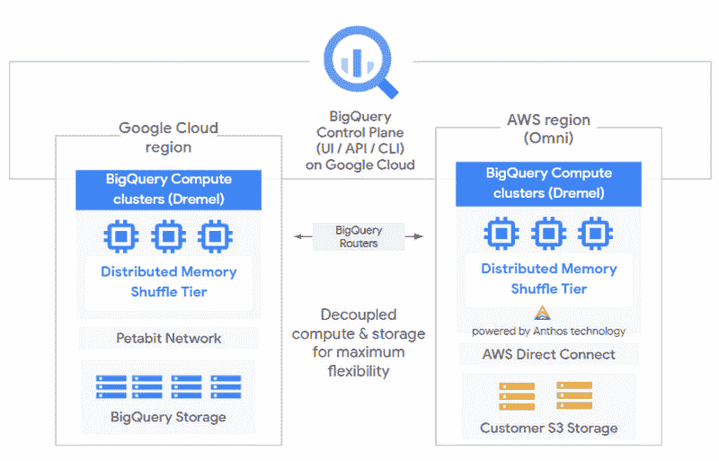

# TWiGCP —“下一个 OnAir，1 周，还有 8 周:BigQuery Omni，机密虚拟机等等！”

> 原文：<https://medium.com/google-cloud/twigcp-next-onair-1-week-down-8-to-go-bigquery-omni-confidential-vms-and-more-461c84735d01?source=collection_archive---------2----------------------->

Cloud Next OnAir 已经启动，这些链接是您参加将持续 8 周的在线活动的指南:

*   [第 1 周谷歌云回顾下一个 20 年:OnAir](http://gtech.run/wapaj)
*   [下一个 OnAir 正好:所有的公告都在一个地方](http://gtech.run/x385a)
*   [谷歌云下一个 20 年:on air——丢失的备忘单](http://gtech.run/yttmc)

过去一周的 GCP 要闻包括:

*   [用于云计算数据分析的 BigQuery Omni】(谷歌博客)](http://gtech.run/jsqmm)
*   [介绍带有机密虚拟机的谷歌云机密计算](http://gtech.run/7mwl6)(谷歌博客)
*   [确保政府的工作量:不折不扣的合规性](http://gtech.run/vvcs4)(谷歌博客)
*   [谷歌云对欧盟国际数据传输和 CJEU 裁决的承诺](http://gtech.run/rc9hb)(谷歌博客)
*   [全球 HTTP(S)负载平衡和 CDN 现在支持无服务器计算](http://gtech.run/aqjaa)(谷歌博客)

来自“无服务器仍然是非常活跃的谷歌云话题”部门:

*   [云运行能处理好这 9 个工作负载吗？—无服务器工具箱|作者 Bret mcg Owen](http://gtech.run/npwp4)(medium.com)
*   [使用谷歌应用引擎、云发布和云数据存储的事件驱动视频转码](http://gtech.run/xq3p4)(medium.com)
*   [使用 GO 和 Google Cloud Run 实现多区域负载平衡—第 1 部分【medium.com ](http://gtech.run/pgu5q)
*   [Firebase 托管和云运行缓存| Neil Kolban](http://gtech.run/wcprp)(medium.com)
*   [谷歌云功能开启。NET (Alpha) |由 Mete Atamel](http://gtech.run/e6eyn)(medium.com)

来自“与 SAP 的紧密合作解决了真正的客户和开发人员问题”部门:

*   [3 SAP 客户面临的业务连续性挑战，以及谷歌云如何提供帮助](http://gtech.run/6jpqs)(谷歌博客)
*   [Google Cloud 上的 SAP:HANA HDI 容器和 CI/CD 管道第二部分|作者 Lucía Subatin](http://gtech.run/yuryd)(medium.com)

来自“云扳手新功能和最佳实践”部门:

*   [云扳手:阅读统计|作者 Mayur kale](http://gtech.run/w7yak)(medium.com)
*   【medium.com】云扳手变化出版社|由克努特·奥拉夫·莱特
*   【medium.com】云扳手的零停机数据库迁移和复制

“安全、授权和许可”部门:

*   [使用谷歌登录认证用户| Charles Engelke](http://gtech.run/ankg6)(medium.com)
*   [如何为 GCP 最终用户提供 OAuth | Warrick 著](http://gtech.run/zz6h6)(medium.com)
*   [将用户权限从 Teradata 映射到 BigQuery](http://gtech.run/w8x7x) (Google 博客)
*   [使用 VPC 服务控制降低 GCP 的数据泄露风险(第一部分)| Mukesh kha TTA 著](http://gtech.run/ymyue)(medium.com)

来自“Kubernetes 基础知识和 GKE 最佳实践”部门:

*   Kubernetes 和网络——为什么这么难？(speakerdeck.com)
*   [为您的 Kubernetes 集群带来流量](http://gtech.run/9unfc)(speakerdeck.com)
*   [设计和构建高可用性集群](http://gtech.run/4dtye)(谷歌博客)
*   [通过入口和服务暴露 GKE 应用](http://gtech.run/u8pyu)(谷歌博客)

来自“让您接触谷歌云产品”部门:

*   [GCP 大表格入门| Christopher Grant](http://gtech.run/kxlav)(medium.com)
*   [了解长相——常见使用案例](http://gtech.run/se9hq)(谷歌博客)

来自“架构考虑”部门:

*   [云解决方案参考架构](http://gtech.run/h7y8p)(showcase.withgoogle.com)
*   规模和弹性不仅仅是流行词| medium.com 王从希
*   [使用 GCP 将整体应用转化为微服务| Artem Nikulchenko](http://gtech.run/n2c3t)(medium.com)

来自“构建应用程序，循序渐进”部门:

*   [在你的应用中管理支付:建立库存|由 Jen Person](http://gtech.run/5vs2k)(medium.com)
*   【medium.com】[如何使用 BigQuery ML 建立电子商务数据推荐系统](http://gtech.run/8m66t)

来自“我猜这就是他们所谓的地球基础设施”部门:

*   [利用海底电缆探测地震](http://gtech.run/6m5dk)(谷歌博客)

来自“每个数据应用程序不都是提取转换负载的变体吗？”部门:

*   泰勒·特里克在 GCP 实施 ETL(blog.realkinetic.com)

来自“将 SRE 理论应用于您的 GCP 服务”部门:

*   设置 SLOs:一步一步的指导

来自我最喜欢的“客户和合作伙伴对 GCP 的最佳评价”部分:

*   [KeyBank 迁移到 BigQuery 云数据仓库](http://gtech.run/vcrbe)(谷歌博客)

来自“**多媒体**”部门:

*   [视频][AI 能让我成为更好的运动员吗？|利用机器学习分析点球](http://gtech.run/kva2m)(youtube.com)
*   [视频][Istio 如何提高可靠性:采访谷歌项目经理丹·奇鲁利](http://gtech.run/y9485)(youtube.com)
*   [播客] Kubernetes 播客[第 112 集——与克里斯·迪博纳(kubernetespodcast.com)合作的开放源代码和开放使用共享资源](http://gtech.run/4aa2b)
*   (gcppodcast.com)GCP 播客[第 227 集——克里斯蒂娜·弗拉申和凯丽·萨拉宾的《潘迪姆》](http://gtech.run/rev8h)

**Beta，GA，还是什么？**“部门:

*   [GA] [云 SDK 301.0.0](http://gtech.run/wfg8w)
*   [GA] [GKE —客户管理的加密密钥](http://gtech.run/hpk5w)
*   [GA] [来自非公共 IP 实例浏览器的 SSH](http://gtech.run/lbg2s)
*   [GA] [使用推荐者洞察 API](http://gtech.run/ztc93)
*   [GA] [云大表托管备份](http://gtech.run/nfv9u)
*   【GA】[云扳手读取统计数据](http://gtech.run/g5z5c)
*   [GA] [GCE 持久磁盘 1.2GB/s 写入吞吐量](http://gtech.run/lmenw)
*   [Beta] [GCE 暂停/恢复](http://gtech.run/xbyxm)
*   [Beta] [云负载平衡的组织策略约束](http://gtech.run/7b6uu)
*   【测试版】[云甲预配置的命名 IP 列表规则](http://gtech.run/p4dhz)
*   [Beta] [Anthos 配置管理 UI](http://gtech.run/vqc6h)
*   [Beta] [使用定制服务帐户进行培训](http://gtech.run/n5nqz)
*   【测试版】 [GKE 新入口特性](http://gtech.run/zlq2c)
*   【Beta】[针对 AI 平台在线预测的私有 IP](http://gtech.run/rw39a)

本周图为 BigQuery Omni！

这就是本周的全部内容！亚历克西斯