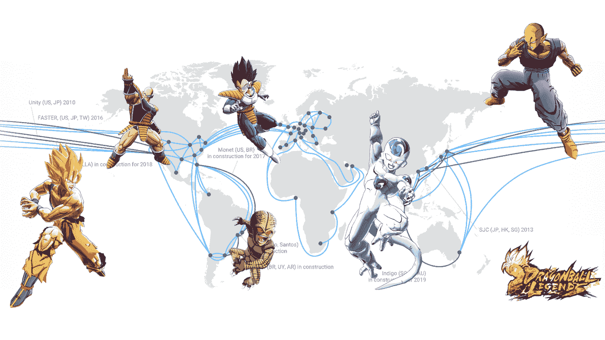

# TWiGCP—“GAE 标准上的节点，GCP 上的 QUIC，改进的数据流，更好的可抢占 GPU 定价”

> 原文：<https://medium.com/google-cloud/twigcp-node-on-gae-standard-quic-on-gcp-improved-dataflow-streaming-and-better-preemptible-966264a894a3?source=collection_archive---------5----------------------->

距离 App Engine Standard 添加新语言—“[*已经有一段时间了，现在你可以将你的 Node.js 应用部署到 App Engine Standard environment*](http://goo.gl/ywGLyQ)”(谷歌博客)。请注意，这是应用引擎标准，可扩展到零，快速部署，并支持本机模块。

[介绍 QUIC 对 HTTPS 负载平衡的支持](http://goo.gl/3PHiXp)(谷歌博客)。在您的负载平衡器中单击启用 QUIC，将您的平均页面加载时间提高 8%或更多。

[介绍 Cloud Dataflow 的新流媒体引擎](http://goo.gl/j2bTa9)(谷歌博客)。利用这一选入测试版功能，在后端服务中混洗数据并存储时间窗口状态。

[试试 Stackdriver on us 的全栈监控](http://goo.gl/ittucU)(谷歌博客)。本月剩余时间免费测试所有 Stackdriver premium 功能。

[合作伙伴互连现已正式推出](http://goo.gl/sSFeG3)(谷歌博客)。从测试版到正式版需要几个月的时间，有大量的合作伙伴和带宽选项可供选择。

[引入可抢占 GPU 的改进定价](http://goo.gl/vNP9su)(谷歌博客)。价格下降+可抢占=每个人的 GPU。

对于所有的足球/足球迷来说:“ [*用云数据流和 BigQuery 制作世界杯香肠*](http://goo.gl/841QW5)”(medium.com)

来自“是时候研究更好的容器工具了”部门:

*   [斯卡福德和卡尼科:将 Kubernetes 带给开发者](http://goo.gl/C2YLko)(medium.com)
*   斯卡福德发布版本 0 . 7 . 0【github.com 

来自“GCP 数据服务超越竞争对手”部门:

*   [2018 年 Anaconda 数据科学状况报告发布](http://goo.gl/RfdXQk)(anaconda.com)

来自“主要合作伙伴进度报告”部门:

*   [我们与思科合作帮助企业踏上云之旅的最新进展](http://goo.gl/atA3J6)(谷歌博客)
*   [谷歌将 SAP HANA 托管服务加入云平台合作伙伴关系](http://goo.gl/2NJgmU)(谷歌博客)

来自我最喜欢的“顾客对 GCP 的最佳评价”部分:

*   [龙珠传奇 GCP 后台](http://goo.gl/Tmxaqm)(谷歌博客)#扳手#数据流#大查询#联网
*   【medium.com】为 2500 万用户扩展 Kubernetes】
*   ciodive.com,[Spotify 如何从内部 Docker 编排平台迁移到 Kubernetes](http://goo.gl/jKBTvq)

来自“最佳实践”部门:

*   对你的谷歌云平台资源进行标记和分组(谷歌博客)

来自“以防你错过”部门:

*   使用云 KMS 密钥保护资源(谷歌文档)
*   [Beta]云审计— [使用 GCP 控制台配置数据访问日志](http://goo.gl/XGbRn4) (Google 文档)

来自“所有播客”部门:

*   gcppodcast.com GCP 播客#131 — [与曼迪·陈在谷歌上的行动](http://goo.gl/UTQTk7)
*   Kubernetes 播客#7 — [Kustomize，Phillip witt rock](http://goo.gl/ecvLFC)(kubernetespodcast.com)

本周图片摘自“[龙珠传说 GCP 后台](http://goo.gl/Tmxaqm)”。只是因为。

这就是本周的全部内容！亚历克西斯