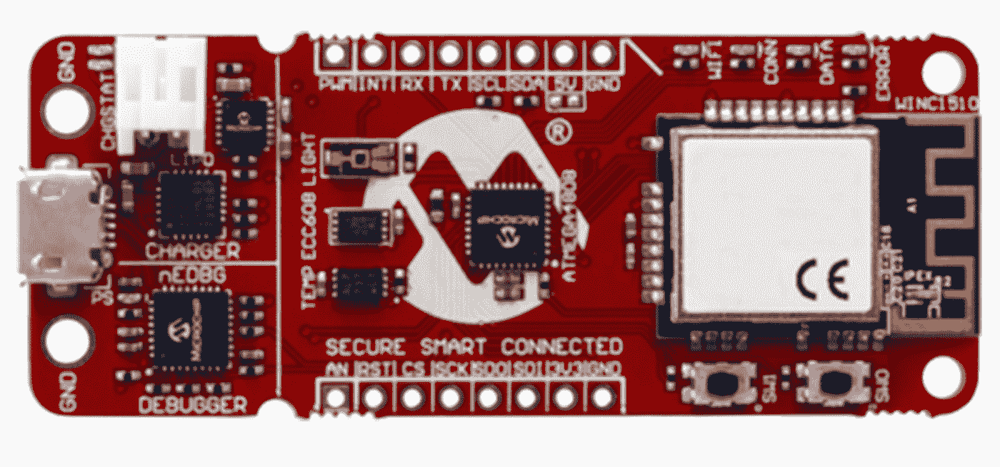

# TWiGCP—“data proc、AVR-IoT WG 套件和 GCP 的秘密”

> 原文：<https://medium.com/google-cloud/twigcp-presto-in-dataproc-avr-iot-wg-kit-and-secrets-on-gcp-fa88056ba00d?source=collection_archive---------0----------------------->

以下是过去一周的主要公告:

" [*用****Presto****可选组件*](http://goo.gl/Ndf82m)【Google 博客】扩展您的 ***云 Dataproc*** *集群的 SQL 功能。为异构数据源提供更多 SQL 查询引擎选择。*

“ [*谷歌* ***云物联网*** *和 Microchip 借助****AVR-IoT WG kit***](http://goo.gl/3bf9qp)”(谷歌博客)为 8 位 MCU 带来简单安全的云连接。首款 8 位 MCU 开发板 WiFi 连接至 GCP。

来自“数据为善”部门:

*   [数据促进发展:通过数据分析赋予社区权力](http://goo.gl/QztCXd)(谷歌博客)

来自“最佳实践和操作方法”部门:

*   [掌控您的数据:使用云 DLP 来识别和混淆敏感信息](http://goo.gl/FvaUoD)(谷歌博客)
*   [无服务器运行:用云 Firestore 和云功能构建一个简单的后端](http://goo.gl/qxMVMo)(谷歌博客)
*   [在 Cloud Composer 中使用上游 Apache 气流挂钩和操作符](http://goo.gl/41Fmm6) (Google 博客)
*   [从 GitOps 到 Kubernetes 的可适应 CI/CD 模式](http://goo.gl/gQ3hdJ) (thenewstack.io)

来自“有趣的游戏，严肃的数字”部门:

*   [我们如何在万圣节创造一个多人涂鸦来增加乐趣](http://goo.gl/at4NH4)(谷歌博客)*62 个国家的 1 亿玩家，同时有超过 500，000 名玩家* " #OpenMatch #GKE
*   [在 medium.com GCP 用 Orchestrator 和 ProxySQL 设计高可用的 MySQL 集群—第一部分](http://goo.gl/ue6zF8)

来自“了解您的秘密，管理您的秘密”部门:

*   [KMS、CMEK、CSEK 和 Hashicorp Vault 的 GCP 机密管理解决方案](http://goo.gl/TkRTCG)(谷歌文档)

来自“所有多媒体”部门:

*   [播客]gcppodcast.com GCP 播客第 156 集
*   [播客] [Kubernetes 播客——腾讯，与乔邹](http://goo.gl/3JiRXa)(kubernetes.com)
*   数据工作室(youtube.com)【YouTube】[社区连接器](http://goo.gl/B44iQJ)

本周的图片是 AVR-IoT WG 开发板，一个准备连接 GCP 的 MCU

这就是本周的全部内容！亚历克西斯