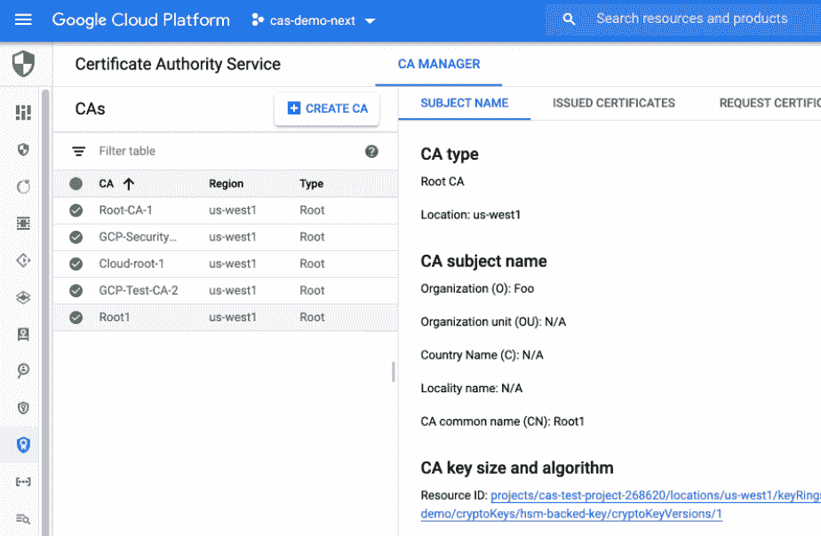

# TWiGCP —“预览证书颁发机构服务、自动扩展 MIGs 和云 SQL IAM & pgAudit”

> 原文：<https://medium.com/google-cloud/twigcp-previewing-certificate-authority-service-auto-scaling-migs-and-cloud-sql-iam-pgaudit-5ce5e2984648?source=collection_archive---------2----------------------->

过去一周的 GCP 要闻包括:

*   [现已公开预览:谷歌云认证中心服务(CAS)](http://gtech.run/ukvze) (谷歌博客)
*   [Lending DocAI 快速跟踪房屋贷款流程](http://gtech.run/6x8md)(谷歌博客)
*   [计算引擎管理的实例组获得扩展控制](http://gtech.run/9lcfb)(谷歌博客)
*   [使用云 SQL 改善 PostgreSQL 的安全性和治理](http://gtech.run/rptyr)(谷歌博客)

来自“简化集装箱化”部门:

*   [在一个简短的 tweet 线程中为 Anthos 迁移](http://gtech.run/625x9)(twitter.com)

来自“跟进最近宣布的新发布/订阅功能”部门:

*   [谷歌云发布/订阅可靠性用户指南:第一部分发布](http://gtech.run/j237q) |基尔·蒂蒂夫斯基(medium.com)

来自“开源库监听云扳手变化”部门:

*   [观察云扳手中没有提交时间戳列的数据更改](http://gtech.run/2t686)(medium.com)

来自“面向开发人员的实用 ML”部门:

*   戴尔·马科维茨(medium.com)的《谷歌云无痛人工智能初学者指南》

来自“大数据和运营支持系统、我们的发展历程以及下一步发展方向”部门:

*   [准备无服务器大数据开源软件](http://gtech.run/x2c6l)(谷歌博客)

来自“乔恩·斯基特最近在忙什么”部门:

*   游览。NET 函数框架 (codeblog.jonskeet.uk)

来自“服务器端可以大量使用的语言”部门:

*   为 Dart 应用程序创建苗条的 Docker 图像 |作者托尼·普杰斯(medium.com)

来自“链接关于链接关于…这变得有点元”部门:

*   谷歌云资源的巨大列表(谷歌博客)

来自“云运行的新特性和有用文档”部门:

*   [云运行的最终用户认证教程](http://gtech.run/fjcjs)(cloud.google.com)
*   云运行时的优雅关机:深度潜水(谷歌博客)

来自“认证链接总是热门”部门:

*   【cloudonair.withgoogle.com】认证准备:机器学习认证
*   [Coursera 上的谷歌云认证培训](http://gtech.run/bfkxt)(谷歌博客)

来自“去过，做过，下面是如何使用 BigQuery、GKE 和文档人工智能”部分:

*   [使用变更数据捕获将数据库复制到 big query](http://gtech.run/wqcav)(cloud.google.com)
*   [使用云日志和数据流在 BigQuery 中创建数据目录标签历史](http://gtech.run/3b9a4)(cloud.google.com)
*   [使用 BigQuery 轻松合并、清理和转换您的 CSV 文件](http://gtech.run/aegph)| Guillaume blaquiere(medium.com)
*   [通过在非高峰时段缩减 GKE 集群来降低成本](http://gtech.run/w487p)(cloud.google.com)
*   [如何使用谷歌云文档 AI 解析表单](http://gtech.run/fk42b)

来自“让 Kubeflow 管道发挥作用”部门:

*   [使用 Kubeflow Pipelines | Amy on GCP 运行分布式 Keras HP 调优搜索](http://gtech.run/wtjhw)(杏仁核. github.io)
*   [如何使用 BigQuery ML 和 Kubeflow 管道构建端到端的购买倾向解决方案](http://gtech.run/lzeh3) |作者 Damodar Panigrahi(medium.com)

来自“客户和合作伙伴与 GCP 一起解决实际问题”部门:

*   [MLB 如何利用谷歌云上的数据分析，用他们的数据讲述更好的故事](http://gtech.run/fx53y)(谷歌博客)
*   [UnifiedPost 与谷歌在文档 AI 上的合作伙伴](http://gtech.run/m5upu)(谷歌博客)
*   [医疗保健组织为 COVID care 使用高级分析](http://gtech.run/jvth6)(谷歌博客)
*   [电子商务数据仓库迁移](http://gtech.run/yvm2a)(谷歌博客)
*   [人工智能如何破解重要合同数据](http://gtech.run/uysuv)(谷歌博客)

来自“**万物多媒体**”部门:

*   [视频] [通过身份识别代理(IAP)](http://gtech.run/ryf9y)(youtube.com)集中访问您组织的网站
*   【视频】【youtube.com】从 BigQuery 查询云 SQL
*   [播客] Kubernetes 播客【kubernetespodcast.com】第 126 集——研究、驾驶和鸣笛
*   [播客] GCP 播客[第 241 集——Sena nu Aggor 和 Ilias Katsardis 的高性能计算 Eric Dull 的德勤网络分析](http://gtech.run/rj35y)(gcppodcast.com)

从" **Beta，GA，还是什么？**“部门:

*   [GA] [云 SDK 314.0.0](http://gtech.run/wfg8w)
*   [GA] [云计费子账户](http://gtech.run/d82zl)
*   [GA] [Anthos 配置管理(ACM) UI](http://gtech.run/qwv92)
*   [GA][memory store Redis—Redis 5.0](http://gtech.run/3jnfc)
*   [GA] [检查云扳手约束](http://gtech.run/px65n)
*   [GA] [创建和管理云扳手生成的列](http://gtech.run/j2vdk)
*   [GA] [Dataproc Ranger 组件](http://gtech.run/3ujkw)
*   【GA】[big query 重复别名](http://gtech.run/lkfks)
*   【GA】[身份平台苹果签到配置](http://gtech.run/2l4g6)
*   【GA】[云日志最近查询](http://gtech.run/wl7v5)
*   [GA] [为 Anthos 1.5 迁移](http://gtech.run/qvnez)

本周图为谷歌云证书权威服务(CAS，预览中)截图

这就是本周的全部内容！亚历克西斯