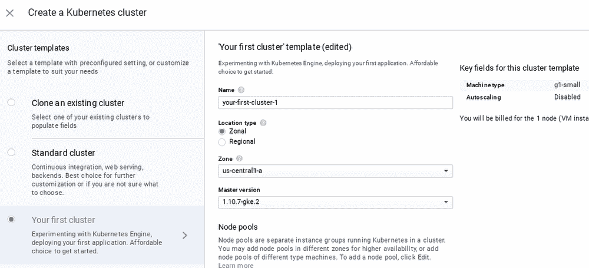

# TWiGCP—“GCP 的 PyTorch，对开发者更友好的 GKE，以及许多深入的操作指南”

> 原文：<https://medium.com/google-cloud/twigcp-pytorch-on-gcp-developer-friendlier-gke-and-numerous-in-depth-how-tos-8653c5dc28c0?source=collection_archive---------0----------------------->

"[跨谷歌云介绍 py torch](http://goo.gl/QoiUFa)(谷歌博客)。将 PyTorch 1.0 预览版引入 GCE 深度学习虚拟机映像、TensorBoard、Kubeflow 和云 TPUs。

[一个开发者和 GKE 一起在 Kubernetes 上](http://goo.gl/2Xvf7o)(谷歌博客)。这一切都从开发人员开始——通过更好的 UX、改进的文档和用于公开单主机 Kubernetes 集群服务的开源工具来降低准入门槛。

[tfjs-vis，TensorFlow.js 的基于浏览器的可视化库](http://goo.gl/LfxncC)([github.com](http://github.com/))

来自“GCP +合作伙伴=用户良好度”部门:

*   [用 GCP 的 MongoDB Atlas 打造你想要的东西](http://goo.gl/ezwjEJ)(谷歌博客)
*   [您的关键任务 SAP 工作负载的云目的地](http://goo.gl/BWEAP8)(谷歌博客)

来自“揭秘混合云和 GCP 灾难恢复”部门:

*   [谷歌云 CTO 谈云服务平台混合玩法](http://goo.gl/13RiRw)(searchcloudcomputing.techtarget.com)
*   [GCP 与本地的网络控制:毕竟没什么不同](http://goo.gl/G7jw9K)(谷歌博客)
*   [使用 GCP 设计和实施您的灾难恢复计划](http://goo.gl/euX7Hc)(谷歌博客)

来自“操作方法和更深入的探索— BigQuery & AutoML 版”部分:

*   [那是设备司机、高尔夫司机，还是出租车司机？用 AutoML Translate 构建定制翻译模型](http://goo.gl/M5uFSu)(谷歌博客)
*   [如何使用 Cloud Composer 在不同地点之间传输 BigQuery 表](http://goo.gl/trXTcB)(谷歌博客)
*   大查询和代理键:一种实用的方法

来自“操作方法和深入探索—云原生版”部分:

*   [健康检查 Kubernetes 上的 gRPC 服务器](http://goo.gl/Lyt32D) ( [kubernetes.io](http://kubernetes.io/) )
*   [无服务器中的秘密](http://goo.gl/Zb62fV)(【sethvargo.com】T2)
*   [Kubernetes 引擎网概述](http://goo.gl/n9Cgsc)(谷歌文档)
*   那现在是什么？([medium.com](/))

从“测试版，正式版，还是什么？”部门:

*   【GA】[云 SDK 219.0.1](http://goo.gl/QMtpTC)
*   [GA] [BigQuery GENERATE_UUID 函数](http://goo.gl/F5iSBn)(为每一行创建一个不同的 ID，而无需对数据进行分区/排序)
*   NVIDIA 特斯拉 P4
*   [GA] [拥有私有 IP 地址的云数据流工作者](http://goo.gl/JAK1rp)

来自“所有多媒体”部门:

*   GCP 播客第 149 集—[yabe bal Fantaye 在非洲进行深度学习研究&Jessica Phalafala](http://goo.gl/2hkr5E)(gcppodcast.com)
*   Kubernetes 播客第 23 集— [持续集成和持续交付，Andrew Philips 和 Lars Wander【kubernetespodcast.com ](http://goo.gl/t784oa)
*   [tensor flow . js 入门](http://goo.gl/58enrS)(youtube.com)

本周的图片摘自 GKE 开发者博客:

这就是本周的全部内容！亚历克西斯