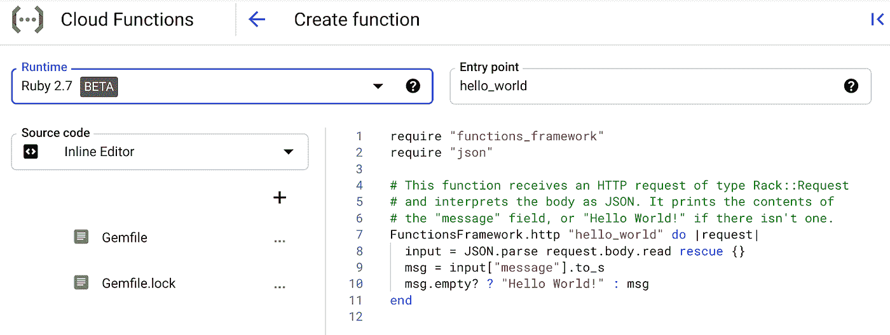

# TWiGCP—“Ruby functions，Eventarc，一年的谷歌研究，以及免费培训”

> 原文：<https://medium.com/google-cloud/twigcp-ruby-functions-eventarc-a-year-of-google-research-and-free-training-bf9cca59381f?source=collection_archive---------2----------------------->

过去一周的 GCP 要闻包括:

*   [Ruby 来云功能](http://gtech.run/jhtvw)(谷歌博客)
*   [Eventarc:谷歌云中的统一事件体验](http://gtech.run/qzxgw)(谷歌博客)
*   [用谷歌云进行实时分析的民主化](http://gtech.run/fb6qa)(谷歌博客)
*   谷歌保护软件开发和供应链风险管理的方法
*   [谷歌研究:回顾 2020 年，展望 2021 年](http://gtech.run/x5rac)(ai.googleblog.com)
*   [2021 年开始，带技能徽章和免费培训](http://gtech.run/shtcq)(谷歌博客)

来自“第二天运营”部门:

*   [使用计算引擎的操作系统补丁管理服务](http://gtech.run/txfhj)(谷歌博客)
*   [锁统计:诊断云扳手的性能问题](http://gtech.run/qqb3s)(谷歌博客)
*   [Cloud Profiler 提供应用性能洞察，没有开销](http://gtech.run/4ehm4)(谷歌博客)
*   [使用 Google Sheets 将复杂的 CSV 文件加载到 BigQuery 中](http://gtech.run/af9yn) (Google 博客)
*   [使用 Terraform 通过云 NAT 运行云调配|作者 Jeremy Tangney【medium.com ](http://gtech.run/su2z6)
*   [通过计划云 SQL 节省资金|作者 Guillaume blaquiere](http://gtech.run/p5pd3)(medium.com)
*   [在 Kubernetes 集群之间迁移应用| Luca Prete](http://gtech.run/67qwh)(medium.com)

来自“为混合人工智能铺平道路”部门:

*   [视频智能机器学习改进坑洞检测](http://gtech.run/3a6ff)(谷歌博客)

来自“设计和配置数据湖”部门:

*   [使用数据融合和 Composer 设计 GCP 的数据湖| Neha Joshi](http://gtech.run/5rlb2)(medium.com)
*   [使用数据融合和 Composer 在 GCP 构建配置驱动的数据湖的框架|作者 Neha Joshi](http://gtech.run/gr42r)(medium.com)

来自“前端无服务器”部门:

*   [GCP API 网关与 gRPC。用于 GCP API 的简单 gRPC 客户端/服务器… |作者 sal maan Rashid](http://gtech.run/vcwu4)(medium.com)
*   [云运行和负载平衡:超越你自己的项目！|作者:纪尧姆·布莱克维尔](http://gtech.run/zp2fg)(medium.com)

来自“即使您以前使用过该产品，也请阅读此内容”部分:

*   [谷歌云存储最佳实践:如何确保数据隐私和安全](http://gtech.run/naakq)(谷歌博客)
*   [安全访问 Google Cloud 中的虚拟机|作者 minherz](http://gtech.run/lpekj)(medium.com)

来自“利用云存储强大的一致性”部门:

*   [在谷歌云存储上实现领袖选举](http://gtech.run/54z5)(谷歌博客)

来自“随用随买”部门:

*   [在谷歌云中大规模计算时间序列指标|作者大卫·萨巴特·丁特](http://gtech.run/psv6x)(medium.com)
*   [使用谷歌云平台的批量驱动 CDC(变更数据捕获)方法|作者 Carlos Augusto](http://gtech.run/bw9da)(medium.com)

来自“客户和合作伙伴与 GCP 一起解决实际问题”部门:

*   [数据库迁移帮助 Stubhub 通过云实现现代化](http://gtech.run/me9ns)(谷歌博客)
*   [云操作和 Wix 的 Velo 开放网络平台带来更好的开发者体验](http://gtech.run/c83cl)(谷歌博客)
*   [选择云原生 Bigtable 以节省数据仓库成本](http://gtech.run/72hy5)(谷歌博客)
*   [使用谷歌云和 OHDSI 进行人口健康分析](http://gtech.run/3rmnu)(谷歌博客)
*   [Workday 使用谷歌云 AI 加速文档处理](http://gtech.run/jg8yc)(谷歌博客)
*   [证明 SAP 金融产品子分类账的横向扩展云场景提供了性能、规模和可靠性](http://gtech.run/8r7jk)(谷歌博客)

来自“**万物多媒体**”部门:

*   在谷歌云上运行 kot Lin(youtube.com)
*   【视频】【youtube.com】与科特林和 Spring Boot 在谷歌云上开发后端
*   [播客] Kubernetes 播客【kubernetespodcast.com 第 133 集——纤毛

从"**预告，GA，还是什么？**“部门:

*   【GA】[云 SDK 323.0.0](http://gtech.run/wfg8w)
*   【GA】[云扳手锁定统计](http://gtech.run/zjl5m)
*   【GA】[云扳手查询统计](http://gtech.run/ksdt4)
*   【GA】[对 Node 14 和 Python 3.9 的云函数支持](http://gtech.run/al46m)
*   [GA] [云构建区域化构建](http://gtech.run/9cxbb)
*   【GA】[云 AI PyTorch 1.6 容器](http://gtech.run/l4wxc)
*   【GA】[云构建用户指定的服务账户](http://gtech.run/wnj6x)
*   [GA] [文件存储非 RFC1918 子网范围支持](http://gtech.run/h2mwl)
*   【GA】[Cloud Composer 网络 ACL 支持](http://gtech.run/3ut24)
*   [GA] [建议 AI 已经迁移到零售 API](http://gtech.run/fbgbu)
*   [GA] [用于云互联的云 VPC 1500 MTU](http://gtech.run/5a656)
*   【GA】[云 SQL 对数据库/内存/总使用量的支持](http://gtech.run/qtde7)
*   【预览】 [BigQuery 控制台改进](http://gtech.run/wtuqk)
*   【预览】[对 Ruby 的云功能支持](http://gtech.run/aql8g)
*   【预览】[云日志共享查询](http://gtech.run/zwvlx)
*   【预览】[云作曲 CMEK 支持](http://gtech.run/lvtwz)
*   【预览】 [Cloud Composer 重启 Airflow web 服务器](http://gtech.run/ku86f)
*   [预览] [托管的微软广告审计日志](http://gtech.run/neq5z)
*   【预览】[基于 Dataproc 服务账户的安全多租户](http://gtech.run/cj3t3)
*   【预览】[云共享 VPC 对 nic0 以外接口的支持](http://gtech.run/6cdpt)
*   【预览】[流量总监对 TCP 的支持](http://gtech.run/cgdzx)
*   【预览】[云 CDN 使用负缓存](http://gtech.run/vtw7z)
*   【预览】[更新资源记录集的云 DNS API](http://gtech.run/8nqsc)

本周的图片突出了对 Ruby 的函数支持

这就是本周的全部内容！亚历克西斯