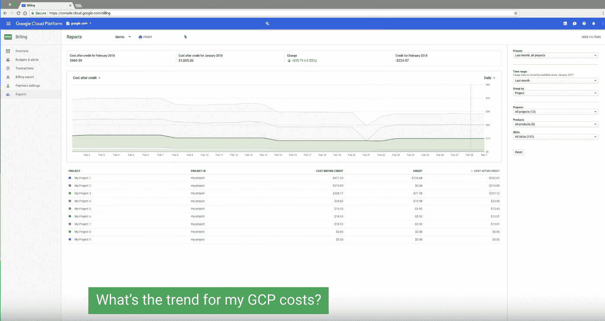

# TWiGCP—“保护好所有的东西！cloud Next’18 注册，以及来自任何终端的 CloudShell”

> 原文：<https://medium.com/google-cloud/twigcp-secure-all-the-things-cloud-next-18-registration-and-cloudshell-from-any-terminal-e3f5b4b18c84?source=collection_archive---------1----------------------->

[Google Cloud Next’18——现已开放注册！](http://goo.gl/QXE18x)(谷歌博客)

对于谷歌云安全服务来说，过去的一周是重要的一周——许多新服务或其他服务即将全面推出:

*   [介绍保护和控制你的 GCP 服务和数据的新方法](http://goo.gl/sMQUfC)(谷歌博客)。

宣布:

*   [GA] [使用云数据丢失防护(DLP) API](http://goo.gl/J1Vwsx) (谷歌博客)来管理您的敏感数据。对存储在您数字资产中的敏感信息进行分类和编辑。非常酷的云功能驱动的解决方案详情[此处](http://goo.gl/5n9Eww)(cloud.google.com)
*   cloud.google.com VPC 服务控制系统
*   【Alpha】[云安全指挥中心](http://goo.gl/XX4Vt2)(cloud.google.com)
*   【Beta】[云甲](http://goo.gl/4akBCR) —拒绝服务防御(cloud.google.com)
*   [云身份作为独立身份即服务](http://goo.gl/qZLK91) (IDaaS)解决方案(cloud.google.com)
*   访问透明度(cloud.google.com)
*   [扩大我们的谷歌云安全合作伙伴关系](http://goo.gl/SuRgb5)(谷歌博客)。通过十几个合作伙伴提供选择。
*   *(更多关于 FedRAMP 等。)*

来自“这对每个人都很有用”部门:

*   [介绍从任何终端连接到云外壳的能力](http://goo.gl/KJ4e9K)(谷歌博客)。在您喜欢的环境中全面管理的 gcloud 和流行的开发人员二进制文件。
*   [使用谷歌云计费报告测试版](http://goo.gl/6TcdLk)(谷歌博客)，一目了然地了解您的支出。[视频](http://goo.gl/3tUkLj)(youtube.com)

来自“这对高性能计算人员非常有用”部门:

*   [使用 Slurm 在 GCP 轻松实现高性能计算集群](http://goo.gl/cDLWQ1)(谷歌博客)

来自“大数据入门”部门:

*   [使用云数据流连接和重组非常大的数据集](http://goo.gl/Riy2xf)(谷歌博客)
*   [使用 TensorFlow、GDELT 和云数据流预测 Reddit 上的社区参与度:第二部分](http://goo.gl/HjDQTL)(谷歌博客)
*   从 Postgres 加载兆兆字节的数据到 big query(statsbot.co)

来自“如果你不订阅 medium.com/google-cloud(但应该)”部门:

*   减少全球合作论坛的网络连接(medium.com)
*   [如何以编程方式监控您的云数据流作业](http://goo.gl/Krnbco)(medium.com)

来自国际基督教青年会部门:

*   [GA] [自定义路由广告](http://goo.gl/QvPQXQ)(边界网关协议，BGP)(谷歌文档)
*   【贝塔】 [GKE 私人集群](http://goo.gl/Hn5Roj)。不再需要节点的公共 IP 地址。(谷歌文档)
*   [认证] [App Engine 现在符合 HIPAA 标准](http://goo.gl/cKaPMV) (Google 文档)
*   通过访问透明性建立信任。文档在这里是。
*   [Beta] [在控制台](http://goo.gl/VF8ue6)中输入您的欧盟代表和数据保护官信息(GDPR 要求第 27 条& 37)(谷歌文档)

来自“无关但很可爱”部门:

*   [扩大 MongoDB Atlas 在 GCP 的可用性](http://goo.gl/BPk1it)(谷歌博客)
*   gRPC 有用资源的精选列表(github.com)

来自“不要随便发表文章”部门:

*   新的龙珠游戏由谷歌的云提供支持(techcrunch.com)
*   采访:谷歌云，GSuite 首席黛安·格林(cnbc.com)

[GCP 播客#119](http://goo.gl/PqVkkE) 英伟达与布莱恩·卡坦扎罗(gcppodcast.com)的深度学习研究

本周图片摘自[云计费报告测试版短片](http://goo.gl/3tUkLj):

这星期到此为止！
——亚历克西斯