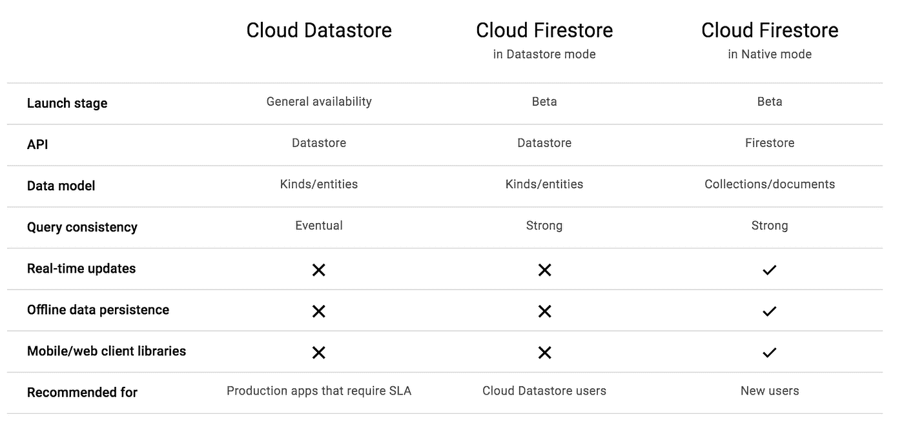

# TWiGCP —“无服务器交付、信任您的二进制文件和更好的云 Firestore”

> 原文：<https://medium.com/google-cloud/twigcp-serverless-delivers-trust-your-binaries-and-better-cloud-firestore-92c773f2fc8d?source=collection_archive---------1----------------------->

…我们回来了！

首先，我们现在为谷歌云博客文章提供了一个整合和[改进的主页。TL；cloud.google.com/blog 博士:](http://goo.gl/QYZNnw)

第二，提醒您，云计算下一届 2018 年大会将在(medium.com)[举行](http://goo.gl/YTjbLm)

来自“兑现下一个‘18 无服务器承诺’部门:

*   [云功能无服务器平台普遍可用](http://goo.gl/vpoE59)(谷歌博客)
*   [介绍 App Engine 第二代运行时和 Python 3.7](http://goo.gl/73NW6g) (谷歌博客)#Django2
*   [在 App Engine 标准环境中引入 PHP 7.2 运行时](http://goo.gl/AsWq3m)(谷歌博客)# WordPress # Laravel # Symfony # Slim
*   [在云功能和应用引擎中引入 headless Chrome 支持](http://goo.gl/gg3ZyM)(谷歌博客)#木偶师
*   [我们如何将最新版本的 Python 引入应用引擎和云功能](http://goo.gl/kGnjxX)(谷歌博客)#gVisor
*   [Steren Giannini 和 Stewart Reichling 的 App Engine 有何新功能](http://goo.gl/wtXnM5)(gcppodcast.com)

来自“每一层的安全性”部门:

*   [只部署你信任的:为 Google Kubernetes 引擎引入二进制授权](http://goo.gl/e1xmBv) (Google 博客)
*   [在谷歌云平台上使用你现有的身份管理系统](http://goo.gl/LoVsMV)(谷歌博客)
*   [防范新的“L1TF”投机漏洞](http://goo.gl/Ep8Hg5)(谷歌博客)

来自“Firebase + GCP”部门:

*   [将云 Firestore 测试版扩展到更多用户](http://goo.gl/RPX94i)(谷歌博客)
*   [从数据存储迁移到 Firestore](http://goo.gl/MwXKK5) (youtube.com)。8 分钟必看！
*   [云 Firestore 中更好的阵列！](http://goo.gl/vJzHb7)(谷歌博客)
*   [一个项目，多个站点！加上上传速度的提升！](http://goo.gl/VFoMoC)(谷歌博客)

来自“大数据 OSS、DevUX 和内置云服务”部门:

*   [使用云发布/订阅、云存储和云数据流对流媒体事件进行简单备份和重放](http://goo.gl/wCTQ7Q)(谷歌博客)
*   [在云数据平台上管理 Apache Spark 应用程序的 Java 依赖关系](http://goo.gl/HY3rWm)(谷歌博客)
*   [输入流连接器综述](http://goo.gl/UqmkHk)(beam.apache.org)

来自我最喜欢的“谷歌客户和合作伙伴对 GCP 的最佳评价”部分:

*   [King 与谷歌云合作开发下一代分析和机器学习](http://goo.gl/uLPWsS)(medium.com)
*   [Niantic labs 如何将数亿 Pokémon GO 用户账户从谷歌数据存储迁移到谷歌扳手](http://goo.gl/XxtZMP)(youtube.com)
*   [不要被谷歌云账单吓到！](http://goo.gl/s8pTG9)(blog.doit-intl.com)
*   [经验教训:从 CircleCI 转向谷歌云构建](http://goo.gl/KpmJcv)(medium.com)
*   [边车和 DaemonSets:集装箱化模式之战](http://goo.gl/nHf9wt)(wecode.wepay.com)
*   [BBC](http://goo.gl/xznbsv)(medium.com)我们如何与 GCP 合作
*   笛卡尔实验室发布其地理空间分析平台【techcrunch.com 
*   [Google Cloud Next:智能城市人工智能前沿的 Geotab](http://goo.gl/Xan6Gz)(geotab.com)
*   [云数据流分布式优化](http://goo.gl/weyQDX)(ml2grow.com)

来自“2018 年云计算之旅”部门:

*   [近距离观察我们最新的面向开发者的谷歌云人工智能功能](http://goo.gl/rP5A4x)(云博客)
*   [为超过 100，000 人构建一个 ML 主题演示](http://goo.gl/WXNq8H)(medium.com)
*   [利用 Next’18 探索谷歌云平台](http://goo.gl/siATrL)(medium.com)
*   [云下一个 2018——谷歌年度云大会的旋风周](http://goo.gl/chZkUU)(medium.com)

来自“Java 开发者分享谷歌云之爱”部门:

*   [访问谷歌云服务，直接从 IntelliJ IDEA](http://goo.gl/S72wd9) (谷歌博客)
*   [呼唤 Java 开发者:春云 GCP 1.0 现已全面上市](http://goo.gl/C7aqU6)(谷歌博客)
*   [booti ful GCP:Google 云平台 Spring Cloud 入门(1/8)](http://goo.gl/h2QJTH) (spring.io) #JoshLong

来自“如果没有专门的 BigQuery 部分，每月总结是什么？”部门:

*   [big query 正在发生什么:集成机器学习、地图等](http://goo.gl/PxVXVA)(谷歌博客)
*   [在 BigQuery 中执行大规模突变](http://goo.gl/iNwvGW)(谷歌博客)
*   [如何用 BigQuery ML 进行在线预测](http://goo.gl/XBfvD4)(towardsdatascience.com)
*   [优化 BigQuery:集群化您的表](http://goo.gl/26eLZo)(medium.com)
*   [在企业中使用 BigQuery 的技巧](http://goo.gl/JBd54M)(medium.com)

来自“Istio hits 1.0 里程碑”部门:

*   Istio 达到 1.0:准备生产(谷歌博客)
*   宣布 Istio 1.0 (istio.io)
*   [为 Istio 1 . 0 . 0](http://goo.gl/g7aDTH)(codelabs.developers.google.com)更新了 codelab
*   [Istio 的联网 API 讲解](http://goo.gl/F11daF)(blog.sebastian-daschner.com)
*   战斗测试 Istio 1.0(medium.com)

来自“TensorFlow、AutoML、云 ML 引擎”部门:

*   [在云 ML 引擎中使用 TPUs 进行超参数调优](http://goo.gl/aoq4PE)(谷歌博客)
*   [如何用 scikit 做无服务器机器学习——在谷歌云 ML 引擎上学习](http://goo.gl/UF5MCh)(towardsdatascience.com)
*   [谷歌云引擎的深度学习图像，权威指南](http://goo.gl/yqBp5p)(blog.kovalevskyi.com)
*   【google.qwiklabs.com】用 C#开发数据和机器学习应用
*   [开始使用谷歌云图像分类自动视觉](http://goo.gl/VzPnAv) (thenewstack.io)
*   关于 TensorFlow 你应该知道的 9 件事(hackernoon.com)
*   [TensorFlow 2.0 即将到来](http://goo.gl/gVr5EY)(groups.google.com)
*   [诗人张量流](http://goo.gl/rKpTtC)(codelabs.developers.google.com)
*   [用通用转换器超越翻译](http://goo.gl/eq9xFp)(谷歌博客)

来自“将机器移交给机器”部门:

*   谷歌利用人工智能管理数据中心进入新阶段(datacenterknowledge.com)

来自“观察所有事物”部门:

*   [深入堆栈驱动服务监控](http://goo.gl/gEgHKQ)(谷歌博客)
*   [追踪谷歌云](http://goo.gl/RJqTVL)(medium.com)
*   [OpenMetrics 项目被纳入 CNCF 沙盒](http://goo.gl/jWvvrJ)(谷歌博客)
*   [马克·卡特的基础设施监控](http://goo.gl/3n5SVh)(softwareengineeringdaily.com)

来自“云原生新闻”部门:

*   chrislovecnm 的 Kubernetes musings:现场的 GKE(chrislovecnm.com)
*   [介绍 Kubebuilder:一个使用 CRDs 构建 Kubernetes APIs 的 SDK](http://goo.gl/9fjFSV)(Kubernetes . io)
*   [Fortio:在 go](http://goo.gl/BtoUxN)(github.com)中加载测试库和命令行工具以及 web UI
*   [参加 gRPC 调查！](http://goo.gl/TNq33g) (grpc.io)

来自“操作方法”部门:

*   [由 10 层组成的云原生微服务应用示例](http://goo.gl/q3VWdA)(github.com)
*   [如何将 ESP32 遥测发送到谷歌云物联网核心](http://goo.gl/fjvx5k)(linkedin.com)
*   【medium.com】更新和定制对你的云 Firestore 数据的查询，以便在谷歌上采取行动

新的谷歌云解决方案:

*   [建造混合渲染农场](http://goo.gl/WqfUkK)
*   [操作集装箱的最佳实践](http://goo.gl/exVxYk)
*   [构建容器的最佳实践](http://goo.gl/4hfD2r)
*   [使用 VSTS 和计算引擎创建 CI/CD 管道](http://goo.gl/Bipsuo)

从“测试版，正式版，还是什么？”部门:

*   [GA] [谷歌云 SDK 213.0.0](http://goo.gl/NLMBt9)
*   [GA] [区域管理实例组—区域选择](http://goo.gl/8THnjp)
*   [Beta][Microsoft SQL Server On Compute Engine—始终在故障转移群集实例(FCI)上运行，存储空间直接(S2D)](http://goo.gl/JEKDxX)
*   [Beta] [BigQuery ML](http://goo.gl/bbwTX1)
*   [Beta] [大查询聚集表](http://goo.gl/1XYnNK)
*   【测试版】[云组织设置向导](http://goo.gl/c3QKDd)
*   [Beta] [Firestore —管理的导入/导出 API](http://goo.gl/QYktkX)
*   【EAP】[云调度器 EAP 注册](http://goo.gl/W3mxft)
*   【EAP】[云任务 EAP 报名](http://goo.gl/z3kLDu)
*   【阿尔法】[自动缩放聚类](http://goo.gl/RiLBgz)

GCP 播客最近几集

*   [Maya Kaczorowski 的集装箱安全系统](http://goo.gl/Jggiwj)
*   【Haben Girma 技术的可访问性
*   [阿格尼斯与马克·曼德尔和西里尔·托维纳](http://goo.gl/S7yGGA)
*   [Steren Giannini 和 Stewart Reichling 的 App Engine 有何新功能](http://goo.gl/wtXnM5)

Kubernetes 播客最近几集:

*   与柳文欢·泰克合作
*   [伊斯蒂奥，贾斯敏·雅克西克和丹·奇鲁利](http://goo.gl/hrieTS)
*   [笛卡尔实验室，蒂姆·凯尔顿](http://goo.gl/6dMtnu)
*   [购物和安全，Jon Pulsifer](http://goo.gl/dMx6yw)

来自“所有多媒体”部门:

*   [云实验室探索预览— GCP 基础](http://goo.gl/cPDTpD)(youtube.com)
*   [Kubernetes/Google 应用引擎上的 JHipster](http://goo.gl/2B8Htk)(youtube.com)
*   [App Engine 的新调度程序设置](http://goo.gl/cY1U6t)(youtube.com)
*   [使用谷歌云的无服务器计算(Siraj)](http://goo.gl/uSLtJC)(youtube.com)
*   [从数据存储迁移到 Firestore](http://goo.gl/MwXKK5)(youtube.com)
*   [适合您 GCE 性能需求的磁盘类型](http://goo.gl/MqXcwH)(youtube.com)
*   [曼宁|谷歌云平台在行动【manning.com ](http://goo.gl/9J8HFk)
*   [马克·卡特的基础设施监控](http://goo.gl/3n5SVh)(softwareengineeringdaily.com)

本周图片摘自 [Cloud Firestore beta 帖子](http://goo.gl/RPX94i):

唷，这就是这个星期的全部内容！亚历克西斯