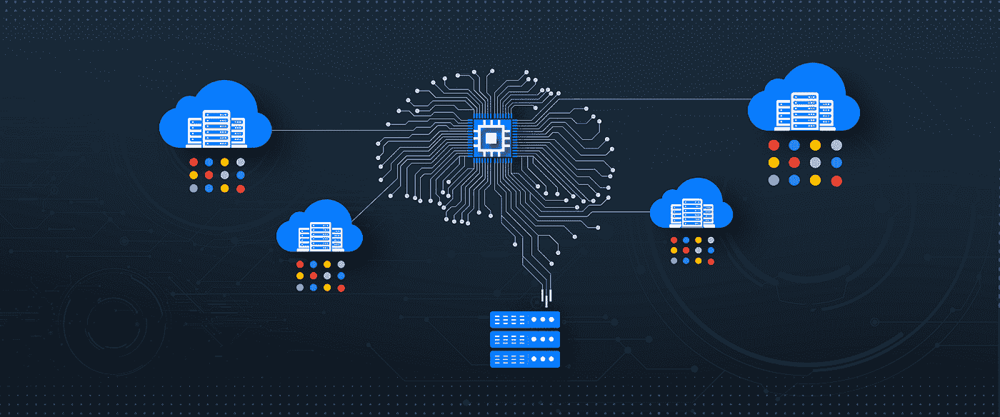

# TWiGCP —“独立租户进步，数据流可观察性，旁观者在这里，C++爱”

> 原文：<https://medium.com/google-cloud/twigcp-sole-tenant-advances-dataflow-observability-looker-is-here-and-c-love-7a5a796e37ad?source=collection_archive---------1----------------------->

以下是谷歌云视频系列 本周最新 [**的链接:**](http://gtech.run/ju4em)

*   [了解云数据融合中的数据管道安全性](http://gtech.run/gfcxc)
*   [云构建为 GitHub 带来了先进的 CI/CD 功能](http://gtech.run/llvam)
*   [新的谷歌云认证解决了云技能缺口](http://gtech.run/qnhw3)
*   [云下一个 2020 年](http://gtech.run/dapjb)

过去一周 GCP 的其他头条新闻包括:

*   [独立租户节点现在更容易更新、扩展和管理](http://gtech.run/cbnga)(谷歌博客)
*   [新的 C++客户端库可用于谷歌云](http://gtech.run/37p7e)(谷歌博客)
*   [通过增强监控为您的管道带来 20/20 视觉效果](http://gtech.run/j87nk)(谷歌博客)
*   [张量处理单元(TPU)现已在 ka ggle](http://gtech.run/nyvnd)(kaggle.com)上提供
*   欢迎旁观者来到谷歌云(谷歌博客)
*   [谷歌云提名 Forrester 浪潮的领导者:用于分析的数据管理](http://gtech.run/v6w4a)(谷歌博客)

来自“去过那里，做过那件事，有伤疤为证”部门:

*   [来自战壕的故事:20 种用 GCP 搬起石头砸自己的脚的方法](http://gtech.run/epnmf)
*   [围棋为云围棋，未成文部分](http://gtech.run/vm4sx)(rakyll.org)
*   一个应用程序现代化的故事——第三部分:容器化&重新部署(medium.com)
*   [通过云端点配额限制您的 API 使用](http://gtech.run/apxsn)(medium.com)
*   [Firebase 发布清单](http://gtech.run/7jqzw)(firebase.google.com)

来自“理解 BigQuery 中的槽”部门:

*   [监控云数据仓库中的资源使用情况](http://gtech.run/3catz)(谷歌博客)

来自“同时迁移和重新平台”部门:

*   [轻松升级 Windows Server 2008 R2，同时迁移到谷歌云](http://gtech.run/48shs)(谷歌博客)

来自“Lak on CI/CD'ing 机器学习”部门:

*   【medium.com】如何使用 Kubeflow ML 管道(#3) 在机器学习(“MLOps”)中执行 CI/CD

来自“大数据学习、样本和烹饪”部门:

*   [谷歌云的数据工程学习路径现已更新](http://gtech.run/hkbrw)(谷歌博客)
*   [示例更改-数据捕获(CDC)使用云数据流捕获 MySQL 数据并将其同步到 BigQuery，以及 Debezium](http://gtech.run/mf8kl)(github.com)
*   [烹饪数据:大查询 ML vs 网恋垃圾](http://gtech.run/x74l5)(youtube.com)

来自“欢迎低代码活动应用程序程序员来到 GCP”部门:

*   [通过谷歌云使用 Node-RED](http://gtech.run/6rr79)(谷歌博客)

从“这个帖子的日期是什么时候？”部门

*   [记录+追踪:一见钟情](http://gtech.run/vsnpl)(谷歌博客)

来自“保护您的集装箱，升级 K8S，掌控您的命运”部门:

*   [Kubernetes 引擎特性和帮助锁定容器的指南](http://gtech.run/d2m69)(谷歌博客)
*   [Kubernetes 1.16 API 弃用和更改默认值](http://gtech.run/dgke6)(medium.com)
*   [有了谷歌 Anthos，我的另一片云就是我想要的](http://gtech.run/8ssqj)(sada.com)

来自“我们中的一些人对这种接近感到不安”部门:

*   [谷歌云下一届‘20’会议指南现已出炉](http://gtech.run/zumpd)(谷歌博客)

来自我最喜欢的“客户和合作伙伴对 GCP 的最佳评价”部分:

*   [Hedera Hashgraph 选择谷歌云作为其首选云提供商，帮助其实现企业级 DLT 的大规模应用](http://gtech.run/k2pv8)(谷歌博客)
*   [uda city 如何使用谷歌云(构建其工作空间)](http://gtech.run/9h3tu)(谷歌博客)

**Beta，GA，还是什么？**“部门:

*   [GA] [云 SDK 280.0.0](http://gtech.run/wfg8w)
*   【GA】[IAM 推荐人](http://gtech.run/tjnhd)
*   [GA] [云资产清点—监控资产变化](http://gtech.run/s5hzg)
*   [GA] [身份感知代理程序认证](http://gtech.run/k7vdt)
*   【嘎】[云 NDB](http://gtech.run/wjcg9)
*   [GA] [GKE 集群激增升级](http://gtech.run/kd4ge)
*   [Beta] [云 CDN 和 HTTPS 负载平衡的定制来源](http://gtech.run/7m3b)
*   【测试版】[互联网网络端点组概述](http://gtech.run/nnz5f)
*   [Beta] [容器优化的操作系统监控系统运行状况](http://gtech.run/e7al7)
*   [Beta] [BigQuery 实时和历史作业元数据](http://gtech.run/tk27a)

来自“**万物多媒体**部门:

*   [播客] Kubernetes 播客[第 90 集——cocroach db，彼得·马蒂斯](http://gtech.run/parbf)(kubernetespodcast.com)
*   【YouTube】[用 AutoML 自然语言提取文本实体](http://gtech.run/a5hhs)(youtube.com)
*   【YouTube】[用 AutoML 自然语言进行客户情感分析](http://gtech.run/zmvn5)(youtube.com)

本周的图片来自《独户节点》的帖子

这就是本周的全部内容！亚历克西斯