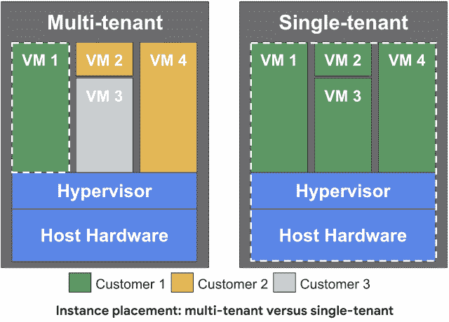

# TWiGCP —“单一租户节点、kubemci 和谷歌的人工智能原则”

> 原文：<https://medium.com/google-cloud/twigcp-sole-tenant-nodes-kubemci-and-googles-ai-principles-7d3c71e36a99?source=collection_archive---------1----------------------->

上周，GCP 为计算引擎增加了一个新的隔离选项:“ [*”为谷歌计算引擎引入了独立租户节点——当共享不是一个选项时*](http://goo.gl/p4ANfp) ”(谷歌博客)。这可能会在受到严格监管的用户、无法忍受嘈杂邻居的游戏服务器以及使用需要单租户主机的软件许可证的用户中流行。

[Google Kubernetes 引擎中的区域集群现已普遍提供](http://goo.gl/6U98n1) (Google 博客)和 *kubemci* (一个新的 CLI 工具)，用于为多集群 GKE 环境配置入口—[*如何使用 kube MCI*](http://goo.gl/ZfBZLX)(Google 博客)在 Kubernetes 引擎上部署地理分布式服务

来自“谷歌人工智能原理、研究和培训”部门:

*   谷歌的人工智能:我们的原则
*   Coursera 上新的机器学习专业教你在 GCP 建立生产就绪模型
*   [用自动增强提高深度学习性能](http://goo.gl/pfYQYA)(谷歌人工智能博客)
*   [用 TensorFlow.js 实现实时 tSNE 可视化](http://goo.gl/MyYmks)(谷歌人工智能博客)

来自“有一个适合您的数据库”部门:

*   [关于云扳手，数据库管理员需要知道什么，第 1 部分:键和索引](http://goo.gl/7SzMYr)(谷歌博客)
*   [使用云数据存储构建可扩展的 Web 应用](http://goo.gl/uSqMBf) (Google 文档)
*   [近距离观察谷歌云平台上的 HANA 生态系统](http://goo.gl/mKUsRU)(谷歌博客)

从“从 BigQuery 到 ML 应用程序再到 ML 应用程序”部门:

*   [谷歌云数据湖燃料云支付处理流程](http://goo.gl/Guad8Q)(techtarget.com)# NoInfraToManage

来自“我在哪里运行我的代码”部门:

*   “你好，世界”的时间到了:VMs vs . containers vs . PaaS vs . FaaS(谷歌博客)

来自“每周更新不是我的事”部门:

*   [上个月的今天:GCP 五月](http://goo.gl/6yzKre)(谷歌博客)

来自“所有播客”部门:

*   Juliet Hougland 和 Michelle Casbon 主持的 GCP 播客第 130 集[数据科学](http://goo.gl/nUauze)(gcppodcast.com)
*   Kubernetes 播客# 6—【kubernetespodcast.com】斯卡福德，马特·里卡德

本周的图片展示了 [GCE 新的独立租户节点](http://goo.gl/p4ANfp)

这就是本周的全部内容！亚历克西斯