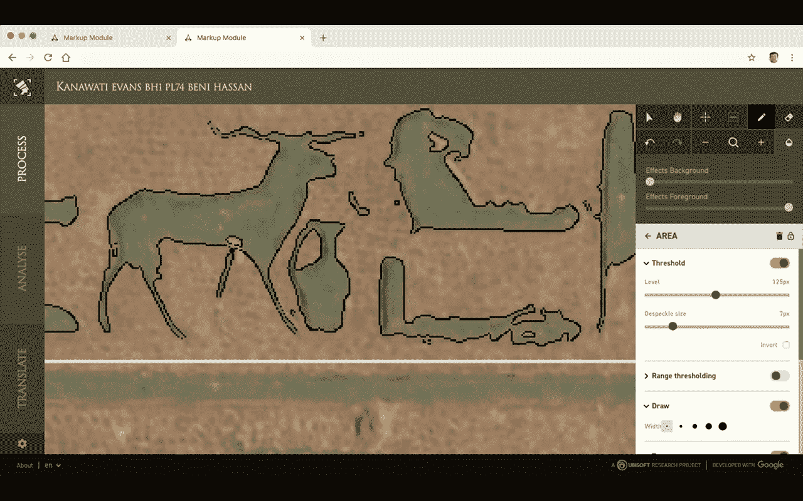

# TWiGCP —“在公告浪潮中驱动 IRM 和 CloudNAT。此外，客户技术使用案例丰富”

> 原文：<https://medium.com/google-cloud/twigcp-stackdriver-irm-and-cloudnat-in-announcement-deluge-50b1759bff2d?source=collection_archive---------0----------------------->

随着 Cloud Next 上周在伦敦停站，本周的公告和客户部分尤为密集。我们开始吧:

来自“SRE 通用工具公告”部门:

*   "[利用新的 Stackdriver 工具和合作伙伴构建更可靠的基础设施](http://goo.gl/EFZR4k)"(谷歌博客)。**斯塔克德瑞·IRM**——谷歌 SRE 工具现已对所有人开放。看看[的演示](http://goo.gl/cbDNpy)。它还具有与 Blue Medora 和 Grafana 实验室集成的功能。

来自“身份和访问管理公告”部门:

*   "[帮助**组织提高可见性并控制**云资源](http://goo.gl/W7rFxm)"(谷歌博客)。例如，这将帮助您将虚拟机创建限制在特定区域，并将 GCP 资源的共享限制在有限的组织范围内。
*   "[为更多企业简化**身份和访问管理**](http://goo.gl/ibTmW6)"(谷歌博客)。面向客户和合作伙伴的云身份(CICP)、云身份中的安全 LDAP 以及云身份感知代理(IAP)中的上下文感知访问。

来自“数据存储公告”部门:

*   "[存储它，分析它，备份它:**云存储更新**带来新的复制选项](http://goo.gl/DEC4Nn)"(谷歌博客)。新的双区域选项等等！
*   "[使用 Cloud Spanner 和 Cloud Bigtable 更新更轻松地开发和部署应用程序](http://goo.gl/hjWCWa)"(谷歌博客)。用于云扳手的 DML 和一个读/写 JDBC 驱动程序。努夫说。

来自“高效灵活的软件定义的网络产品发布”部门:

*   "[介绍**Google Kubernetes 引擎**](http://goo.gl/a1t8BC)上的容器原生负载平衡(Google 博客)。再见 iptables。这也适用于 GCE 上的 Kubernetes。
*   "[简化企业云联网:宣布**云 NAT** 及更多](http://goo.gl/bZkjsF)(谷歌博客)。这种高度可用的 NAT 解决方案支持在没有公共 IP 地址的情况下调配虚拟机，同时仍允许它们访问互联网。

来自“BigQuery 公告”部门:

*   "[big query 发生了什么:新的摄取格式、数据类型更新、ML 和查询调度](http://goo.gl/VZeCTG)"(谷歌博客)
*   " [BigQuery 抵达伦敦地区，更多地区即将到来](http://goo.gl/d1jwcG)"(谷歌博客)

唷！

来自我最喜欢的“顾客对 GCP 的最佳评价”部分:

*   GitLab.com 怎么了？查看其稳定性的最新数据(about.gitlab.com)
*   [金案例研究](http://goo.gl/KgSNVn)(cloud.google.com)
*   【METRO AG 如何将其 SAP 财务系统迁移至谷歌云(谷歌博客)
*   [育碧、谷歌云和 Psycle 展示了机器学习的力量，为自动化象形文字翻译奠定了基础](http://goo.gl/2YWiVx) (blog.ubi.com)。云计算和象形文字有什么不喜欢的？
*   [ZSL 如何在谷歌云的帮助下保护濒危动物和培育健康的生态系统](http://goo.gl/iGM27y)(谷歌博客)
*   [Traveloka 如何在基于 BigQuery 的微服务架构上构建数据供应 API](http://goo.gl/Xhckog)(谷歌博客)

来自“操作方法”部门:

*   [无服务器运行:用云 Firestore 和云功能构建一个简单的后端](http://goo.gl/sPKBZb)(谷歌博客)
*   [TensorFlow &反光带:我篮球打得不好吗？🏀](http://goo.gl/Gb1WJo)(towardsdatascience.com)
*   [与(medium.com)GCP](http://goo.gl/sE8saF)一起在几分钟内部署 Python 无服务器功能
*   [在端点包装谷歌云功能 HTTP 触发器](https://goo.gl/QPuwZu)(medium.com)

来自“科特林在服务器上也很棒”部门:

*   [谷歌云平台 Kotlin 登陆页面](http://goo.gl/Pr5tGn)(cloud.google.com)

来自“人人都爱受管理的 Kubernetes 比较”部门:

*   [谷歌 GKE vs 微软 AKS vs 亚马逊 EKS](http://goo.gl/NSVxL1)(kubedex.com)

从“测试版，正式版，还是什么？”部门:

*   [GA] [云 SDK 220.0.0](http://goo.gl/QMtpTC)
*   GKE 私人集群
*   【嘎】[可抢占的云 TPU](http://goo.gl/GFdLdf)
*   【GA】[云扳手数据操作语言语法](http://goo.gl/Dg9HvZ)
*   【GA】[云扳手 JDBC 驱动](http://goo.gl/izP7KD)
*   【测试版】[云 TPU v3](http://goo.gl/yPnTAa)
*   [Beta] [GKE 网络端点组—直接通过 pod 实现负载平衡](http://goo.gl/Yqaxmi)
*   【测试版】[云物联网核心设备日志](http://goo.gl/jNFD3v)

来自“所有多媒体”部门:

*   [gcppodcast.com GCP 播客# 150——奇怪的循环，远程工作，&KF 分布式系统](http://goo.gl/jdJPtS)
*   [Kubernetes 播客# 024——大三角帆，史蒂文·金](http://goo.gl/6dzB5p)(kubernetespodcast.com)
*   [边看边学:Kubernetes 和开发人员 GKE](http://goo.gl/aRNTmG)(谷歌博客)
*   [tensor flow . js 入门【youtube.com ](http://goo.gl/nb5Sy8)
*   Google Cloud Next’18 伦敦:[第一天主题演讲](http://goo.gl/pUJ6A7)(youtube.com)
*   Google Cloud Next’18 伦敦:[第二天主题演讲](http://goo.gl/cyMVJg)(youtube.com)

本周图片来自象形文字倡议(Hieroglyphics Initiative)，这是育碧和谷歌联合推出的一个研究项目:

查看这篇博文中的更多内容。

这就是本周的全部内容！亚历克西斯