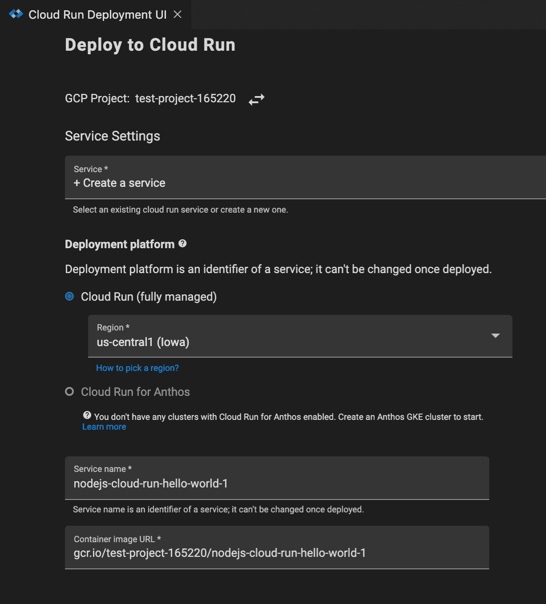

# TWiGCP —“通过数据流、Anthos 服务网格和 GKE 对所有东西进行流式传输、管理和容器化”

> 原文：<https://medium.com/google-cloud/twigcp-stream-all-the-things-with-dataflow-manage-all-the-services-with-anthos-service-mesh-dd538fdc542a?source=collection_archive---------0----------------------->

以下是谷歌云视频系列 本周最新 [**的链接:**](http://gtech.run/ju4em)

*   [云元数据管理服务现已推出](http://gtech.run/87zqx)
*   [截至 2020 年 6 月 Anthos 的促销活动](http://gtech.run/mmfcl)
*   [谷歌云的拉斯维加斯地区现已开放](http://gtech.run/lj9de)
*   [谷歌云对话由 DevRel](http://gtech.run/wsvzz)

过去一周 GCP 的其他头条新闻包括:

*   [使用 SQL、实时人工智能等工具轻松访问流分析](http://gtech.run/wes33)(谷歌博客)
*   [Windows Server containers 现已在 GKE 上市](http://gtech.run/kwcek)(谷歌博客)
*   [Anthos 服务网格(ASM)深度:走向基于服务的架构](http://gtech.run/vdr8u)(谷歌博客)
*   [谷歌云半年度透明度报告现已发布](http://gtech.run/2au36)(谷歌博客)

来自“云技术应该比以往任何时候都更能帮助您”部门:

*   [云人工智能如何在冠状病毒期间提供帮助](http://gtech.run/lqzmj)(谷歌博客)
*   [支持新冠肺炎期间的零售业务](http://gtech.run/4kgu6)(谷歌博客)

来自“云遇见艺术”部门:

*   使用 Bigtable 的监控工具，这意味着一个 Pb 级的数据库，来制作艺术(medium.com)
*   [谷歌云如何帮助扩展一个人的人工智能服务——以及他的生活](http://gtech.run/qdzdh)(谷歌博客)

来自“弄脏你的手”部门:

*   [Anthos 如何实现 CI/CD](http://gtech.run/n8dgn) (谷歌博客)
*   [通过自动电子邮件获得的数据分析结果](http://gtech.run/4qafv)(谷歌博客)
*   [安全访问谷歌云资源](http://gtech.run/yuyxf)(medium.com)
*   [云原生生物信息学:HPC 到 GCP](http://gtech.run/dmldp)(medium.com)

来自“BigQuery，一个词却有如此多的可能性”部门:

*   [使用 BigQuery 的简单机器学习建议](http://gtech.run/juc5s)(linkedin.com)
*   使用 Data Studio(medium.com)在谷歌地图上显示 BigQuery 结果

来自“房间里的云原生 Java 开发人员”部分:

*   【jamesward.com】GraalVM 原生镜像提示&招数

来自我最喜欢的“客户和合作伙伴对 GCP 的最佳评价”部分:

*   新冠肺炎如何将一项业务引向远程医疗服务
*   gcppodcast.com GCP 播客[第 219 集](http://gtech.run/u86wr)
*   [使用 BlueMedora 的 BindPlane 和谷歌云](http://gtech.run/3funt)(谷歌博客)

来自“**多媒体**”部门:

*   [视频] [Jupyter 笔记本—kube flow 101](http://gtech.run/jfzt5)(youtube.com)
*   [视频] [云 AI 数据标注服务——AI 奇遇](http://gtech.run/gr2h6)(youtube.com)
*   [视频] [网络情报中心防火墙洞察入门](http://gtech.run/thbhh)(youtube.com)
*   产品负责人 Tino Tereshko-SpringML【springml.com 更新 BigQuery
*   [播客] Kubernetes 播客[第 102 集——赫尔姆，马特·布彻](http://gtech.run/c9pnx)(kubernetespodcast.com)
*   gcppodcast.com，GCP 播客第 219 集

**Beta，GA，还是什么？**“部门:

*   [GA] [云 SDK 291.0.0](http://gtech.run/wfg8w)
*   [GA][GKE 上的 Windows Server containers](http://gtech.run/kwcek)
*   [GA] [对话流语音适配](http://gtech.run/xhhj8)
*   [GA] [私有目录](http://gtech.run/dzazc)
*   [Beta] [Dataproc 组件网关](http://gtech.run/axs8c)
*   【Beta】[云代码支持云运行](http://gtech.run/aqy6x)
*   【测试版】[为运行在谷歌云的容器平台上而设计的构建包](http://gtech.run/vnf5f)
*   [云媒体翻译流媒体语音转文字](http://gtech.run/dxnba)

本周图片是最新云代码迭代中新增云运行支持的截图

这就是本周的全部内容！亚历克西斯