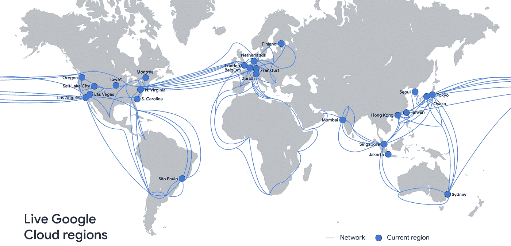

# TWiGCP—“tail-f，用于开发、监控 QL 和新区域的扳手”

> 原文：<https://medium.com/google-cloud/twigcp-tail-f-spanner-for-devs-monitor-ql-and-new-regions-fa6a6036795f?source=collection_archive---------1----------------------->

新年快乐，祝 2021 年你一切都好。这是 TWiGCP 的 2⁸集。感谢你们一直以来的读者和支持！

过去几周 GCP 的头条新闻包括:

*   [谷歌云宣布新区域](http://gtech.run/mbk7r)(谷歌博客)
*   [引入监控查询语言，或 MQL](http://gtech.run/hqzpf) (谷歌博客)
*   [云日志获得实时日志搜索](http://gtech.run/s7du6)(谷歌博客)
*   [云扳手数据库为开发者增加新功能](http://gtech.run/hzjw4)(谷歌博客)

来自“安全最佳实践”部门:

*   [在 Google Cloud](http://gtech.run/wb7ec) (Google 博客)中，您可以做些什么来更好地加密您的安全密钥
*   [带有堡垒主机的 GKE 专用集群|作者:彼得·赫尔沃拉](http://gtech.run/np3u2)(medium.com)

来自“网络产品功能演练”部门:

*   [使用流量控制器路由 TCP 流量](http://gtech.run/nrt7z)(cloud.google.com)
*   [cloud.google.com VPC——多网络接口概述和示例](http://gtech.run/mu5xy)

来自“在 Google Cloud 上并行化 C++应用”部门:

*   [在发布/订阅和 GKE 的帮助下运行 C++应用](http://gtech.run/yc2xl)(谷歌博客)

来自“未来比你想象的更近”部门:

*   【BigQuery Omni 使多云数据分析成为可能(谷歌博客)

来自“深入了解云扳手和云 SQL”部门:

*   [云扳手 ExecuteQuery 请求的幕后](http://gtech.run/lnkyw)(谷歌博客)
*   只有私有 IP 的云 SQL:好的、坏的和丑陋的|作者 Guillaume blaquiere(medium.com)

来自“12 天(还在继续)云工作流”部门:

*   [云工作流的第 1 天到第 12 天](http://gtech.run/utr6y)(glaforge.appspot.com)

“合规、资产……”部门:

*   [使用 Data Studio 监控您的 GCP 组织上的 VPC-SC 违规情况| Lorenzo Caggioni](http://gtech.run/wy3zb)(medium.com)
*   [如何在谷歌数据目录中发现您的 Sap HANA 资产| Marcelo Costa](http://gtech.run/5yuan)(medium.com)

来自“为 TPUs 定制 PyTorch 环境”部门:

*   [在 GCP 人工智能平台上使用 TPUs 运行 PyTorch 培训| Marcos nova es](http://gtech.run/c2hna)(medium.com)

来自“将您的侦探技能用于 BigQuery”部门:

*   【medium.com，用 Python 和 INFORMATION_SCHEMA 调查 BigQuery 的缓慢性

来自“可视化 Hadoop”部门:

*   [将您的可视化软件连接到 Google Cloud 上的 Hadoop](http://gtech.run/2kf8p)(cloud.google.com)
*   [在谷歌云上连接可视化软件和 Hadoop 的架构](http://gtech.run/sxtfm)(cloud.google.com)

来自“这可能会派上用场”部门:

*   [SFTP 访问谷歌云存储|尼尔·科尔班](http://gtech.run/3bkfe)(medium.com)

来自“可能是您最重要的路线图”部门:

*   [迁移到谷歌云:选择您的迁移路径](http://gtech.run/jmehj)(cloud.google.com)

来自“粘合代码即服务”部门:

*   [Google Cloud Functions for Cloud data prep |作者 Victor Coustenoble](http://gtech.run/wu72k)(medium.com)
*   [使用 Google Cloud Run 将数据流式传输到 big query | Soumendra Mishra](http://gtech.run/qa852)(medium.com)
*   [在云功能上运行有效的 Node.js 应用](http://gtech.run/6hfwx)(谷歌博客)

来自“客户和合作伙伴与 GCP 一起解决实际问题”部门:

*   [幕后看一看我们面向云视频人工智能注解的千万亿次视频处理架构【blog.gdeltproject.org ](http://gtech.run/q3zyk)
*   [飞轮利用谷歌云托管服务](http://gtech.run/azr7a)(谷歌博客)
*   [Google Cloud 上的 EDA 设计验证工作流程示例](http://gtech.run/wg88p) (Google 博客)
*   为风筝提供动力的数据分析| Priyanka verga dia(medium.com)
*   [智能家居公司使用大表云数据库](http://gtech.run/h3ckg)(谷歌博客)

来自“**万物多媒体**部门:

*   数据中心——谷歌(google.com)
*   [视频/演示] [向 VR 中的 ML 训练问好](http://gtech.run/gkvss)(youtube.com)
*   在谷歌云上运行 kot Lin(youtube.com)
*   [播客] Kubernetes 播客[第 133 集——Akri，凯特·戈登林](http://gtech.run/6ubcg)(kubernetespodcast.com)

来自"**预告，GA，还是什么？**“部门:

*   [GA] [云 SDK 322.0.0](http://gtech.run/wfg8w)
*   【GA】[云扳手 eur6 和 nam12 多地区](http://gtech.run/x34x2)
*   [GA] [云 SQL PostgreSQL 的 IAM 认证](http://gtech.run/ban4y)
*   [GA] [承诺使用折扣(CUD)建议](http://gtech.run/356ub)
*   [GA] [内部 HTTP(S) LB 的 GKE 内部入口](http://gtech.run/qzqg3)
*   [GA] [VPC 服务与计算引擎的集成](http://gtech.run/s3eby)
*   [GA] [Dataproc 对 pd 平衡持久磁盘的支持](http://gtech.run/e5wsf)
*   [GA] [数据丢失预防混合作业](http://gtech.run/4t52q)
*   【预览】[Google API 的私有服务连接](http://gtech.run/49vaz)
*   [预览] [为基于 TCP 的服务配置连接器支持](http://gtech.run/55mkl)
*   [1.34.0] [配置连接器](http://gtech.run/6pcka)

本周的图片是现有谷歌云区域的更新地图(2021 年还会有 4 个)

这就是本周的全部内容！亚历克西斯