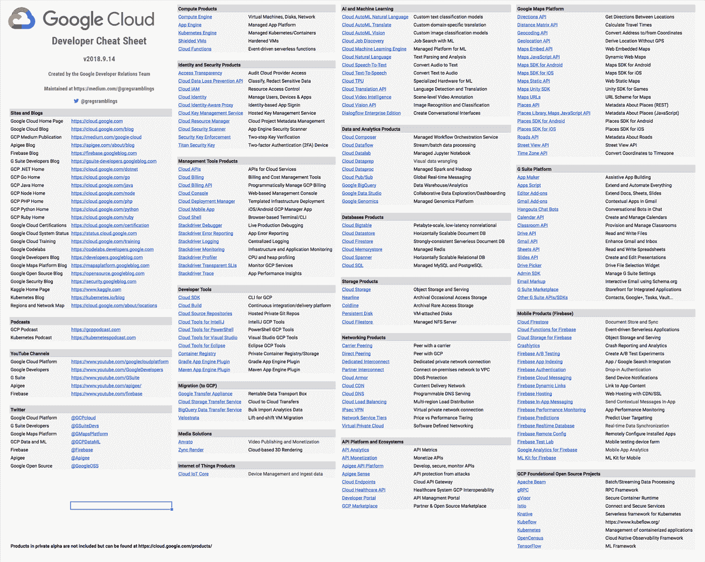

# TWiGCP—“TPUs 认识 GKE，Stackdriver 工作空间，以及一些生活黑客”

> 原文：<https://medium.com/google-cloud/twigcp-tpus-meet-gke-stackdriver-workspaces-and-some-lifehacking-2d0844f3b24c?source=collection_archive---------1----------------------->

这是您过去一周的 GCP 新闻报道。

来自“来自谷歌和社区的 Kubernetes 新闻”部门:

*   支持 Minigo 的 Kubernetes 引擎中的云 TPU 现已推出测试版(谷歌博客)。单个集群创建标志、YAML 资源约束一行程序和 TPU 满足 GKE！
*   [用 Spinnaker 在 Google Kubernetes 引擎上自动分析金丝雀](http://goo.gl/f53UUc) (Google 文档)
*   [KubeRBS 自动还原 Kubernetes，让你晚上睡得更香！](http://goo.gl/F37Vgd)(blog.doit-intl.com)
*   Kubernetes:配置图和秘密(带 Firebase)(medium.com)
*   [斯卡福德 0.14](http://goo.gl/8L5pn4) (github.com)。新的“skaffold init”功能

来自“Firebase offline 和利用新的应用引擎运行时”部门:

*   [云 Firestore 中的多标签离线支持！](http://goo.gl/F9BsGp)(谷歌博客)。现在，您可以使用 Cloud Firestore Web SDK 5.5.0 版本为 Chrome、Safari 和 Firefox 打开这一实验性的多标签离线同步。
*   [使用 Python 和云 Firestore 开发应用引擎服务](http://goo.gl/GA5RKL)(medium.com)

[使用 Stackdriver 工作空间来帮助管理您的混合和多云环境](http://goo.gl/HUKSYm) (Google 博客)。按团队职能、组织或环境组织工作区。

来自“透明信任”部门:

*   [访问透明日志现已普遍适用于六个 GCP 服务](http://goo.gl/Gue1bR)(谷歌博客)
*   [在谷歌云平台删除你的数据](http://goo.gl/9cd8Po)(谷歌博客)

来自“如果你需要使用 Google 的 BigQuery、Dataproc 和 Dataflow 的理由”部分:

*   BigQuery 中的以太坊:我们如何建立这个数据集(谷歌博客)。这是一篇热门博客文章的后续，讲述了 BigQuery 特性如何允许在几秒钟内分解所有以太坊智能合约。
*   [在 Cloud Dataproc 上部署 Apache Hive 的灵活方式](http://goo.gl/2tb6FZ) (Google 博客)。可抢占虚拟机的短暂集群通常也意味着更便宜的解决方案。
*   [分布式 Shuffle 如何提高云数据流管道的可扩展性和性能](http://goo.gl/5gnYgy)(谷歌博客)。将状态存储和计算分开，并通过分布式洗牌层将它们连接起来。
*   [移至 BigQuery](http://goo.gl/u1MzhC) (blog.hike.in)

来自“AI/ML 工具、挑战和 GCP 深度学习图像”部门:

*   [介绍无限制对抗范例挑战](http://goo.gl/c9uMfp)(谷歌博客)
*   假设工具:机器学习模型的无代码探索
*   [预配置了 Tensorflow、PyTorch、Jupyter、Cuda 和 CuDNN 的 GCP 深度学习映像](http://goo.gl/4Agvyr)(twitter.com)

来自“生活黑客”部门:

*   [谷歌云开发者备忘单](http://goo.gl/N9eNps)(medium.com)
*   [使用谷歌主页、云功能、数据存储、地图方向应用编程接口……](http://goo.gl/gy6eih)(blog.doit-intl.com)让你的孩子预计到达学校

从“测试版，正式版，还是什么？”部门:

*   [GA] [云 SDK 216.0.0](http://goo.gl/dCMjBV)
*   VPC 内部 DNS 服务
*   [GA]数据流洗牌(美国中部 1 和欧洲西部 1)
*   [Beta]数据流引擎(美国中部 1 和欧洲西部 1)
*   [Beta][GKE 的云 TPUs](http://goo.gl/9vxMyk)
*   大查询地理空间
*   【测试版】[调度查询](http://goo.gl/8GbPBS)

来自“所有多媒体”部门:

*   [播客] GCP 播客#0146 集是[谷歌人工智能与杰夫·迪恩](http://goo.gl/b3UVea)(gcppodcast.com)
*   [播客] Kubernetes 播客第 020 集是与贾斯汀·加里森(kubernetespodcast.com)关于[云计算原生运营模式的对话](http://goo.gl/TtLpps)
*   [视频] [无服务器，Knative，Kubernetes，还有你](http://goo.gl/k4iwvm) (acloud.guru)

本周图为[更新(谷歌云)开发者小抄](http://goo.gl/N9eNps):

这就是本周的全部内容！亚历克西斯